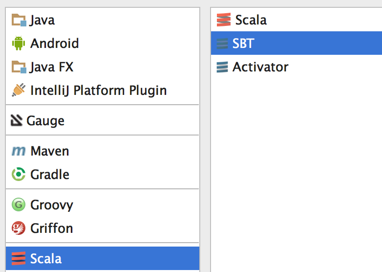
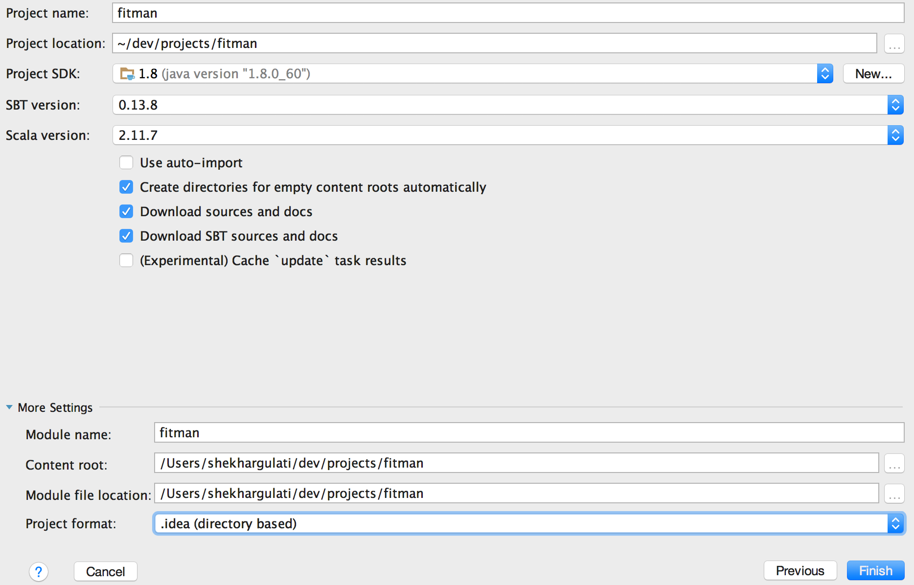
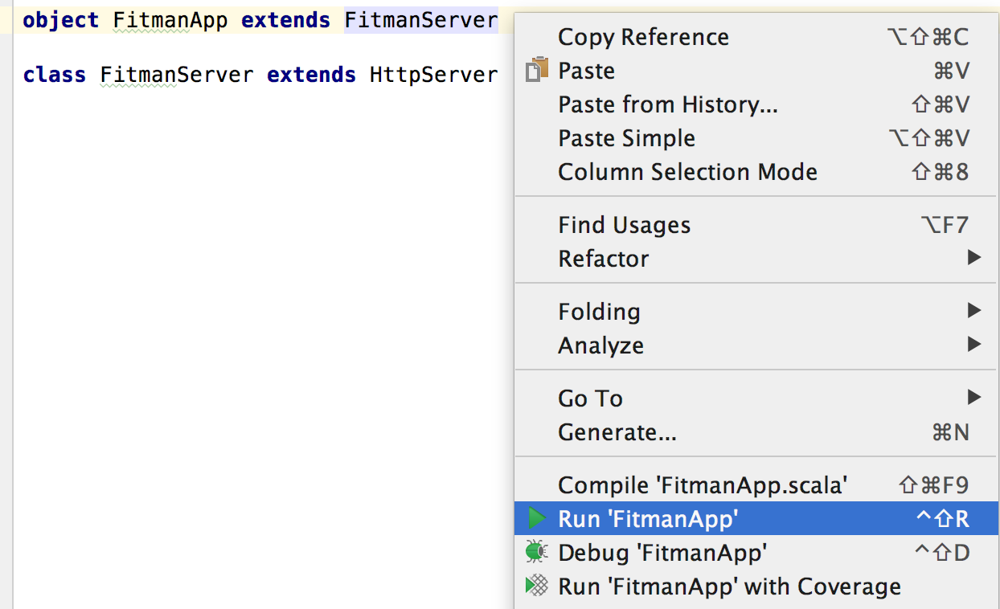
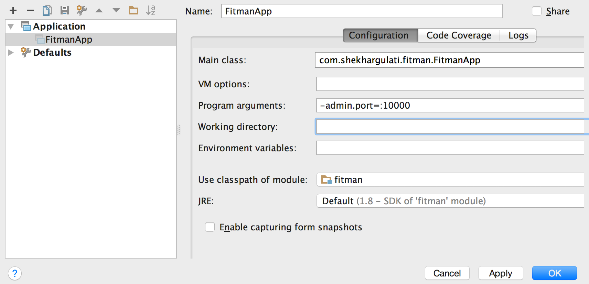

Week 1: Finatra Tutorial -- Build Beautiful REST API The Twitter Way
-------

[Finatra](https://github.com/twitter/finatra) is an open-source project by Twitter that can be used to build REST APIs in Scala programming language. Finatra builds on top of Twitter's Scala stack -- twitter-server, finagle, and twitter-util.

1. [Finagle](http://twitter.github.io/finagle/): It can be used to construct high performance servers.
2. [Twitter Server](http://twitter.github.io/twitter-server/): It defines a template from which servers at Twitter are built. It uses finagle underneath.
3. [Twitter-Util](http://twitter.github.io/util/): A bunch of idiomatic, small, general purpose tools for Scala.


In this step-by-step tutorial, we will cover how to build a Scala REST API using Finatra version 2. Finatra version 2 is a complete rewrite of finatra and is significantly faster(50 times according to documentation) than version 1.x.

> This blog is part of my year long blog series [52 Technologies in 2016](https://github.com/shekhargulati/52-technologies-in-2016)

## Prerequisite

1. Scala 2.11.7
2. IntelliJ Idea Community Edition
3. JDK 8

> Code for today's demo application is on Github at [fitman](fitman)

## Building an application from scratch

In this blog, we will build a simple application called **fitman**. The goal of this application is to track weight of an individual. Every week, a user enter his/her weight and a status message describing how they are feeling. This will allow them to view a timeline of their body weight.

### Step 1: Create a Scala SBT project using IntelliJ Idea

Open IntelliJ Idea and select Scala > SBT project. You will see screen as shown below.



After selecting, press ***Next*** button. Enter the project details and press ***Finish*** button.



This will create a Scala based SBT project that we will use.

> You can use any other IDE or tool as well to scaffold a Scala SBT project.

### Step 2: Adding required dependencies to build.sbt

Your `build.sbt` should look like following:

```scala
name := "fitman"

version := "1.0"

scalaVersion := "2.11.7"

lazy val versions = new {
  val finatra = "2.1.2"
  val logback = "1.1.3"
}

resolvers ++= Seq(
  Resolver.sonatypeRepo("releases"),
  "Twitter Maven" at "https://maven.twttr.com"
)

libraryDependencies += "com.twitter.finatra" % "finatra-http_2.11" % versions.finatra
libraryDependencies += "com.twitter.finatra" % "finatra-slf4j_2.11" % versions.finatra
libraryDependencies += "ch.qos.logback" % "logback-classic" % versions.logback
```

Out of three dependencies mentioned above, `finatra-http_2.11` is only required. `finatra-slf4j_2.11` and `logback-classic` are added for logging purpose only.

> Couple of things that disappointed me once I added above mentioned dependencies was 1) time it took to download all the dependencies 2) few transient dependencies like `twitter-metrics` are not present on Maven central so you have to add Twitter's Maven repository located at https://maven.twttr.com.


### Step 3: Fitman says Hello

A finatra app consists of an http server, a list of controllers, and zero or more filters. Let's create a simple Scala class that extends finatra's `com.twitter.finatra.http.HttpServer` as shown below.

```scala
import com.twitter.finatra.http.HttpServer

object FitmanApp extends FitmanServer

class FitmanServer extends HttpServer
```

In the code shown above, we created a server `FitmanServer` that extends `com.twitter.finatra.http.HttpServer`. `HttpServer` extends `TwitterServer` and adds configuration specific to an http server. `TwitterServer` is a template using which other types of servers can be created. `FitmanApp` is an object that is used to launch the server. From the documentation,

> The reason for having a separate object is to allow server to be instantiated multiple times in tests without worrying about static state persisting across test runs in the same JVM.

Also, according to documentation **Finatra convention is to create a Scala object with a name ending in **Main****. I prefer to use convention where name ends with `App` so I am using that.

You can run the application just like you will run any Scala main program. In IntelliJ, right click and click **Fitman App** as shown below.



This will launch the netty based server at port `8888`. As there is no route configured, so you will not be able to do anything useful.

> If you want to use any other port that 8888 then you can use `-http.port` flag and set the it to your preferred value like -http.port=:8080

Let's write our first controller -- `HelloController` in the `FitmanApp.scala` file as shown below.

```scala
import com.twitter.finagle.http.Request
import com.twitter.finatra.http.routing.HttpRouter
import com.twitter.finatra.http.{Controller, HttpServer}

object FitmanApp extends FitmanServer

class FitmanServer extends HttpServer {
  override protected def configureHttp(router: HttpRouter): Unit = {
    router.add(new HelloController)
  }
}

class HelloController extends Controller {

  get("/hello") { request: Request =>
    "Fitman says hello"
  }

}
```

In the code shown above, we created `HelloController` which extends finatra `Controller` abstract class. `HelloController` is defined with one endpoint - `/hello`. When an HTTP GET request is made to `/hello` then the associated callback function will be called. The callback function has `callback: RequestType => ResponseType` signature. It accepts a `com.twitter.finagle.http.Request` and returns back a response of any type that can be converted to `com.twitter.finagle.http.Response`. The callback function in this case just returns a string.

To make server aware of the controller, we registered `HelloController` with `FitmanServer` by overriding its `configureHttp` method. The `configureHttp` exposes `HttpRouter` that is used to register an instance of `HelloController`.

> You can also ask server to handle instantiation of controller by passing the type of controller to the add method instead of its instance. This becomes very useful when used along with dependency injection framework like Guice. We will discuss it later in detail.
```scala
override protected def configureHttp(router: HttpRouter): Unit = {
  router.add[HelloController]
}
```

Now, when you make an HTTP GET request to `http://localhost:8888/hello` you will receive fitman ascii art as shown below.

```
→ curl -i http://localhost:8888/hello
HTTP/1.1 200 OK
Content-Length: 17
Fitman says hello
```


#### Admin Interface

Every Finatra by default exposes an admin interface at http://localhost:9990/admin that you can use to get system level details like CPU usage profile, heap profile, server information, and many other. To learn about all admin features refer to [Twitter Server documentation](https://twitter.github.io/twitter-server/Features.html#http-admin-interface).

You can configure admin interface to run on any other port by passing `-admin.port` flag. In IntelliJ, edit your run configuration as shown below.



From now on Admin interface will be available at http://localhost:10000/admin.

#### Overriding default server configuration

There are two ways you can override default server configuration values. One way is to use flags as discussed previously with admin and http ports.  The other way you can override default server configuration is by overriding fields in the `FitmanServer` as shown below.

```scala
class FitmanServer extends HttpServer {

  override protected def defaultFinatraHttpPort: String = ":8080"
  override protected def defaultTracingEnabled: Boolean = false
  override protected def defaultHttpServerName: String = "FitMan"

  override protected def configureHttp(router: HttpRouter): Unit = {
    router.add(new HelloController)
  }
}
```

### Step 4: Let's write feature test for HelloController

One of the feature of Finatra that impressed me most was its inbuilt support for feature testing. Feature testing is a form of blackbox testing that tests a particular feature from outside.

Let's add dependencies to `build.sbt` file. You can view full build.sbt [here](https://github.com/shekhargulati/52-technologies-in-2016/blob/master/01-finatra/fitman/build.sbt).

```scala
libraryDependencies += "com.twitter.finatra" % "finatra-http_2.11" % versions.finatra % "test"
libraryDependencies += "com.twitter.inject" % "inject-server_2.11" % versions.finatra % "test"
libraryDependencies += "com.twitter.inject" % "inject-app_2.11" % versions.finatra % "test"
libraryDependencies += "com.twitter.inject" % "inject-core_2.11" % versions.finatra % "test"
libraryDependencies += "com.twitter.inject" %% "inject-modules" % versions.finatra % "test"
libraryDependencies += "com.google.inject.extensions" % "guice-testlib" % versions.guice % "test"
libraryDependencies +=  "com.twitter.finatra" % "finatra-jackson_2.11" % versions.finatra % "test"

libraryDependencies += "com.twitter.finatra" % "finatra-http_2.11" % versions.finatra % "test" classifier "tests"
libraryDependencies += "com.twitter.inject" % "inject-server_2.11" % versions.finatra % "test" classifier "tests"
libraryDependencies += "com.twitter.inject" % "inject-app_2.11" % versions.finatra % "test" classifier "tests"
libraryDependencies += "com.twitter.inject" % "inject-core_2.11" % versions.finatra % "test" classifier "tests"
libraryDependencies += "com.twitter.inject" % "inject-modules_2.11" % versions.finatra % "test" classifier "tests"
libraryDependencies += "com.google.inject.extensions" % "guice-testlib" % versions.guice % "test" classifier "tests"
libraryDependencies +=  "com.twitter.finatra" % "finatra-jackson_2.11" % versions.finatra % "test"  classifier "tests"

libraryDependencies += "org.scalatest" % "scalatest_2.11" % "2.2.4" % "test"
libraryDependencies += "org.specs2" %% "specs2" % "2.3.12" % "test"
```


Let's write our first feature test that will test the `/hello` endpoint. To create a feature test, you have to extend a trait called `FeatureTest`. You have to provide implementation for server definition as shown below. We created an instance of `EmbeddedHttpServer` passing it our application twitter server -- `FitmanServer`.

```scala
import com.twitter.finagle.http.Status
import com.twitter.finatra.http.test.EmbeddedHttpServer
import com.twitter.inject.server.FeatureTest

class HelloControllerFeatureTest extends FeatureTest {
  override val server: EmbeddedHttpServer = new EmbeddedHttpServer(
    twitterServer = new FitmanServer)

  "Say Hello" in {
    server.httpGet(
      path = "/hello",
      andExpect = Status.Ok,
      withBody = "Fitman says hello"
    )
  }
}
```

This test will start an embedded http server and will make an actual HTTP GET request to the `/hello` endpoint. We asserted that HTTP status code returned by our service is 200 i.e. OK and response body contains text `Fitman says hello`. If you change the body text to something other than `Fitman says hello` then test will fail with detailed message outlining the difference between texts as shown below.

```
"Fitman says hello[]" did not equal "Fitman says hello[123]"
```

This allows you to test the externally visible features of the API.

### Step 5: Let's capture weight

Let's first write the feature test for our WeightResource. The feature test will test that when an HTTP POST request is made to `/weights` endpoint then weight will be stored in some database. In today's blog, we will use a mutable Map to act as a database. Later in this series, we will cover how to work with databases in Scala. We will update our blog then.

```scala
import com.shekhargulati.fitman.FitmanServer
import com.twitter.finagle.http.Status
import com.twitter.finatra.http.test.EmbeddedHttpServer
import com.twitter.inject.server.FeatureTest

class WeightResourceFeatureTest extends FeatureTest {
  override val server = new EmbeddedHttpServer(
    twitterServer = new FitmanServer
  )

  "WeightResource" should {
    "Save user weight when POST request is made" in {
      server.httpPost(
        path = "/weights",
        postBody =
          """
            |{
            |"user":"shekhar",
            |"weight":85,
            |"status":"Feeling great!!!"
            |}
          """.stripMargin,
        andExpect = Status.Created,
        withLocation = "/weights/shekhar"
      )
    }
  }
}
```

When you will run the test case then this test will fail as we have not yet added functionality for WeightResource.

Our data model looks like as shown below. It should have same field names as JSON.

```scala
case class Weight(
                   user: String,
                   weight: Int,
                   status: Option[String],
                   postedAt: Instant = Instant.now()
                 )
```

Now, let's write our WeightResource.

```scala
import com.twitter.finatra.http.Controller

import scala.collection.mutable

class WeightResource extends Controller {

  val db = mutable.Map[String, List[Weight]]()

  post("/weights") { weight: Weight =>
    val weightsForUser = db.get(weight.user) match {
      case Some(weights) => weights :+ weight
      case None => List(weight)
    }
    db.put(weight.user, weightsForUser)
    response.created.location(s"/weights/${weight.user}")
  }

}
```
Update FitmanServer with new Controller
```
    router.add(new WeightResource)
```

In the code shown above, we did the following:

1. We created a mutable Map to store weight for a user.
2. In the `post("/weights")` callback, we are directly using our case class Weight instead of using Finagle request. Finatra automatically converts the request body to the case class.
3. In the post method callback, we first check whether the user exists in the db or not. If user exists, then we add weight to its existing weights collection else we create new List with weight.
4. Finally, we return the response back to the user. `response.created` makes sure that HTTP status 201 is set. We also set the location header to point to a new resource.

### Step 6: View user weight

Now, let's write our second operation that will return all captured weights for a user. We will start with a feature test as shown below.

```scala
"List all weights for a user when GET request is made" in {
  val response = server.httpPost(
    path = "/weights",
    postBody =
      """
        |{
        |"user":"test_user_1",
        |"weight":80,
        |"posted_at" : "2016-01-03T14:34:06.871Z"
        |}
      """.stripMargin,
    andExpect = Status.Created
  )

  server.httpGetJson[List[Weight]](
    path = response.location.get,
    andExpect = Status.Ok,
    withJsonBody =
      """
        |[
        |  {
        |    "user" : "test_user_1",
        |    "weight" : 80,
        |    "posted_at" : "2016-01-03T14:34:06.871Z"
        |  }
        |]
      """.stripMargin
  )
}
```

Add the following method to `WeightResource`

```scala
get("/weights/:user") { request: Request =>
  db.getOrElse(request.params("user"), List())
}
```

### Step 7: Getting logging right

In step 2, we added `finatra-slf4j_2.11` and `logback-classic` dependencies to the classpath so that we can effectively log in our application. `finatra` uses SLF4J api for framework logging. SLF4J provides an API abstraction for various logging framework like log4j, logback, etc. Developers are free to choose their favorite logging library that works with SLF4J. finatra documentation recommends to use Logback as an SLF4J binding as it is much more superior and performant than other logging libraries.

To log in your application, you have to mixin `com.twitter.inject.Logging` trait into your application's object or class. Let's add some log statements to `WeightResource`.

```scala
import com.twitter.finagle.http.Request
import com.twitter.finatra.http.Controller
import com.twitter.inject.Logging
import org.joda.time.Instant

import scala.collection.mutable

class WeightResource extends Controller with Logging {

  val db = mutable.Map[String, List[Weight]]()

  get("/weights") { request: Request =>
    info("finding all weights for all users...")
    db
  }

  get("/weights/:user") { request: Request =>
    info( s"""finding weight for user ${request.params("user")}""")
    db.getOrElse(request.params("user"), List())
  }

  post("/weights") { weight: Weight =>
    val r = time(s"Total time take to post weight for user '${weight.user}' is %d ms") {
      val weightsForUser = db.get(weight.user) match {
        case Some(weights) => weights :+ weight
        case None => List(weight)
      }
      db.put(weight.user, weightsForUser)
      response.created.location(s"/weights/${weight.user}")
    }
    r
  }

}

case class Weight(
                   user: String,
                   weight: Int,
                   status: Option[String],
                   postedAt: Instant = Instant.now()
                 )
```

### Step 8: Validations

Finatra comes with validation annotations that can be used to add validation support. Out of the box Finatra comes with following validation annotations.

1. CountryCode
2. FutureTime
3. Max
4. Min
5. NotEmpty
6. OneOf
7. PastTime
8. Range
9. Size
10. TimeGranularity
11. UUID

All these annotations are defined in `finatra-jackson_2.11` module so you have to add that to build.sbt

```scala
libraryDependencies +=  "com.twitter.finatra" % "finatra-jackson_2.11" % versions.finatra
```

Let's write a test case

```scala
"Bad request when user is not present in request" in {
  server.httpPost(
    path = "/weights",
    postBody =
      """
        |{
        |"weight":85
        |}
      """.stripMargin,
    andExpect = Status.BadRequest
  )
}
```

If you run the test now, it will fail with Http status code 500 i.e. Internal server error.

To make it work first we have to register a filter in the FitmanServer.

```scala
import com.twitter.finatra.http.filters.CommonFilters

class FitmanServer extends HttpServer {
  override protected def configureHttp(router: HttpRouter): Unit = {

    router
      .filter[CommonFilters]
      .add[HelloController]
      .add[WeightResource]
  }
}
```

Now test will pass.

```scala
"Bad request when data not in range" in {
  server.httpPost(
    path = "/weights",
    postBody =
      """
        |{
        |"user":"testing12345678910908980898978798797979789",
        |"weight":250
        |}
      """.stripMargin,
    andExpect = Status.BadRequest,
    withErrors = Seq(
      "user: size [42] is not between 1 and 25",
      "weight: [250] is not between 25 and 200"
    )
  )
}
```

Update the `Weight` case class

```scala
case class Weight(
                   @Size(min = 1, max = 25) user: String,
                   @Range(min = 25, max = 200) weight: Int,
                   status: Option[String],
                   postedAt: Instant = Instant.now()
                 )
```

That's it for this week. Please give your feedback [https://github.com/shekhargulati/52-technologies-in-2016/issues/1](https://github.com/shekhargulati/52-technologies-in-2016/issues/1)

[](https://github.com/igrigorik/ga-beacon)
