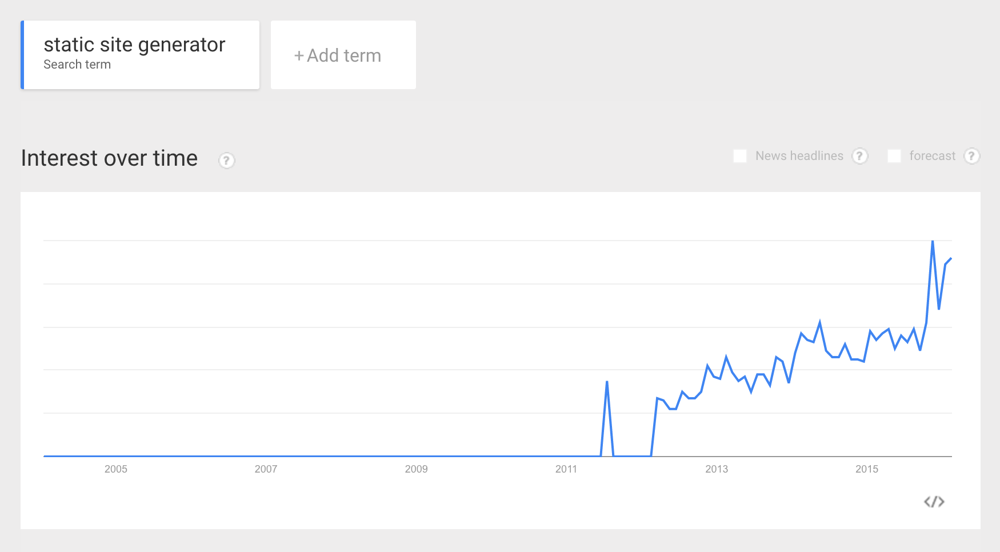

Hugo: A Modern WebSite Engine That Just Works
----

This week I decided to take a break from Scala and scratch my own itch my building an online bookshelf using Hugo. **[Hugo](https://gohugo.io/)** is a static site generator written in Go programming language. You can use it for building modern static websites. Static site generator takes your content files written in a markup language like [Markdown](https://en.wikipedia.org/wiki/Markdown), apply layouts you have defined, and generate static HTML files that can be delivered to the user. Static websites are nothing new, they date back to the [first ever website](http://info.cern.ch/hypertext/WWW/TheProject.html) in human history. We started with static websites, then moved to dynamic websites, and finally we are moving back to static websites for use-cases where it make sense. Most common use-cases for static websites are blogs, product documentation, help guides, tutorials, online portfolio or resume.

> **This blog is part of my year long blog series [52 Technologies in 2016](https://github.com/shekhargulati/52-technologies-in-2016)**

Static generators again came into limelight after the introduction of [Jekyll](https://jekyllrb.com/) in 2008. Jekyll is a static website generator written in Ruby. It was created by Github co-founder Tom Preston-Werner. Because Jekyll was created by Github co-founder, it has very good integration with Github. It was very easy to get your website running on Github pages.

Another reason static site generators are back in popularity has to do with a lot of advantages they offer. In my opinion, static generators offer following advantages:

1. You don't need a database to store content
2. Forces you to use version control system to store content
3. Fast and cacheable
4. Less maintenance overhead
5. Works well for a lot of use-cases like blogs, documentation, etc.
6. Low barrier to entry
7. Runs out of the box on many platforms like Github pages, Amazon S3, or any web server like Nginx
8. Good developer workflow using Git

I would recommend that you read [good post by David Walsh on advantages and disadvantages of static site generators](https://davidwalsh.name/introduction-static-site-generators). If you look at Google trends, you will notice a steep rise in interest for static site generators. As you can see below, after 2011 more and more people are searching about `static site generator`.



There are many Open-source static site generators options available to the users. You can choose from more than [400 static site generators](https://staticsitegenerators.net/). The most popular ones are [Jekyll](https://github.com/jekyll/jekyll), [Hugo](https://github.com/spf13/hugo), [Middleman](https://github.com/middleman/middleman), [Harp](https://github.com/sintaxi/harp).

> **I have personally used Jekyll and Hugo. I migrated my company blog to Jekyll and it didn't turned out to be a good decision. The two main drawback of Jekyll are 1) you need Ruby runtime 2) it is very slow for bigger projects. To get someone running Jekyll on a machine is a pain. This leads to a barrier in adoption.**

## Why Hugo?

As mentioned above, I had a bad experience with Jekyll so I was looking for an alternative that didn't have same limitations. The reasons I prefer Hugo are:

1. It is not dependent on any programming language runtime
2. It provides binaries for all modern operating system
3. It is Fast
4. It provides quick feedback by live reloading of the content
5. It comes with good defaults and follows convention over configuration philosophy

## Why an online bookshelf?

Some of you might be wondering why I wanted to create an online bookshelf. One promise that I made this year to myself is to read at least one non-technology each month in 2016. Last many years, I am upset with myself for not giving time to read non-technology books. This year I have to change this so I decided to build a bookshelf that will keep track of all the books I read. I got inspired to build my online bookshelf after visiting [Bill Gates blog](https://www.gatesnotes.com/). Bill Gates is maintaining an [awesome bookshelf](https://www.gatesnotes.com/Books) where he shares which his recently read books and their reviews. A screenshot of his bookshelf is shown below.


-----

Building our bookshelf
---

Now, that we know about static site generators and Hugo let's start building our bookshelf step by step. By the end of this tutorial, we will have our bookshelf hosted on Github pages and mapped to a domain.

## Github repository

The code for today’s demo application is available on github: [bookshelf](./bookshelf).

## Step 1: Getting started with Hugo

Go to [https://github.com/spf13/hugo/releases](https://github.com/spf13/hugo/releases) and download Hugo for your operating system. If you are on Mac, the you can install using `brew` package manager as well.

```bash
$ brew update && brew install hugo
```

Once `hugo` is installed, make sure to run the `help` command to verify `hugo` installation. Below I am only showing part of the output of the `help` command for brevity.

```bash
$ hugo help
```
```
hugo is the main command, used to build your Hugo site.

Hugo is a Fast and Flexible Static Site Generator
built with love by spf13 and friends in Go.

Complete documentation is available at http://gohugo.io/.
```

You can check `hugo` version using the command shown below.

```bash
$ hugo version
```
```
Hugo Static Site Generator v0.15 BuildDate: 2015-11-26T11:59:00+05:30
```

> **In this post, we will use the latest version of hugo i.e. version 0.15**

## Step 2: Scaffold bookshelf hugo site

Hugo has commands that allows us to quickly scaffold a Hugo managed website. Navigate to a convenient location on your filesystem and create a new Hugo site `bookshelf` by executing the following command.

```bash
$ hugo new site bookshelf
```

Change directory to `bookshelf` and you will see the following directory layout.

```bash
$ tree -a
```
```
.
|-- archetypes
|-- config.toml
|-- content
|-- data
|-- layouts
`-- static

5 directories, 1 file
```

As mentioned in the command output, `bookshelf` directory has 5 sub-directories and 1 file. Let's look at each of them one by one.

* **archetypes**: You can create new content files in Hugo using the `hugo new` command. When you run that command, it adds few configuration properties to the post like date and title. [Archetype](https://gohugo.io/content/archetypes/) allows you to define your own configuration properties that will be added to the post front matter whenever `hugo new` command is used.

* **config.toml**: Every website should have a configuration file at the root. By default, the configuration file uses `TOML` format but you can also use `YAML` or `JSON` formats as well. [TOML](https://github.com/toml-lang/toml) is minimal configuration file format that's easy to read due to obvious semantics. The configuration settings mentioned in the `config.toml` are applied to the full site. These configuration settings include `baseurl` and `title` of the website.

* **content**: This is where you will store content of the website. Inside content, you will create sub-directories for different sections. Let's suppose your website has three actions -- `blog`, `article`, and `tutorial` then you will have three different directories for each of them inside the `content` directory. The name of the section i.e. `blog`, `article`, or `tutorial` will be used by Hugo to apply a specific layout applicable to that section.

* **data**: This directory is used to store configuration YAML, JSON,or TOML files that can be used by Hugo when generating your website.

* **layouts**: The content inside this directory is used to specify how your content will be converted into the static website.

* **static**: This directory is used to store all the static content that your website will need like images, CSS, JavaScript or other static content.

## Step 3: Add content

Let's now add a post to our `bookshelf`. We will use the `hugo new` command to add a post. In January, I read [Good To Great](http://www.amazon.com/Good-Great-Some-Companies-Others/dp/0066620996/) book so we will start with creating a post for it. **Make sure you are inside the `bookshelf` directory.**

```bash
$ hugo new post/good-to-great.md
```
```
/Users/shekhargulati/bookshelf/content/post/good-to-great.md created
```

The above command will create a new directory `post` inside the `content` directory and create `good-to-great.md` file inside it.

```bash
$ tree -a content
```
```
content
`-- post
    `-- good-to-great.md

1 directory, 1 file
```

The content inside the `good-to-great.md` looks like as shown below.

```
+++
date = "2016-02-14T16:11:58+05:30"
draft = true
title = "good to great"

+++
```

The content inside `+++` is the TOML configuration for the post. This configuration is called **front matter**. It enables you to define about the post along with the content. Every post has three configuration properties shown above.

* **date** specifies the date and time at which post was created.
* **draft** specifies that post is not ready for publication yet so it will not be in the generated site
* **title** specifies title for the post

Let's add a small review for **Good to Great** book.

```
+++
date = "2016-02-14T16:11:58+05:30"
draft = true
title = "Good to Great Book Review"

+++

I read **Good to Great in January 2016**. An awesome read sharing detailed analysis on how good companies became great. Although this book is about how companies became great but we could apply a lot of the learnings on ourselves. Concepts like level 5 leader, hedgehog concept, the stockdale paradox are equally applicable to individuals.
```

## Step 4: Serve content

Hugo has inbuilt server that can serve content so that you can preview it. You can also use the inbuilt Hugo server in production as well. To serve content, execute the following command.

```bash
$ hugo server
```
```
0 of 1 draft rendered
0 future content
0 pages created
0 paginator pages created
0 tags created
0 categories created
in 9 ms
Watching for changes in /Users/shekhargulati/bookshelf/{data,content,layouts,static}
Serving pages from memory
Web Server is available at http://localhost:1313/ (bind address 127.0.0.1)
Press Ctrl+C to stop
```

This will start the server on port `1313`. You can view your blog at http://localhost:1313/. When you will go to the link, you will see nothing. There are couple of reasons for that:

1. As you can see in the `hugo server` command output, Hugo didn't rendered the draft. Hugo will only render drafts if you pass `buildDrafts` flag to the `hugo server` command.
2. We have not specified how Markdown content should be rendered. We have to specify a theme that Hugo can use. We will do that in next step.

To render drafts, re-run the server with command shown below.

```bash
$ hugo server --buildDrafts
```
```
1 of 1 draft rendered
0 future content
1 pages created
0 paginator pages created
0 tags created
0 categories created
in 6 ms
Watching for changes in /Users/shekhargulati/bookshelf/{data,content,layouts,static}
Serving pages from memory
Web Server is available at http://localhost:1313/ (bind address 127.0.0.1)
Press Ctrl+C to stop
```

If you go to [http://localhost:1313/](http://localhost:1313/), you will still not view anything as we have not specified theme that Hugo should use.

## Step 5: Add theme

Themes provide the layout and templates that will be used by Hugo to render your website. There are a lot of Open-source themes available at [https://themes.gohugo.io/](https://themes.gohugo.io/) that you can use. From the [Hugo docs](https://gohugo.io/themes/overview/),

> **Hugo currently doesn’t ship with a `default` theme, allowing the user to pick whichever theme best suits their project.**

Themes should be added in the `themes` directory inside the website root. Create new directory themes and change directory to it.

```bash
$ mkdir themes && cd themes
```
Now, you clone one or more themes inside the `themes` directory. We will use robust theme.

```bash
$ git clone git@github.com:dim0627/hugo_theme_robust.git
```

Start the server again

```bash
$ hugo server --theme=hugo_theme_robust --buildDrafts
```
```
1 of 1 draft rendered
0 future content
1 pages created
2 paginator pages created
0 tags created
0 categories created
in 10 ms
Watching for changes in /Users/shekhargulati/bookshelf/{data,content,layouts,static,themes}
Serving pages from memory
Web Server is available at http://localhost:1313/ (bind address 127.0.0.1)
Press Ctrl+C to stop
```

> ** If Hugo will not find a specific theme in the `themes` directory then it will throw an exception as shown below.**
```
FATAL: 2016/02/14 Unable to find theme Directory: /Users/shekhargulati/bookshelf/themes/robust
```

To view your website, you can go to http://localhost:1313/. You will see as shown below.


Let's understand the layout of a theme. A theme consists of following:

* **theme.toml** is the theme configuration file that gives information about the theme like name and description of theme, author details, theme license.

* **images** directory contains two images -- `screenshot.png` and `tn.png`. `screenshot.png` is the image of the list view and `tn.png` is the single post view.

* **layouts** directory contains different views for different content types. Every content type should have two files single.html and list.html. single.html is used for rendering single piece of content. list.html is used to view a list of content items for example all posts with `programming` tag.

* **static** directory stores all the static assets used by the template. This could JavaScript libraries like jQuery or CSS styles or images or any other static content. This directory will be copied into the final site when rendered.

## Step 6: Use multiple themes

You can very easy test different layouts by switching between different themes. Let's suppose we want to try out `bleak` theme. We clone `bleak` theme inside the `themes` directory.

```bash
$ git clone git@github.com:Zenithar/hugo-theme-bleak.git
```


Restart the server using `hugo-theme-bleak`.

```bash
$ hugo server --theme=hugo-theme-bleak --buildDrafts
```

Now, website will use `bleak` theme and will be rendered differently as shown below.


## Step 7: Update config.toml and live reloading in action

Restart the server with `robust` theme as we will use it in this blog.

```bash
$ hugo server --theme=hugo_theme_robust --buildDrafts
```

The website uses the dummy values specified in the `config.toml`. Let's update the configuration.

```toml
baseurl = "http://replace-this-with-your-hugo-site.com/"
languageCode = "en-us"
title = "Shekhar Gulati Book Reviews"

[Params]
  Author = "Shekhar Gulati"
```

Hugo has inbuilt support for live reloading. So, as soon as you save your changes it will apply the change and reload the web page. You will see changes as shown below.


The same is reflected in the Hugo server logs as well. As soon as the configuration is changed, it applied the changes.

```
Config file changed: /Users/shekhargulati/bookshelf/config.toml
1 of 1 draft rendered
0 future content
1 pages created
2 paginator pages created
0 tags created
0 categories created
in 11 ms
```

## Step 8: Customize robust theme

Robust theme is a good start towards our online bookshelf but we to customize it a bit to meet the look and feel required for the bookshelf. Hugo makes it very easy to customize themes. You can also create your themes but we will not do that today. If you want to create your own theme, then you should refer to the [Hugo documentation](https://gohugo.io/themes/creation/).

The first change that we have to make is to use a different default image instead of the one used in the theme. The default image used in both the list and single view page resides inside the `themes/hugo_theme_robust/static/images/default.jpg`. We can easily replace it by creating a simple directory structure inside the `static` directory inside the `bookshelf` directory.

Create images directory inside the static directory and copy an image with name `default.jpg` inside it. We will use the default image shown below.


Hugo will sync the changes and reload the website to use new image as shown below.


Now, we need to change the layout of the index page so that only images are shown instead of the text. The index.html inside the layouts directory of the theme refer to partial `li` that renders the list view shown below.

```html
<article class="li">
  <a href="{{ .Permalink }}" class="clearfix">
    <div class="image" style="background-image: url({{ $.Site.BaseURL }}images/{{ with .Params.image }}{{ . }}{{ else }}default.jpg{{ end }});"></div>
    <div class="detail">
      <time>{{ with .Site.Params.DateForm }}{{ $.Date.Format . }}{{ else }}{{ $.Date.Format "Mon, Jan 2, 2006" }}{{ end }}</time>
      <h2 class="title">{{ .Title }}</h2>
      <div class="summary">{{ .Summary }}</div>
    </div>
  </a>
</article>
```

Create a new file li.html inside the `bookshelf/layouts/_default` directory. Copy the content shown below into the li.html. We have removed details of the book so that only image is shown.

```html
<article class="li">
  <a href="{{ .Permalink }}" class="clearfix">
    <div class="image" style="background-image: url({{ $.Site.BaseURL }}images/{{ with .Params.image }}{{ . }}{{ else }}default.jpg{{ end }});"></div>
  </a>
</article>
```

Now, the website will be rendered as shown below.


Next, we want to remove information related to theme from the footer. So, create a new file inside the `partials/default_foot.html` with the content copied from the theme `partials/default_foot.html`. Replace the footer section with the one shown below.

```html
<footer class="site">
  <p>{{ with .Site.Copyright | safeHTML }}{{ . }}{{ else }}&copy; {{ $.Site.LastChange.Year }} {{ if isset $.Site.Params "Author" }}{{ $.Site.Params.Author }}{{ else }}{{ .Site.Title }}{{ end }}{{ end }}</p>
  <p>Powered by <a href="http://gohugo.io" target="_blank">Hugo</a>,</p>
</footer>
```

We also have to remove the sidebar on the right. Copy the index.html from the themes layout directory to the bookshelf layouts directory. Remove the section related to sidebar from the html.

```html
<div class="col-sm-3">
  {{ partial "sidebar.html" . }}
</div>
```

So far we are using the default image but we would like to use the book image so that we can relate to the book. Every book review will define a configuration setting in its front matter. Update the `good-to-great.md` as shown below.


```
+++
date = "2016-02-14T16:11:58+05:30"
draft = true
title = "Good to Great Book Review"
image = "good-to-great.jpg"
+++

I read **Good to Great in January 2016**. An awesome read sharing detailed analysis on how good companies became great. Although this book is about how companies became great but we could apply a lot of the learnings on ourselves. Concepts like level 5 leader, hedgehog concept, the stockdale paradox are equally applicable to individuals.
```

After adding few more books to our shelf, the shelf looks like as shown below. These are few books that I have read within last one year.


## Step 9: Make posts public

So far all the posts that we have written are in draft status. To make a draft public, you can either run a command or manually change the draft status in the post to True.

```bash
$ hugo undraft content/post/good-to-great.md
```

Now, you can start the server without `buildDrafts` option.

```
$ hugo server --theme=hugo_theme_robust
```

## Step 10: Integrate Disqus

Disqus allows you to integrate comments in your static blog. To enable Disqus, you just have to set `disqusShortname`  in the config.toml as shown below.

```
[Params]
  Author = "Shekhar Gulati"
  disqusShortname = "shekhargulati"
```

Now, commenting will be enabled in your blog.


## Step 11: Generate website

To generate Hugo website code that you can use to deploy your website, type the following command.

```bash
$ hugo --theme=hugo_theme_robust
0 draft content
0 future content
5 pages created
2 paginator pages created
0 tags created
0 categories created
in 17 ms
```

> **Make sure to change the baseurl. For my bookshelf on Github pages, url is [https://shekhargulati.github.io/bookshelf](https://shekhargulati.github.io/bookshelf)**

After you run the hugo command, a public directory will be created with the generated website source.


## Step 12: Deploy bookshelf on Github pages

Create a new repository with name `bookshelf` on Github. Once created, create a new Git repo on local system and add remote.

```bash
$ mkdir bookshelf-public
$ cd bookshelf-public
$ git init
$ git remote add origin git@github.com:shekhargulati/bookshelf.git
```

Copy the content of the `public` directory to the `bookshelf-public` directory. Run this command from with in the `bookshelf-public` directory.

```bash
$ cp -r ../bookshelf/public/ .
```

Create new branch `gh-pages` and checkout it.

```bash
$ git checkout -b gh-pages
Switched to a new branch 'gh-pages'
```

Add all the files to the index, commit them, and push the changes to Github.

```bash
$ git add --all
$ git commit -am "bookshelf added"
$ git push origin gh-pages
```

In couple of minutes, your website will be live https://shekhargulati.github.io/bookshelf/.

----

That's all for this week. Please provide your valuable feedback by adding a comment to [https://github.com/shekhargulati/52-technologies-in-2016/issues/10](https://github.com/shekhargulati/52-technologies-in-2016/issues/10).

[](https://github.com/igrigorik/ga-beacon)
