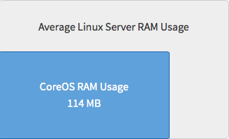
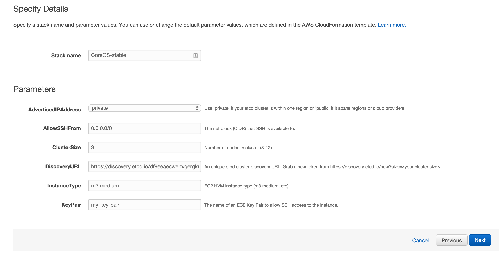
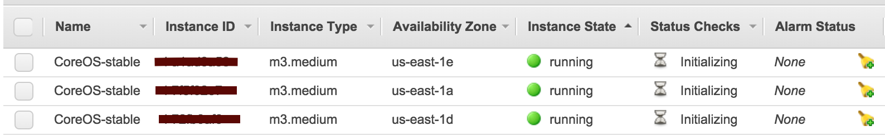

CoreOS for Application Developers
----

Welcome to eighth week of [52 Technologies in 2016](https://github.com/shekhargulati/52-technologies-in-2016) blog series. This week we will learn about [CoreOS](https://coreos.com/), an Open source Linux distribution built to run and manage highly scalable and fault tolerant systems. It is designed to `docker` and `rocket` containers. When I started learning about CoreOS, I was overwhelmed by its complexity and different components that you have to know and interact with like `etcd`, `systemd`, `fleet`, `Flannel`. I am not an Ops guy so CoreOS documentation and many tutorials that I found on the web didn't clicked with me. The goal of this tutorial is to help application developers understand why they should care about CoreOS and show them how to work with CoreOS cluster running on top of Amazon EC2.

## What is CoreOS?

According to [CoreOS website](https://coreos.com/), **CoreOS is a Linux for Massive Server Deployments**. This means it is not a general purpose Linux distro that you can use as your development workspace instead, you will use it to run and your applications at scale.

Built on [Gentoo](https://www.gentoo.org/), CoreOS is a lean and mean operating system that runs minimal Linux. When you limit your OS to the bare minimal i.e. just openssl, ssh, linux kernel, gcc then you need a mechanism to run package and run applications that you want to use.  CoreOS does not even has a package manager like `yum` or `Apt`. CoreOS is very different from other Linux distributions as it is centered around containers. *Linux Containers is an operating-system-level virtualization environment for running multiple isolated Linux systems (containers) on a single Linux control host*. CoreOS uses containers to run and manage applications services. You package application along with its dependencies within a container that can be run on a single or multiple CoreOS machines. CoreOS supports both Docker and Rocket containers.

> **Docker is the poster child of containers. In [November 2013](https://blog.openshift.com/day-21-docker-the-missing-tutorial/), I first learnt and wrote about Docker. [Docker](https://www.docker.com/) is a set of toolset geared around containers. Docker clicked with everyone and overnight became the tool that everyone wanted to learn and introduce in their organization. One reason Docker became popular very quickly is its approachability to an average developer. To use Docker, you don't have to know Linux internals and work with complicated tools.**

CoreOS developers claim that it is 40% more efficient in RAM usage than an average linux installation.



## Why should I care?

I am an application developer and one trend that I see becoming popular in application development space is **Microservices**. [Microservices](https://en.wikipedia.org/wiki/Microservices) is a software architecture style in which a large complex application is broken down into smaller,independent, autonomous services that work together. These autonomous services encapsulate business functionality corresponding to single a feature and interact with each other using a language agnostic APIs. These applications are built by multiple teams across different geographies.  They have lifecycle of their own and can be deployed independently of each other. Most of the successful internet companies like Amazon, Google, Netflix, Twitter, etc. are using Microservices architecture for their applications.

There are a lot of benefits an organization can achieve by adopting Microservices architecture. Some of these benefits are:

1. You can **choose right tool for the job**. Each service can possible use a different programming language or different database solution for the problem at hand. This eliminates a long term commitment to a particular technology stack.
2. You can **deploy services independently of each other**. A small, simple service can be deployed much more easily than a big monolithic application. This will help in delivering business value to the customer faster.
3. You get **quick feedback for the business functionality**.
4. You can **understand code much easily**. Each Microservice is designed to do one thing so their code base are reasonably smaller. This helps a developer to understand the code much more easily.
5. You get **small focussed teams**.

Although, there a lot of benefits of Microservice architecture there are some challenges as well. There is an operational cost and complexity associated with Microservices. Microservice architecture leads to many moving parts. This makes them difficult to debug and reason about. A single request might get fulfilled by many services, introducing latency. To work in this new world, you have to rethink about your datacenter. The traditional datacenter model will not work.

### CoreOS: The modern datacenter

We are moving to the world of web scale IT where we want our applications to be available, fault-tolerant, scalable, and broken into smaller applications. To support such application development landscape, we need web scale Infrastructure. **CoreOS** is one solution to move in the direction of modern datacenter, **datacenter as a machine**. You will be able to work with cluster of machines as one single machine. CoreOS can help us build a datacenter where we can run and manage our Microservices at scale. It is designed to be fault-tolerant and resilient so that if one host fails your application can recover from it without any human intervention.

CoreOS also supports features like automatic updates and rolling releases that you need when you run applications at scale.

## CoreOS Components

The main components of CoreOS are:

* ***etcd***: The core idea behind `etcd` is that you can replicate your `/etc` directory in a fault tolerant way. `etcd` is a distributed key-value store that is designed to overcome individual node failure. According to wikipedia, `etc` directory
> **Contains system-wide configuration files and system databases; the name stands for "et cetera". Originally also contained "dangerous maintenance utilities" such as init, but these have typically been moved to /sbin or elsewhere.**

* ***systemd***: It is an init system for a single host. It is a big upgrade to `init.d` allowing you write service units which point to any bash or Python script. It is based on `cgroups` and does not rely on `pid` files. A simple `systemd` service file looks like as shown below.

  ```
  [Unit]
  Description=Sleep Service

  [Service]
  ExecStart=/usr/bin/sleep 3000
  ```
* ***fleet***: `fleet` is an init system for a cluster. You can think it as a distributed `systemd`. fleet let you work with a cluster of machine as one machine.

* ***flannel***: flannel is a virtual network that gives a subnet to each host for use with container runtimes. It creates a UDP encapsulated overlay network that can run fairly inexpensively on virtual machines. The goal of flannel is that each container running on a host has its own unique ip address so that you can get away from port mapping business. flannel creates a logical route table between virtual machine A and virtual machine B and creates an overlay network. This gives it private IPs in the range `10.0.0.16/24` that containers can use.

* ***Docker***: Docker provides an envelope (or container) for running your applications. It packages the application and all its dependencies in a virtual container that runs on any Linux server. This helps enable flexibility and portability on where the application can run, whether on premise, public cloud, private cloud, bare metal, etc.


## Launch a CoreOS cluster on Amazon EC2.

CoreOS team provides a Vagrant project that you can use to launch CoreOS cluster on your local machine. In this tutorial, I am going to launch a 3 machine CoreOS cluster on Amazon EC2. CoreOS team provides a list of AMI that we can use to launch our CoreOS cluster. You can refer to [https://coreos.com/os/docs/latest/booting-on-ec2.html](https://coreos.com/os/docs/latest/booting-on-ec2.html) for details. Click on the region in which you want to create your stack. You will be asked to enter details as shown below.



Once stack is created, you will see three instances running in your EC2 management console.




## SSH into CoreOS host

SSH into any of the instance using the SSH key you used in the previous step.

```bash
$ ssh -i ~/.ssh/my-ec2-key.pem core@ec2-50-189-111-255.compute-1.amazonaws.com
```

By default, it uses the `core` user instead of `root` and doesn’t use a password for authentication.

Once SSHed, you will see following screen.

```bash
CoreOS stable (835.13.0)
core@ip-10-129-99-123 ~ $
```

## Check service status

Let's verify status of `etcd`, `fleet`, and `docker`. We will use `systemctl` command to check status of services. `systemctl` is a system and service manager used to introspect and control the state of the `systemd` system and its units.

To check status of `etcd`, run the following command.

```
core@ip-xx-xx-xx-xx ~ $ systemctl status etcd2
● etcd2.service - etcd2
   Loaded: loaded (/usr/lib64/systemd/system/etcd2.service; disabled; vendor preset: disabled)
  Drop-In: /run/systemd/system/etcd2.service.d
           └─10-oem.conf, 20-cloudinit.conf
   Active: active (running) since Mon 2016-02-22 13:36:24 UTC; 8min ago
 Main PID: 772 (etcd2)
   Memory: 34.8M
      CPU: 2.477s
   CGroup: /system.slice/etcd2.service
           └─772 /usr/bin/etcd2
```

To check status of `fleet`, type following command.

```
core@ip-xx-xx-xx-xx ~ $ systemctl status fleet
● fleet.service - fleet daemon
   Loaded: loaded (/usr/lib64/systemd/system/fleet.service; disabled; vendor preset: disabled)
   Active: active (running) since Mon 2016-02-22 13:36:24 UTC; 9min ago
 Main PID: 780 (fleetd)
   Memory: 12.0M
      CPU: 3.387s
   CGroup: /system.slice/fleet.service
           └─780 /usr/bin/fleetd
```

To check status of `docker`, execute the following command.

```
core@ip-xx-xx-xx-xx ~ $ docker version
Client:
 Version:      1.8.3
 API version:  1.20
 Go version:   go1.4.2
 Git commit:   cedd534-dirty
 Built:        Thu Feb 18 16:25:16 UTC 2016
 OS/Arch:      linux/amd64

Server:
 Version:      1.8.3
 API version:  1.20
 Go version:   go1.4.2
 Git commit:   cedd534-dirty
 Built:        Thu Feb 18 16:25:16 UTC 2016
 OS/Arch:      linux/amd64
```


## Working with etcd

As mentioned above, `etcd` is a distributed key value store. Let's SSH into two CoreOS instances and see it in action.

```bash
core@ip-xx-xx-xx-xx ~ $ etcdctl set message "Hello World"
Hello World
```

SSH into the second instance to retrieve the value.

```bash
core@ip-yy-yy-yy-yy ~ $ etcdctl get message
Hello World
```

The data in one node is replicated to the second node. It uses Raft consensus algorithm to replicate the data.

You can also create directories in `ectd` and then store different configuration values in it.

```
core@ip-xx-xx-xx-xx ~ $ etcdctl set /tmp/message1 "hello 1"
hello 1
core@ip-xx-xx-xx-xx ~ $ etcdctl set /tmp/message2 "hello 2"
hello 2
core@ip-yy-yy-yy-yy ~ $ etcdctl ls /tmp
/tmp/message1
/tmp/message2
core@ip-yy-yy-yy-yy ~ $ etcdctl get /tmp/message1
hello 1
```

In the commands shown above, we created a directory `tmp` and then stored couples of key value pairs. To view keys in the tmp, we used `ls` command. If the directory contains another directories then you can use `-recursive` flag to list all the directories and their keys.

## Working with systemd

In this section, we will write a simple service that will periodically poll Github status API. In systemd, you have to write unit files to describe your service. Let's create a new service file `github-status.service` inside the `/etc/systemd/system` directory. Populate it with following contents.

```bash
[Unit]
Description=Check Github Status
After=docker.service
Requires=docker.service

[Service]
ExecStartPre=/usr/bin/docker build -t="shekhargulati/ubuntu-curl" /home/core
ExecStart=/usr/bin/docker run --name my-container1 shekhargulati/ubuntu-curl:latest /bin/sh -c "while true; do curl https://status.github.com/api/status.json; sleep 10;done"
ExecStop=/usr/bin/docker stop my-container1

[Install]
WantedBy=multi-user.target
```

In the unit file shown above, we created a Docker image `shekhargulati/ubuntu-curl` using the Dockerfile present at `/home/core` directory. Dockerfile is shown below.

```
FROM ubuntu:latest
RUN apt-get update
RUN apt-get install -y curl
```

After container is created, we run the container using the command `while true; do curl https://status.github.com/api/status.json; sleep 10;done`. This command polls Github status API every 10 seconds.

To enable the new service unit, run the following command.

```bash
$ sudo systemctl enable /etc/systemd/system/github-status.service
```
The above command will create a symlink.
```
Created symlink from /etc/systemd/system/multi-user.target.wants/github-status.service to /etc/systemd/system/github-status.service.
```


Next, you can start the `github-status` service using the following command.

```
$ sudo systemctl start github-status.service
```

To view the logs of systemd service, we can use `journalctl`. `journalctl` is used to query contents of the systemd journal.

```
$ journalctl -f -u github-status.service
```
```
Feb 22 16:12:32 ip-xx-xx-xx-xx.ec2.internal docker[9374]: {"status":"good","last_updated":"2016-02-22T16:11:57Z"}
Feb 22 16:12:42 ip-xx-xx-xx-xx.ec2.internal docker[9374]: {"status":"good","last_updated":"2016-02-22T16:12:31Z"}
```

As we packaged our github-status.service inside a Docker container, you can view that a container is running using the following command.

```
core@ip-xx-xx-xx-xx ~ $ docker ps
CONTAINER ID        IMAGE                              COMMAND                  CREATED             STATUS              PORTS               NAMES
108ae4804d21        shekhargulati/ubuntu-curl:latest   "/bin/sh -c 'while tr"   15 minutes ago      Up 15 minutes                           my-container1
```

You can stop the service using the systemctl as shown below. This will stop the docker container as well.

## Working with fleet


We can use fleet to work with systemd services at cluster level. Let's now create a new service which will print `hello all` message.

```bash
[Unit]
Description=Hello
After=docker.service
Requires=docker.service

[Service]
ExecStartPre=/usr/bin/docker pull busybox
ExecStartPre=-/usr/bin/docker rm container1
ExecStart=/usr/bin/docker run --name container1 busybox:latest /bin/sh -c "while true; do echo 'hello all'; sleep 1;done"
ExecStop=/usr/bin/docker stop container1

[X-Fleet]
```

Submit the unit file

```bash
core@ip-xx-xx-xx-xx ~ $ fleetctl submit hello.service
Unit uptime-check.service inactive
```

List all unit files

```bash
core@ip-xx-xx-xx-xx ~ $ fleetctl list-units
UNIT		MACHINE				ACTIVE	SUB
hello.service	241f23f5.../10.149.77.143	inactive	inactive
```


Start the service

```
$ fleetctl start hello.service
```
```
Unit hello.service launched on 241f23f5.../10.149.77.143
```

If you list-units now, you will see that service is running on one host.

```
$ fleetctl list-units
UNIT		MACHINE				ACTIVE	SUB
hello.service	241f23f5.../10.149.77.143	active	running
```

You can view the logs using the `journalctl` command.

```
$ journalctl -u hello.service -f
-- Logs begin at Mon 2016-02-22 13:35:00 UTC. --
Feb 22 16:53:49 ip-xx-xx-xx-xx.ec2.internal docker[10660]: hello all
Feb 22 16:53:50 ip-xx-xx-xx-xx.ec2.internal docker[10660]: hello all
Feb 22 16:53:51 ip-xx-xx-xx-xx.ec2.internal docker[10660]: hello all
Feb 22 16:53:52 ip-xx-xx-xx-xx.ec2.internal docker[10660]: hello all
```

You can schedule a unit on all machines using the Global option.

```
[Unit]
Description=Hello
After=docker.service
Requires=docker.service

[Service]
ExecStartPre=/usr/bin/docker pull busybox
ExecStartPre=-/usr/bin/docker rm container1
ExecStart=/usr/bin/docker run --name container1 busybox:latest /bin/sh -c "while true; do echo 'hello all'; sleep 1;done"
ExecStop=/usr/bin/docker stop container1

[X-Fleet]
Global=true
```

```
fleetctl list-unit-files
UNIT		HASH	DSTATE		STATE	TARGET
hello.service	5659e44	inactive	-	global
```


```
$ fleetctl start hello.service
Triggered global unit hello.service start
```

```
$ fleetctl list-units
UNIT		MACHINE				ACTIVE	SUB
hello.service	241f23f5.../10.149.77.143	active	running
hello.service	c952b3af.../10.79.177.29	active	running
hello.service	f37a7daa.../10.153.148.154	active	running
```

You can view status on individual hosts by running the `systemctl status hello.service` command.

----

That's all for this week. Please provide your valuable feedback by adding a comment to [https://github.com/shekhargulati/52-technologies-in-2016/issues/11](https://github.com/shekhargulati/52-technologies-in-2016/issues/11).

[](https://github.com/igrigorik/ga-beacon)
