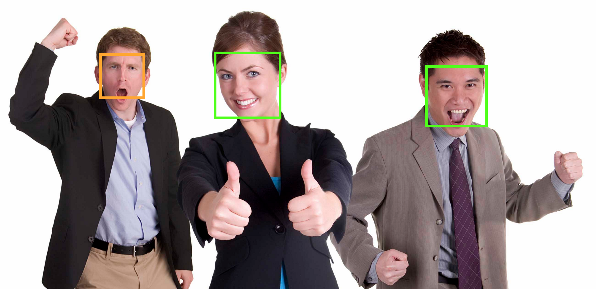
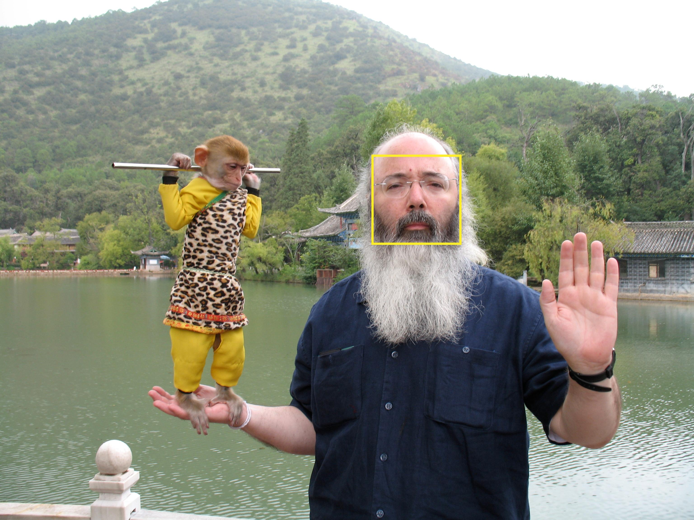
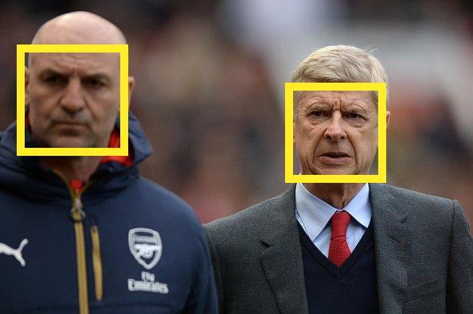
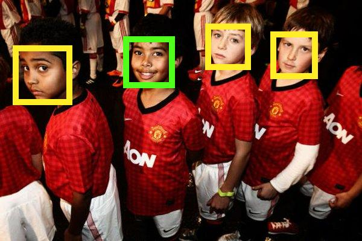

Realtime People Counter with Google's Cloud Vision API and RxJava
-----

Welcome to the ninth blog of [52 Technologies in 2016](https://github.com/shekhargulati/52-technologies-in-2016)  blog series. Recently, Google released [Cloud Vision](https://cloud.google.com/vision/) API that enables developers to incorporate image recognition in their applications. Image Recognition allow developers to build applications that can understand content of images. Google's Cloud Vision API is very powerful and support following features:

1. **Image categorization**: The API can help classify images into categories. You can build powerful applications like Google Photos that do automatic categorization.
2. **Inappropriate content detection**: The API can detect inappropriate content in an image like nudity, violence, etc. It uses Google Safe search capabilities underneath.
3. **Emotion detection**: This allows you to detect happy, sad or moderate emotions in an image.
4. **Retrieve text from the image**: This allows you to extract text in multiple languages from the images.
5. **Logo detection**: It can help you identify product logos within an image.

There are many possible applications that you can build using this powerful API. In this tutorial, we will learn how to build a realtime people counter. The application will subscribe to a twitter stream for a topic and would return number of people found in each image. We can then use this data to get advanced statistic like number of people in a time frame using RxJava buffer capabilities.

According to [Wikipedia](https://en.wikipedia.org/wiki/People_counter),

> **A people counter is a device that can be used to measure the number and direction of people traversing a certain passage or entrance. There are many possible use cases couple of them are mentioned below:**
1. **In retail stores, people counting systems are used to calculate the conversion rate, i.e. the percentage of visitors that make purchases.**
2. **In shopping centers, they can be used to measure the number of visitors.**

Now, that we have understood what we are going to build today let's get started.

## Prerequisite

1. Knowledge of Java 8 is required. You can refer to [my Java 8 tutorial](https://github.com/shekhargulati/java8-the-missing-tutorial) in case you are new to it.
2. You should have a Google Cloud Account. Create a new application and enable Cloud Vision API for it.
3. Get Twitter application connection credentials. Create a new Twitter application at [https://apps.twitter.com/](https://apps.twitter.com/). This will give you the required credentials that you need to connect to Twitter API. At the end, you will have access to consumer key, consumer secret, access token, and access token secret.
4. Basic knowledge of RxJava is required. You can refer to [my RxJava tutorial](http://blog.xebia.in/2015/09/01/day1-building-an-application-from-scratch-using-rxjava-and-java8/) in case you are new to it.

> **This blog is part of my year long blog series [52 Technologies in 2016](https://github.com/shekhargulati/52-technologies-in-2016)**

## Step 1: Create a Java Gradle project

Google Cloud Vision API exposes its REST API so you can build your application using any programming language. Google officially provide SDK for Java and Python. We will use Java SDK in this tutorial. Navigate to a convenient location on your file system and create a Gradle project with name ***people-counter***. You can scaffold a Gradle project using your IDE. Once project is created, open the `build.gradle` file and populate it with following contents.  

```groovy
group 'com.shekhargulati.52tech'
version '1.0-SNAPSHOT'

apply plugin: 'java'

sourceCompatibility = 1.8

repositories {
    mavenCentral()
}

dependencies {
    compile 'io.reactivex:rxjava:1.1.1'
    compile 'org.twitter4j:twitter4j-stream:4.0.4'
    compile 'com.google.apis:google-api-services-vision:v1-rev6-1.21.0'

    testCompile group: 'junit', name: 'junit', version: '4.11'
}
```

In the build script shown above, we have added dependencies to `rxjava`, `twitter4j-stream`, and `google-api-services-vision` libraries. `rxjava` and `twitter4j-stream` libraries are required to convert a tweet stream to an `Observable`. `google-api-services-vision` provide us access to Cloud Vision API.

## Step 2: Detecting faces in an image

Google Cloud Vision API has many capabilities. The one that we will use in this blog is **face detection**. Face detection detects all the human faces in an image along with their position and emotions. Let's create a new class `FaceDetector` that will use Cloud Vision API to detect all the faces in an image.

```java
import com.google.api.services.vision.v1.Vision;
import com.google.api.services.vision.v1.model.FaceAnnotation;
import java.nio.file.Path;
import java.util.Collections;
import java.util.List;

public class FaceDetector {

    private final Vision vision;

    public FaceDetector(Vision vision) {
        this.vision = vision;
    }

    public List<FaceAnnotation> detectFaces(Path image) throws IOException {
        return Collections.emptyList();
    }
}
```
In the code shown above:

1. Constructor of FaceDetector takes Vision as its argument. This will help us inject Vision API instance from outside.
2. `detectFaces` method will take an image path and return a list of `FaceAnnotation`. FaceAnnotation is a value object that contains result of face detection. If no images are detected in an image then empty result will be returned.

Let's now fill the stub `detectFaces` implementation with the actual code.

```java
import com.google.api.services.vision.v1.Vision;
import com.google.api.services.vision.v1.model.*;

import java.io.IOException;
import java.nio.file.Files;
import java.nio.file.Path;
import java.util.Collections;
import java.util.List;

public class FaceDetector {

    private final Vision vision;

    public FaceDetector(Vision vision) {
        this.vision = vision;
    }

    public List<FaceAnnotation> detectFaces(Path image) throws IOException {
        BatchAnnotateImagesRequest batchRequest = new BatchAnnotateImagesRequest()
                .setRequests(
                        Collections.singletonList(
                                new AnnotateImageRequest()
                                        .setImage(new Image().encodeContent(Files.readAllBytes(image)))
                                        .setFeatures(Collections.singletonList(new Feature().setType("FACE_DETECTION").setMaxResults(10)))
                        ));
        Vision.Images.Annotate annotate = vision.images().annotate(batchRequest);
        annotate.setDisableGZipContent(true);
        BatchAnnotateImagesResponse batchAnnotateImagesResponse = annotate.execute();
        if (batchAnnotateImagesResponse.getResponses().isEmpty()) {
            return Collections.emptyList();
        }
        AnnotateImageResponse annotateImageResponse = batchAnnotateImagesResponse.getResponses().get(0);
        return annotateImageResponse.getFaceAnnotations();
    }
}
```

In the `detectFaces` method shown above we did the following:

1. We created a `BatchAnnotateImagesRequest` instance. This allow us to batch multiple image annotation request into a single call.
2. We populated `BatchAnnotateImagesRequest` with a single `AnnotateImageRequest`.`AnnotateImageRequest` is the request that we make to  Cloud Vision API to annotate `FACE_DETECTION` over the provided image. Each request consists of base64 encoded image data and a list of features to annotate on the image.
4. Then, we got the `Images` collection from the `vision` instance and asked it to `annotate` our image.
5. Next, we disabled Gzip as there is a bug in the Cloud Vision API that it fails for large gzipped images.
6. Finally, we execute our `annotate` request. If there are no responses in the `BatchAnnotateImagesResponse` then we return an empty list else we get the first response and return its face annotations.

Let's see face detection in action by running it over the following image.


As you can see in the image, there are three people in it so we should expect three face annotations.

```java
import com.google.api.services.vision.v1.model.FaceAnnotation;
import org.junit.Test;

import java.nio.file.Path;
import java.nio.file.Paths;
import java.util.List;

import static org.hamcrest.CoreMatchers.equalTo;
import static org.junit.Assert.assertThat;

public class FaceDetectorTest {

    @Test
    public void shouldReturnFaceAnnotationsAllThreePeople() throws Exception {
        Path image = Paths.get("src", "test", "resources", "random-people.png");
        FaceDetector faceDetector = new FaceDetector(GoogleVisionServiceFactory.getVisionServiceInstance("app"));
        List<FaceAnnotation> faceAnnotations = faceDetector.detectFaces(image);
        assertThat(faceAnnotations.size(), equalTo(3));
    }

}
```

To run the above test case, you have to set an environment variable `GOOGLE_APPLICATION_CREDENTIALS`. The value of `GOOGLE_APPLICATION_CREDENTIALS` environment variable is the path to Google Cloud service account file.

```
$ export GOOGLE_APPLICATION_CREDENTIALS=path_to_service_account_file
```

If you run the test without setting `GOOGLE_APPLICATION_CREDENTIALS`, then you will get an exception with following message.

> **The Application Default Credentials are not available. They are available if running in Google Compute Engine. Otherwise, the environment variable GOOGLE_APPLICATION_CREDENTIALS must be defined pointing to a file defining the credentials. See https://developers.google.com/accounts/docs/application-default-credentials for more information.**

Cloud Vision API detected three faces. `faceAnnotations` list will contain three entries one for each detected face. Part of the `FaceAnnotation` is shown below.

```javascript
{
  "angerLikelihood": "VERY_UNLIKELY",
  "blurredLikelihood": "VERY_UNLIKELY",
  "detectionConfidence": 0.9995242,
  "headwearLikelihood": "VERY_UNLIKELY",
  "joyLikelihood": "VERY_LIKELY",
  "landmarkingConfidence": 0.64031124,
  "landmarks": [
    {
      "position": {
        "x": 1643.347,
        "y": 318.13702,
        "z": -4.753362E-4
      },
      "type": "LEFT_EYE"
    },
    {
      "position": {
        "x": 1728.9514,
        "y": 315.09427,
        "z": 9.495166
      },
      "type": "RIGHT_EYE"
    },
    ...// removed other for brevity
  ],
  "panAngle": 6.319743,
  "rollAngle": -1.8814136,
  "sorrowLikelihood": "VERY_UNLIKELY",
  "surpriseLikelihood": "VERY_UNLIKELY",
  "tiltAngle": -6.42992,
  "underExposedLikelihood": "VERY_UNLIKELY"
}
```

The JSON response shown above give many more details about the detected face. As shown in the above response, it also contains emotion of the detected face. We can see that this detected face is in the joy mood as  `joyLikelihood` value is `VERY_LIKELY`.

To verify that it has found three faces we will draw a box around each face. I have copied this code from Google [sample application code](https://github.com/GoogleCloudPlatform/cloud-vision/blob/master/java/face_detection/src/main/java/com/google/cloud/vision/samples/facedetect/FaceDetectApp.java#L151).

```java
@Test
public void shouldReturnFaceAnnotationsAllThreePeople() throws Exception {
    Path image = Paths.get("src", "test", "resources", "random-people.png");
    FaceDetector faceDetector = new FaceDetector(GoogleVisionServiceFactory.getVisionServiceInstance("image-sentiment-analyzer"));
    List<FaceAnnotation> faceAnnotations = faceDetector.detectFaces(image);
    Path outputPath = ImageWriter.writeWithFaces(image, Paths.get("build"), faceAnnotations);
    System.out.println("Output file created at: " + outputPath.toAbsolutePath().toString());
    assertThat(faceAnnotations.size(), equalTo(3));
}
```

As you can see above, we are writing an image in the `build` directory using the ImageWriter. The output image will have the same name and extension as the original image. Green box signifies joy, red box signify sorrow, and orange color signify surprise.



## Step 3: Counting people in an image

Counting people in an image is very easy once we have `FaceAnnotation` for an image as shown below.

```java
import com.google.api.services.vision.v1.Vision;
import com.google.api.services.vision.v1.model.FaceAnnotation;

import java.io.ByteArrayOutputStream;
import java.io.IOException;
import java.io.InputStream;
import java.net.URL;
import java.nio.file.Files;
import java.nio.file.Path;
import java.util.List;


public class PeopleCounter {

    private final FaceDetector faceDetector;

    public PeopleCounter(Vision vision) {
        this.faceDetector = new FaceDetector(vision);
    }

    public ImagePeopleCount count(String imageUrl) {
        try {
            List<FaceAnnotation> faceAnnotations = faceDetector.detectFaces(urlToByteArray(imageUrl));
            if (faceAnnotations.isEmpty()) {
                return new ImagePeopleCount(imageUrl, 0);
            }
            return new ImagePeopleCount(imageUrl, faceAnnotations.size());
        } catch (IOException e) {
            return new ImagePeopleCount(imageUrl, 0);
        }
    }

    public ImagePeopleCount count(Path image) throws IOException {
        List<FaceAnnotation> faceAnnotations = faceDetector.detectFaces(Files.readAllBytes(image));
        if (faceAnnotations.isEmpty()) {
            return new ImagePeopleCount(image.toFile().getName(), 0);
        }
        return new ImagePeopleCount(image.toFile().getName(), faceAnnotations.size());
    }


    private byte[] urlToByteArray(String urlOfImage) {
        ByteArrayOutputStream byteArrayOutputStream = new ByteArrayOutputStream();
        try (InputStream inputStream = new URL(urlOfImage).openStream()) {
            byte[] byteChunk = new byte[4096];
            int n;

            while ((n = inputStream.read(byteChunk)) > 0) {
                byteArrayOutputStream.write(byteChunk, 0, n);
            }
            return byteArrayOutputStream.toByteArray();
        } catch (IOException e) {
            System.err.printf("Failed while reading bytes from %s: %s", urlOfImage, e.getMessage());
            return new byte[0];
        }
    }

}
```

`ImagePeopleCount` is our custom value object to store people count in an image.

```java
public class ImagePeopleCount {

    private final String image;
    private final int count;

    public ImagePeopleCount(String image, int count) {
        this.image = image;
        this.count = count;
    }

    public String getImage() {
        return image;
    }

    public int getCount() {
        return count;
    }
}
```

In the `ImagePeopleCount`, we can also capture the count of joy, surprise, and sorrow likelihood. We can later use that information in our application to perform sentiment analysis of images.

Let's test over `PeopleCounter` on the image shown below. PeopleCounter should detect one face only.


```java
@Test
public void shouldReturnOnlyAsCountInMonkeyAndManImage() throws Exception {
    Path image = Paths.get("src", "test", "resources", "monkey-and-man.jpg");
    PeopleCounter peopleCounter = new PeopleCounter(GoogleVisionServiceFactory.getVisionServiceInstance("app"));
    ImagePeopleCount imagePeopleCount = peopleCounter.count(image);
    assertThat(imagePeopleCount, equalTo(new ImagePeopleCount("monkey-and-man.jpg", 1)));
}
```



## Creating a Tweet Observable

Create a new class `TweetObservable` that will have a factory method to create an `Observable` as shown below.

```java
import rx.Observable;
import twitter4j.*;

public final class TweetObservable {

    public static Observable<Status> of(final String... searchKeywords) {
        return Observable.create(subscriber -> {
            final TwitterStream twitterStream = new TwitterStreamFactory().getInstance();
            twitterStream.addListener(new StatusAdapter() {
                public void onStatus(Status status) {
                    subscriber.onNext(status);
                }

                public void onException(Exception ex) {
                    subscriber.onError(ex);
                }
            });
            FilterQuery query = new FilterQuery();
            query.language("en");
            query.track(searchKeywords);
            twitterStream.filter(query);
        });


    }
}
```

The code shown above does the following:

1. It creates an `Observable` using the `Observable.create(OnSubscribe)` method.
2. `Observable.create` method is passed an lambda expression that creates an instance of `TwitterStream` using the `TwitterStreamFactory`.
3. We query Twitter for all the search terms received as method argument.
4. The `twitterStream` instance is configured with a listener that will be invoked when a new status is received or an exception is encountered. When a new status is received then `subscriber.onNext()` is called with the status update. In case an error is encountered, subscriber `onError` method is invoked passing it the exception that was thrown.

## PeopleCounterApp: Subscribing to Tweet Observable


```java
import rx.Observable;
import twitter4j.MediaEntity;
import twitter4j.Status;

public class PeopleCounterApp {

    public static void main(String[] args) throws Exception {
        PeopleCounter peopleCounter = new PeopleCounter(GoogleVisionServiceFactory.getVisionServiceInstance("image-sentiment-analyzer"));

        Observable<Status> tweets = TweetObservable.of("Wenger");

        Observable<String> imageStream = tweets
                .filter(status -> status.getExtendedMediaEntities().length > 0)
                .flatMap(s -> Observable.from(s.getExtendedMediaEntities()))
                .map(MediaEntity::getMediaURL);

        imageStream
                .map(image -> peopleCounter.count(image))
                .take(20)
                .subscribe(System.out::println, e -> e.printStackTrace());

    }

}

```

Output is shown below.

```
Output file created at: ~/09-cloudvision/people-counter/build/044cfa74-a843-4158-8635-13bc9d1c3f81
ImagePeopleCount{image='http://pbs.twimg.com/media/CcUNF-SWIAEtJf6.jpg', count=2}
ImagePeopleCount{image='http://pbs.twimg.com/media/CcUDzlHWEAAuRw2.jpg', count=0}
Output file created at: ~/09-cloudvision/people-counter/build/6465c325-7cdc-49c6-928c-b51ed8869a64
ImagePeopleCount{image='http://pbs.twimg.com/media/CcUDzk2WwAAkKCD.jpg', count=1}
Output file created at: ~/09-cloudvision/people-counter/build/4f4314d8-45f3-47f4-a949-c21f6639ef3f
ImagePeopleCount{image='http://pbs.twimg.com/media/CcUNF-SWIAEtJf6.jpg', count=2}
ImagePeopleCount{image='http://pbs.twimg.com/media/CcUK-geUUAA45q3.jpg', count=0}
Output file created at: ~/09-cloudvision/people-counter/build/94807bdf-b497-4976-8f3e-8d8f7849c7ae
ImagePeopleCount{image='http://pbs.twimg.com/media/CcULAYQVAAAYSyk.jpg', count=1}
Output file created at: ~/09-cloudvision/people-counter/build/ac3ec34a-ebd3-4dc4-b8b8-205829829120
ImagePeopleCount{image='http://pbs.twimg.com/media/CcUN0j6VAAQYQS7.jpg', count=1}
ImagePeopleCount{image='http://pbs.twimg.com/media/CcUNzOPUcAAt77W.jpg', count=0}
ImagePeopleCount{image='http://pbs.twimg.com/media/CcUN0etUEAAWmvU.jpg', count=0}
Output file created at: ~/09-cloudvision/people-counter/build/e44d7b27-5730-4335-a3d8-d88fc9fb5ed3
ImagePeopleCount{image='http://pbs.twimg.com/media/CcUNF-SWIAEtJf6.jpg', count=2}
ImagePeopleCount{image='http://pbs.twimg.com/media/COzorzQWsAAPHVd.jpg', count=0}
ImagePeopleCount{image='http://pbs.twimg.com/media/CcUDMJtWAAApdC7.jpg', count=0}
ImagePeopleCount{image='http://pbs.twimg.com/media/CcUDMKWW0AEac-W.jpg', count=0}
Output file created at: ~/09-cloudvision/people-counter/build/cceb5a70-2ec4-48a6-8c51-89d8b0ddba74
ImagePeopleCount{image='http://pbs.twimg.com/media/CcUNX0sUUAAHHzl.jpg', count=4}
ImagePeopleCount{image='http://pbs.twimg.com/media/CcUNXv3UAAA3n42.jpg', count=0}
ImagePeopleCount{image='http://pbs.twimg.com/media/CcUK-geUUAA45q3.jpg', count=0}
Output file created at: ~/09-cloudvision/people-counter/build/a5b795c1-80b5-47c2-a33b-53d4e74ced99
ImagePeopleCount{image='http://pbs.twimg.com/media/CcUNX0sUUAAHHzl.jpg', count=4}
ImagePeopleCount{image='http://pbs.twimg.com/media/CcUNXv3UAAA3n42.jpg', count=0}
ImagePeopleCount{image='http://pbs.twimg.com/media/CcUN2jPWAAAQf34.jpg', count=0}
Output file created at: ~/09-cloudvision/people-counter/build/e482890e-38bd-412d-b3f0-fb31f5d62f62
ImagePeopleCount{image='http://pbs.twimg.com/media/CcUNF-SWIAEtJf6.jpg', count=2}
```

Three images that standout for me are shown below.







----

That's all for this week. Please provide your valuable feedback by adding a comment to [https://github.com/shekhargulati/52-technologies-in-2016/issues/12](https://github.com/shekhargulati/52-technologies-in-2016/issues/12).

[](https://github.com/igrigorik/ga-beacon)
