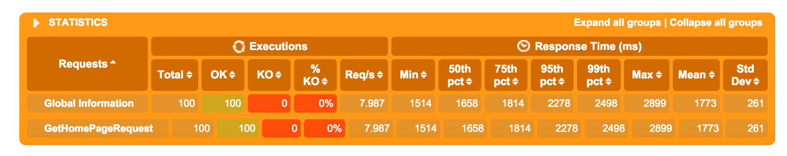
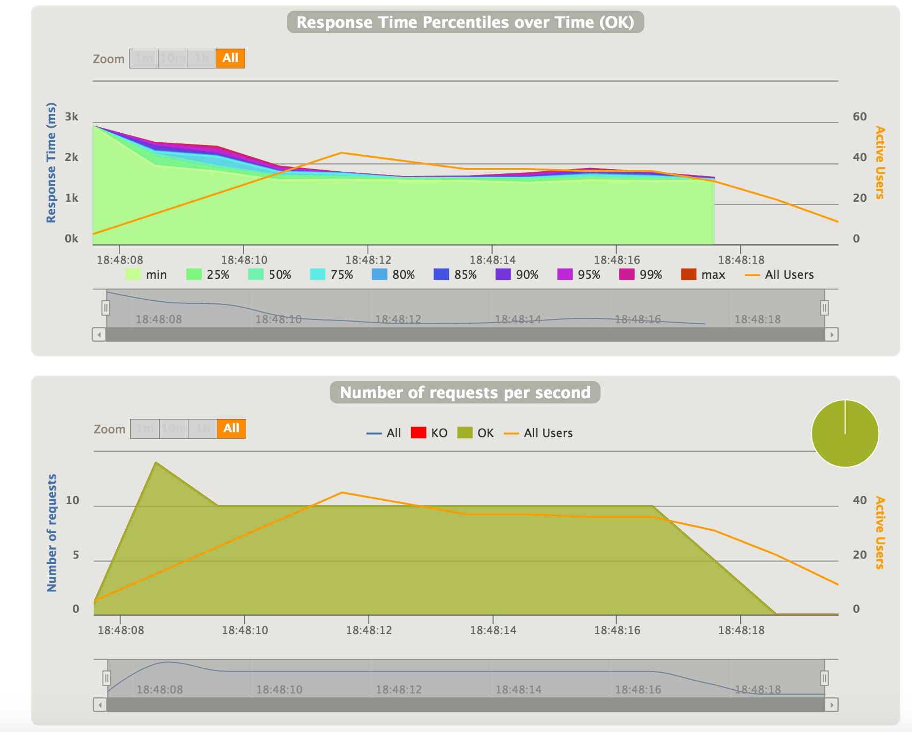

Gatling: The Ultimate Load Testing Tools for Programmers
--------

Welcome to the tenth blog of [52 Technologies in 2016](https://github.com/shekhargulati/52-technologies-in-2016)  blog series. **Gatling** is a high performance open source **load testing** tool built on top of Scala, Netty, and Akka. It is a next generation, modern load testing tools very different from existing tools like Apache JMeter. **[Load testing](https://en.wikipedia.org/wiki/Load_testing)** is conducted to understand behavior of an application under load. You put load on the application by simulating users and measure its response time to understand how application will behave under both normal and anticipated peak load conditions.

Gatling can be used to load test your HTTP server. HTTP is not the only protocol that one can load test with Gatling. Gatling also has inbuilt support for Web Socket and JMS protocols. You can extend Gatling to support your protocol of choice.

Load testing is often neglected by most software teams resulting in poor understanding of their application performance characteristics. These days most software teams take unit testing and functional testing seriously but still they ignore load testing. They write unit tests, integration tests, and functional tests and integrate them in their software build. I think part of the reason developer still don't write load tests has to do with the fact that most load testing tools are GUI based so you can't code your load tests. They allow you to export your load test as XML.

> **This blog is part of my year long blog series [52 Technologies in 2016](https://github.com/shekhargulati/52-technologies-in-2016)**

## Why Gatling?

Gatling is not the only load testing tool. There are many load testing tools both open source and commercial. These includes [Apache JMeter](https://jmeter.apache.org/), [Grinder](http://grinder.sourceforge.net/), [Load Runner](https://en.wikipedia.org/wiki/HP_LoadRunner), and [many other](http://www.opensourcetesting.org/performance.php). Some of the reasons you should choose Gatling are:

1. Most of the traditional load testing tool simulate virtual users using threads. One virtual user is equal to one thread. This approach is not very resource efficient involving a lot of content switching and overhead. Gatling on the another hand uses Akka messages to simulate users. This allows Gatling to simulate thousands of virtual user in a very cheap and efficient way.

2. Gatling is designed asynchronous in nature. It uses Netty to perform non-blocking IO(NIO).

3. A programmatic way to write load tests. Gatling provides a Scala DSL to write performance tests.

4. It produce rich reports that give information in terms of percentile rather than just min, max, and mean.

5. It is extensible in nature so you can add support for protocols of your choice.

6. It has very good build tool support making it very easy plug your load tests in your continuous delivery pipeline.

## Prerequisite

To use Gatling, you need to have at least **JDK7u6** installed on your operating system. We will write Gatling load test scenarios against a WordPress application running on OpenShift. [OpenShift](http://openshift.com/) Online is a Platform-as-a-service solution from Red Hat. It has a free tier that allows developers to build and test 3 applications without any upfront cost. In the free tier, application run inside a gear that is 512MB in RAM size and 1GB in disk space. To create a WordPress application, sign in using your OpenShift account and then go to [https://openshift.redhat.com/app/console/application_type/quickstart!1](https://openshift.redhat.com/app/console/application_type/quickstart!1) to create a WordPress application by giving it a name. Once created, your WordPress application will be running at `https://{app-name}-{domain-name}.rhcloud.com/`. My blog is running at [https://my-shekharblogs.rhcloud.com/](https://my-shekharblogs.rhcloud.com/).

## Using Gatling

Gatling can be used in two ways:

1. You can create a Scala SBT/Maven/Gradle project and write load test scenarios using its Scala DSL. In this blog, we will use SBT. Create a new directory named `blog` on your filesystem and change directory to it. Create a `build.sbt` file and populate it with following content. Now we will write load test scenarios using Gatling Scala DSL. In this blog, we will use this approach. We are adding required Gatling dependencies in the `build.sbt`.
  ```scala
  name := "blog-load-tests"
  version := "0.1.0"

  scalaVersion := "2.11.7"

  libraryDependencies += "io.gatling.highcharts" % "gatling-charts-highcharts" % "2.1.7" % "test"
  libraryDependencies += "io.gatling" % "gatling-test-framework" % "2.1.7" % "test"
  ```
2. The second way to use Gatling is to record test scenarios using Recorder. Recorder is a tool provided with Gatling that allows you to record your actions on a web application and export them as a Gatling scenario. To use it, you have to download the [Gatling bundle](https://repo1.maven.org/maven2/io/gatling/highcharts/gatling-charts-highcharts-bundle/2.1.7/gatling-charts-highcharts-bundle-2.1.7-bundle.zip) and then run `recorder.sh` or `recorder.bat` depending on your operating system.

## Enabling Gatling plugin

In the previous step, we create a SBT project and added Gatling dependencies. Now, we will enable Gatling plugin so that we can execute our Gatling test scenarios. Create `plugins.sbt` inside the `project` directory and populate it with following contents.

```scala
addSbtPlugin("io.gatling" % "gatling-sbt" % "2.1.5")
```

Now, enable plugin by adding following line to `build.sbt`.

```scala
enablePlugins(GatlingPlugin)
```

## Writing your first Gatling scenario

Let's start by writing the first scenario to load test our WordPress application. In our scenario, we will simulate 10 new users accessing our WordPress blog every one second for total of 10 seconds. They all will make a GET request to the home page and pause for 1 second.

Inside `src/test/scala` directory, create a new Scala class `AccessHomePageSimulation` inside the `loadtests` package as shown below.

```scala
package loadtests

import io.gatling.core.Predef._
import io.gatling.http.Predef._
import scala.concurrent.duration._

class AccessHomePageSimulation extends Simulation {

}
```

In the code shown above:

1. We imported all the required imports. The first two import statements imports all the required Gatling classes and traits. The `scala.concurrent.duration` package will be required to specify duration of our test scenarios.
2. We created a Scala class `AccessHomePageSimulation` which extends Gatling `Simulation` abstract class. A simulation represents a load test specification. It describes different scenarios will be executed.

Next, we will write our test scenario as shown below.

```scala
import io.gatling.core.Predef._
import io.gatling.http.Predef._
import scala.concurrent.duration._

class AccessHomePageSimulation extends Simulation {

  val blogHttpConf = http
    .baseURL("https://my-shekharblogs.rhcloud.com")
    .acceptHeader("text/html")
    .userAgentHeader("Mozilla/5.0 (Macintosh; Intel Mac OS X 10_10_5) AppleWebKit/537.36 (KHTML, like Gecko) Chrome/48.0.2564.116")
    .acceptLanguageHeader("en-US,en;q=0.8,pt;q=0.6")

  val scenario1 = scenario("Access Home Page")
    .exec(
      http("GetHomePageRequest")
        .get("/")
        .check(status.is(_ => 200))
    )
    .pause(1)

  setUp(
    scenario1.inject(rampUsers(100) over 10)
  ).protocols(blogHttpConf)

}
```

The code shown above does the following:

1. First, we created the HTTP configuration object that will store request URL and accept headers.
2. Second, we created our scenario which makes a GET request to home page and pause for 1 second.
3. Finally, we simulated our 100 virtual users using `rampUsers` method. We are ramping 100 users over 10 seconds so every one second we will have 10 new users.

If you want to start all the users at once then you can use `atOnceUsers` method as shown below.

```scala
setUp(
  scenario1.inject(atOnceUsers(100))
).protocols(blogHttpConf)
```

You can run the test case using SBT by either running `test` command from within SBT shell or by running `sbt test` command. It will render the test summary on the terminal as shown below.

```
Generating reports...

================================================================================
---- Global Information --------------------------------------------------------
> request count                                        100 (OK=100    KO=0     )
> min response time                                   1514 (OK=1514   KO=-     )
> max response time                                   2899 (OK=2899   KO=-     )
> mean response time                                  1773 (OK=1773   KO=-     )
> std deviation                                        261 (OK=261    KO=-     )
> response time 50th percentile                       1658 (OK=1658   KO=-     )
> response time 75th percentile                       1814 (OK=1814   KO=-     )
> mean requests/sec                                  7.987 (OK=7.987  KO=-     )
---- Response Time Distribution ------------------------------------------------
> t < 800 ms                                             0 (  0%)
> 800 ms < t < 1200 ms                                   0 (  0%)
> t > 1200 ms                                          100 (100%)
> failed                                                 0 (  0%)
================================================================================
```

The output generated above mentions the key point. We can gather that none of the request failed and all of the requests took more than 1200 ms to execute. We can also see the min, max, and mean response times. The most important statistics is the percentile response times. 50% of the requests have response time less than 1658 ms and 75% of the requests have response time less than 1814 ms.

Gatling also generates a HTML report that you can use to drill down on details. The location to the file will be mentioned in the terminal output as shown below.

```
Reports generated in 0s.
Please open the following file: /Users/shekhargulati/52-technologies-in-2016/10-gatling/blog/target/gatling/accesshomepagesimulation-1457270287042/index.html
[info] Simulation AccessHomePageSimulation successful.
[info] Simulation(s) execution ended.
```

The HTML report is generated inside the `accesshomepagesimulation-1457270287042`. You can open the report using your favorite browser. The summary that we saw on the terminal is also mentioned on the web page as shown below.



You can also view response time percentile over time and number of requests per second.



## Conclusion

Gatling is a very valuable tool that can help you discover application bottlenecks. You can use the feedback to improve your application performance. There are many other features of Gatling that I have not covered in this blog like dynamic data using Feeders, using loops to perform repetitive tasks, and checking failures. You can refer to [Gatling documentation](http://gatling.io/docs/2.1.7/advanced_tutorial.html#advanced-tutorial) to learn more.

That's all for this week. Please provide your valuable feedback by posting a comment to [https://github.com/shekhargulati/52-technologies-in-2016/issues/13](https://github.com/shekhargulati/52-technologies-in-2016/issues/13).

[](https://github.com/igrigorik/ga-beacon)
