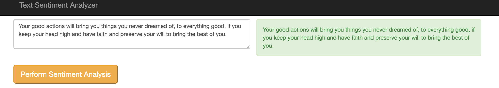
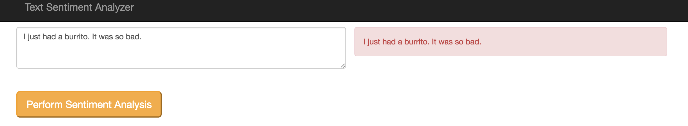
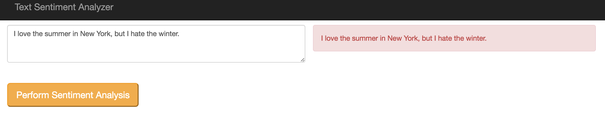

Sentiment Analysis in Python with TextBlob
-----

Welcome to the eleventh blog of [52 Technologies in 2016](https://github.com/shekhargulati/52-technologies-in-2016)  blog series. If you are following this series then you would have probably noticed that I already wrote week 11 blog on [tweet deduplication](https://github.com/shekhargulati/52-technologies-in-2016/tree/master/11-tweet-deduplication). I was not happy with the content so I decide to write another blog for week 11.

In week 11, I decided to spend time to learn about text processing using the Python programming language. We will only focus on Sentiment Analysis in this blog. I have written about sentiment analysis multiple times in last few years. We learnt how to do sentiment analysis in Scala using Stanford CoreNLP in [week 3 blog](https://github.com/shekhargulati/52-technologies-in-2016/tree/master/03-stanford-corenlp). Sentiment analysis gives you the power to mine emotions in text. This can help you build awesome applications that understand human behavior. Few years back, I built an application that helped me decide if I should watch a movie or not by doing sentiment analysis on social media data for a movie. There are many possible applications of Sentiment analysis like understanding customer sentiment for a product by analysis of reviews.

In this blog, I will talk about a Python package called [TextBlob](https://textblob.readthedocs.org/) which can help developers solve understand sentiments in their text. We will first cover some basics, and then we will develop a simple Python Flask application which will use the TextBlob API.

> **This blog is part of my year long blog series [52 Technologies in 2016](https://github.com/shekhargulati/52-technologies-in-2016)**

## What is TextBlob?

In this blog, I will talk about a Python package called [TextBlob](https://textblob.readthedocs.org/en/). TextBlob is an open source text processing library written in Python. It can be used to perform various natural language processing tasks such as part-of-speech tagging, noun-phrase extraction, sentiment analysis, text translation, and many more. You can read about all the features supported by TextBlog in the official [documentation](https://textblob.readthedocs.org/en/).
TextBlob stands on strong shoulders of [NTLK](http://www.nltk.org/), which is the leading platform for building Python programs to work with human language data.

## Prerequisite

To follow this blog, you need to have following on your machine:

1. **Python**: You can download Python executable for your operating system from [https://www.python.org/downloads/](https://www.python.org/downloads/). I will be using Python 2.7.11 version.

2. **Virtualenv**: Virtualenv tool allows you to create isolated Python environments without polluting the global Python installation. This allows you to use multiple Python versions easily on a single machine. Please refer to official documentation for [installation](https://virtualenv.pypa.io/en/latest/installation.html) instructions.

## Github Repository

The code for demo application is available on github at [sentiment-analyzer](./sentiment-analyzer).

## Application

The demo application is running on OpenShift [https://sentimentanalysis-52tech.rhcloud.com/](https://sentimentanalysis-52tech.rhcloud.com/). It is a very simple example of using TextBlob sentiment analysis API. You type the text in the textarea shown in the left and press button, then you will see the text in different color on right. If text color is **Green** then review is positive, if text color is **Red** then review is negative, or it text color is **Orange** then text is neutral.





## Building the application

Open a command line terminal and create a new directory `sentiment-analyzer` and change directory to it.

```
$ mkdir sentiment-analyzer
$ cd sentiment-analyzer
```

Create a new virtualenv and activate it as shown below.

```
$ virtualenv venv --python=python2.7
$ source venv/bin/activate
```

We will use `pip` to install the `textblob` package. After installing the package, we will download the corpora.

```
$ pip install -U textblob
$ python -m textblob.download_corpora lite
```

Next, We will develop a simple Flask application which will expose a REST API. To install the Flask framework, we will again use pip as shown below.

```
$ pip install flask
```

Create a new file called `sentimentanalyzer.py` under the `sentiment-analyzer` directory. Copy the content shown below in `sentimentanalyzer.py`.

```python
from flask import Flask , jsonify, render_template, request
from textblob import TextBlob

app = Flask(__name__)

@app.route('/')
@app.route('/index')
def index():
	return render_template('index.html')

@app.route('/api/sentiment',methods=['POST'])
def sentiment():
	text = TextBlob(request.form['message'])
	response = {'polarity' : text.polarity , 'subjectivity' : text.subjectivity}
	return jsonify(response)

if __name__ == "__main__":
	app.run(debug=True)
```

The code shown above does the following:

1. It imports the Flask class, `jsonify` function, and `render_template` function from `flask` package.

2. It imports the `TextBlob` class from `textblob` package.

3. It defines a route to `/` and `index` url. So, if a user makes a GET request to either `/` or `/index`, then the index.html will be rendered.

4. It defines a route to `/api/sentiment/` url. The is a placeholder and will contain the text message the user want to run sentiment analysis on. We create an instance of TextBlob passing it the message. Next, we get polarity and subjectivity of the message, and then create a json object and return it back.

5. Finally, we start the development server to run the application using the python `sentimentanalyzer.py` command. We also enabled debugging by passing Debug=True. Debugging provides an interactive debugger in the browser when an unexpected exceptions occur. Another benefit of the debugger is that it will automatically reload the changes. We can keep the debugger running in the background and work through our application. This provides a highly productive environment.


The `index()` function renders an html file. Create a new directory called `templates` in the `sentiment-analyzer` directory and then create new file named `index.html`.

```
$ mkdir templates
$ touch templates/index.html
```

Copy the content to the index.html source file which uses Twitter Boostrap to add style. We are also using jQuery to make REST calls on a keyup event.

```html
<html>
<head>
	<title>Sentiment Analyzer: Built using Text Blob</title>
	<meta name="viewport" content="width=device-width, initial-scale=1.0">
	<link rel="stylesheet" type="text/css" href="static/css/bootstrap.css">
	<style type="text/css">
    body {
      padding-top:60px;
      padding-bottom: 60px;
    }
  </style>
</head>
<body>

<div class="navbar navbar-inverse navbar-fixed-top">
      <div class="container">
        <div class="navbar-header">
          <button type="button" class="navbar-toggle" data-toggle="collapse" data-target=".navbar-collapse">
            <span class="icon-bar"></span>
            <span class="icon-bar"></span>
            <span class="icon-bar"></span>
          </button>
          <a class="navbar-brand" href="#">Text Sentiment Analyzer</a>
        </div>

    </div>
  </div>

<div class="container">
	<div class="row">
		<div class="col-md-6">
			<div class="row">
				<textarea class="form-control" rows="3" placeholder="Write text to see sentiment analysis in action. Write minimum 10 charaters and press button."></textarea>
			</div>
			<div class="row">
				<br><br>
				<button class="btn-lg btn-warning">Perform Sentiment Analysis</button>
			</div>
		</div>
		<div class="col-md-6">
			<p id="result"></p>
		</div>
	</div>
</div>

<script type="text/javascript" src="static/js/jquery.js"></script>
<script type="text/javascript">

	$("button").click(function(){
		var messageTxt = $('textarea').val();
		$('#result').removeClass("alert alert-warning");
		$('#result').removeClass("alert alert-danger");
		$('#result').removeClass("alert alert-success");
		if (messageTxt.length > 10){

			$.post('/api/sentiment',{message: messageTxt},function(result){
				if(result.polarity < 0.0){
					console.log('less than 0');
					$('#result').addClass("alert alert-danger")	.text(messageTxt);
				} else if( result.polarity >= 0.0 && result.polarity <= 0.5){
					console.log('between 0 and 0.5');
					$('#result').addClass("alert alert-warning").text(messageTxt);
				}else{
					console.log('Greater than 0.5');
					$('#result').addClass("alert alert-success").text(messageTxt);
				}

});
	}
});
</script>
</body>
</html>
```

## Deploy to OpenShift

To deploy the application on OpenShift, you have to first install its command-line tool `rhc` and then just type the command shown below.

```
$ rhc create-app sentimentanalyzer python-2.7 --from-code https://github.com/shekhargulati/sentiment-analyzer.git --timeout 180
```

It will do all the stuff from creating an application, to setting up public DNS, to creating private git repository, and then finally deploying the application using code from my Github repository.The application will be deployed on http://sentimentanalyzer-{domain-name}.rhcloud.com. Please replace {domain-name} with your account domain name. The app is running here [https://sentimentanalysis-52tech.rhcloud.com/](https://sentimentanalysis-52tech.rhcloud.com/)

-----

That's all for this week. Please provide your valuable feedback by posting a comment to [https://github.com/shekhargulati/52-technologies-in-2016/issues/15](https://github.com/shekhargulati/52-technologies-in-2016/issues/15).

[](https://github.com/igrigorik/ga-beacon)
