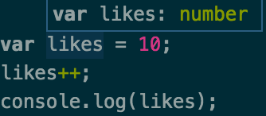
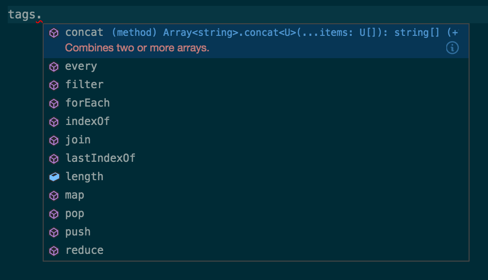
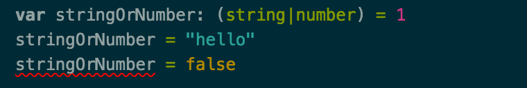

Let's Learn TypeScript
-------

Welcome to seventeenth week of [52 Technologies in 2016](https://github.com/shekhargulati/52-technologies-in-2016) blog series. This week I decided to learn TypeScript so I will discuss how you can get started with TypeScript. [TypeScript](https://www.typescriptlang.org/) is a typed superset of JavaScript, which means that it supports all the JavaScript features plus it adds static typing to the language. TypeScript is transpiled to JavaScript. According to [wikipedia](https://en.wikipedia.org/wiki/Source-to-source_compiler), transpiling is the process of compiling source code written in one programming language into another programming language. **JavaScript is the new byte code**. There are [many programming languages](https://github.com/jashkenas/coffeescript/wiki/list-of-languages-that-compile-to-js) that compile down to JavaScript. MicroSoft is behind the development of TypeScript and one the reason they created TypeScript is to make it easy to build large scale JavaScript applications. The TypeScript compiler is itself written in TypeScript, transcompiled to JavaScript and licensed under the Apache 2 License.

JavaScript as most of you already know is a dynamic typed programming language. This means that type checking is done at runtime. This allows you to rapidly prototype in JavaScript without worrying about type safety. Strong typing or static typing on the other hand perform type checking at the compile time. If you assign number type to a variable then you can't assign anything other than number to that variable else the compile will show error. The advantage of strong typing include better tooling support like auto complete and refactoring.

TypeScript does not take away dynamic nature of JavaScript it allows you to add types to dynamic JavaScript applications.

> **The main reason you should learn TypeScript is that it provides static typing along with making it feasible for you to leverage ES6 and ES7 features today.**

TypeScript allows you to leverage latest JavaScript features defined in ECMAScript 6 and some future features defined in ECMAScript 7 today. Your code can use all the latest features and TypeScript compiler will convert the code to the ECMAScript 5 or ECMAScript 3 code. The reason you have to compile code to previous versions of JavaScript is that most browsers or JavaScript runtimes still don't fully support ECMAScript 6. It will still take few more years before ECMAScript 6 will be the default JavaScript version everywhere.

Every piece of JavaScript code is a valid TypeScript code. You can take any JavaScript file and rename its extension from `.js` to `.ts` and voila you have a valid TypeScript code.

TypeScript makes use of Type Inference to determine type of an expression from its context. Even if you have not specified any type annotation in your TypeScript code TypeScript in some cases can figure types. For example, if a method return a number then TypeScript knows that this method returns a number and then it can use that information when you are calling that function.

## Example Domain

Throughout this tutorial, we will base our examples on story submission website like HackerNews. There is one entity in our application `Story` that we will use.

## Basic Types

TypeScript supports three basic types -- **boolean**, **number**, **string**.

----

You can declare a `number` as shown below. Just like JavaScript numbers are floating point values.

```ts
var votes = 10;
votes++;
console.log(votes); // prints 11
```

As you can see above, we have use `number` type annotation to denote that `likes` is a number. If you don't put `number` type annotation then TypeScript will use type inference to determine type that `likes` is a number. Visual Studio code will show the type if you hover over the variable.



---

The second basic type supported by TypeScript is boolean. boolean is a type with only two valid values -- **true** and **false**.

```typescript
var visible: boolean = true;
let storyExists:boolean = false;
```

-----

The third basic type supported by TypeScript is `string`. You can either use single quote `'` or double quote `"` for strings

```typescript
let title: string = "Learning TypeScript";
let description: string = 'Learning TypeScript Today!'
```

As you can see above, we are using `let`, which is part of ECMAScript 6. We can use ECMAScript 6 features with TypeScript.

> **`let` allows you to declare variables that are limited in scope to the block, statement, or expression on which it is used. This is unlike the `var` keyword, which defines a variable globally, or locally to an entire function regardless of block scope.**

The code when converted to ECMAScript 5 removes all the latest features and type annotations and looks like idiomatic JavaScript that you would have written by hand.

```javascript
var likes = 10;
likes++;
console.log(likes);
var isActive = true;
var usernameExists = false;
var username = "shekhargulati";
var fullname = 'Shekhar Gulati';
```

## Using template literals

ECMAScript 6 introduced template literals which allow you to embed expressions in your strings. They are very useful when you are building dynamic strings as shown below. You can use template literals with your TypeScript code.

```typescript
let title: string = "Learning TypeScript";
let fullname = "Shekhar Gulati"
let summary = `${fullname} is ${title} this weekend.`
```

This gets converted to following ECMAScript 5 code.

```javascript
var title = fullname + " is learning " + topic + " this weekend.";
```

## Typed and Generic Arrays

In TypeScript, you can either create typed arrays or generic arrays. Typed Arrays are created like as shown below.

```typescript
var tags: string[] = ["javascript","programming"]
tags.push("typescript")
tags.forEach(function(tag){
    console.log(`Tag ${tag}`)
});
```

As TypeScript knows you are working with Array it will only show you methods applicable to Arrays when you use code completion.



The second way to create arrays is using generic array type.

```typescript
let storyLikedBy: Array<number> = [1,2,3]
```

Both array declarations generate same JavaScript code.

## Enums

If you have used programming language like Java or C# then you would have used enum. An `enum` allows you to define a set of predefined constants.

```typescript
enum StoryType {Video, Article, Tutorial}
let st:StoryType = StoryType.Article
```

ECMAScript 5 code for the enum is shown below. As you can see, enum start with number value 0.

```javascript
var StoryType;
(function (StoryType) {
    StoryType[StoryType["Video"] = 0] = "Video";
    StoryType[StoryType["Article"] = 1] = "Article";
    StoryType[StoryType["Tutorial"] = 2] = "Tutorial";
})(StoryType || (StoryType = {}));
var st = StoryType.Article;
```

You can specify your own enum numbering as well.

```typescript
enum StoryType {Video = 10, Article = 20, Tutorial=30}
```

## Tuple

Tuple types allow you to express an array of values of different known types. As shown below, we are mapping over an array of `string` titles and converting it to a tuple of `[string, number]`.

```typescript
let storyTitles = ["Learning TypeScript", "Getting started with TypeScript","Building your first app with TypeScript"]
let titlesAndLengths : [string, number][] = storyTitles.map(function(title){
    let tuple: [string, number]  = [title, title.length]
    return tuple
})
```

## Any

When you are working with third party code or want to opt-out of static typing then you can use `Any` type.

```
var dontKnow: any = {}
dontKnow = "abc"
dontKnow = 1
```

## Union types

In TypeScript, you can specify that a variable is either of one type or another. For example, if we have a variable `stringOrNumber` that can be either a string or number then we can write it like as shown below.

```typescript
var stringOrNumber: (string|number) = 1
stringOrNumber = "hello"
```

If we try to assign a boolean then it will show error as shown below.



## Functions

You declare functions in the same way you declare them in JavaScript with additional information of types.

```typescript
var stories: [string, string[]][] = []

function addStory(title: string, tags: string[]): void {
    stories.push([title, tags])  
}
```

The generated ECMAScript 5 code is shown below.

```javascript
var stories = [];
function addStory(title, tags) {
    stories.push([title, tags]);
}
```

### Lambda expression

From ECMAScript 6, you can write inline lambda expressions in JavaScript. TypeScript also allows you to write lambda expressions as shown below.

```typescript
var tags: string[] = ["javascript","programming"]
let tagLengths: number[] = tags.map(tag => tag.length)
```

Sorting tags by their length

```typescript
tags.sort((tag1, tag2) => tag1.length - tag2.length)
```

We can refactor the above to use function types as shown below.

```typescript
let sortByLength: (x: string, y: string) => number = (x, y) => x.length - y.length
tags.sort(sortByLength)
```

Functions are first class citizen. The following TypeScript functions will all produce same JavaScript function declarations.

```typescript
let sortByLength1 = function(x:string, y:string): number {
    return x.length - y.length
}

let  sortByLength2 = function(x:string, y:string){
    return x.length - y.length
}  

let  sortByLength3 = (x: string, y: string) :  number => {
    return x.length - y.length
}

let  sortByLength4 = (x: string, y: string) :  number => {
    return x.length - y.length
}

let  sortByLength5 = (x: string, y: string) =>  x.length - y.length


let sortByLength6: (x: string, y: string) => number = (x, y) => x.length - y.length
tags.sort(sortByLength6)
```

### Optional and default values

You can define a function has an optional value by using `?:` syntax.

```typescript
function storySummary(title:string, description?: string) {
    if(description){
        return title + description;
    }else{
        return title;
    }

}
```

You can also use default values.

```typescript
function storySummary(title:string, description: string = "") {
    return title + description;
}
```

## Interfaces

In TypeScript, interfaces are used to define contract for value objects and behavior. TypeScript is based on `structural typing`, in which type compatibility and equivalence are determined by the type's actual structure or definition, and not by other characteristics such as its name or place of declaration. Let's look at Story interface shown below.

```typescript
interface Story {
    title: string;
    description ?: string;
    tags : string[]
}
```

Now, any object that define `title` and `tags` properties will be treated as a valid implementation of `Story` interface.

```typescript
let story1:Story = {title:"Learning TypeScript", tags:["typescript","learning"]}
```

Interfaces can also define functions.

```typescript
interface StoryExtractor {
    extract(url:string): Story
}

let extractor:StoryExtractor = {extract: url => story1}
```

This can also be written like.

```typescript
interface StoryExtractor {
    (url:string): Story
}

let extractor:StoryExtractor = url => story1
```

## Classes

Starting with ECMAScript 2015, also known as ECMAScript 6, JavaScript programmers will be able to build their applications using this object-oriented class-based approach.

```typescript
class TextStory implements Story{
    title:string
    tags: string[]

   static storyWithNoTags(title:string): TextStory {
       return new TextStory(title, [])
   }
    constructor(title:string, ...tags){
        this.title = title;
        this.tags = tags     
    }

   summary (){
       return `TextStory ${this.title}`
   }

}

let story = TextStory.storyWithNoTags("Learning TypeScript")
```

You can follow common object-oriented design patterns like inheritance as shown below.

```typescript
class TutorialStory extends TextStory {
    constructor(title:string, ...tags){
        super(title, tags)
    }

    summary(){
        return `TutorialStory: ${this.title}`
    }
}
```

You can also define abstract classes in TypeScript as shown below.

> **Abstract classes are base classes from which other classes may be derived. They may not be instantiated directly. Unlike an interface, an abstract class may contain implementation details for its members. The abstract keyword is used to define abstract classes as well as abstract methods within an abstract class.**

```typescript
abstract class StoryProcessorTemplate {
    public process(url: string): Story {
        var title: string = this.extractTitle(url)
        var text: string = this.extractText(url)
        var tags: string[] = this.extractTags(text)
        return {
            title : title,
            tags : tags
        }
    }

    abstract extractTitle(url:string): string

    abstract extractText(url:string): string

    abstract extractTags(url:string): string[]
}
```

## Module

Until now, JavaScript had no support for modules. With ECMAScript 6, JavaScript will natively support modules. Each module is defined in its own file. The functions or variables defined in a module are not visible outside unless you explicitly export them. The code snippet shown below declares a module `StoryApp` and exports a class `StoryManager` that clients can use.

```typescript
module StoryApp{
    export class StoryManager{
        addStory(){}
        removeStory(){}
    }
}

let manager = new StoryApp.StoryManager()
manager.addStory()
```

You can also import a module and use alias for them.

```
import s = StoryApp
let manager = new s.StoryManager()
manager.addStory()
```

or you can directly import `StoryManager` class as shown below.

```typescript
import SM = StoryApp.StoryManager
let manager = new SM()
manager.addStory()
```

## Generics

TypeScript also supports Generics which allows you to write components that work over various types.

Let's suppose we want to write a function that works on any type that has length function but we want to make sure both arguments are compatible.

```typescript

interface HasLength{
    length: number
}

function addLengths<T extends HasLength>(t1: T, t2: T):number {
    return t1.length + t2.length;
}

addLengths("hello","abc")
addLengths([1,2,3],[100,11,99])
```

You can also use Generics with interfaces and classes as shown below.

```typescript
interface Textable{
    text:string
}

interface Message<T extends Textable>{
    content: T

    msg(): string
}
```

```typescript
class Pair<T>{
    fst: T
    snd:T
}
```

-----

That's all for this week.

Please provide your valuable feedback by posting a comment to [https://github.com/shekhargulati/52-technologies-in-2016/issues/22](https://github.com/shekhargulati/52-technologies-in-2016/issues/22).

[](https://github.com/igrigorik/ga-beacon)
