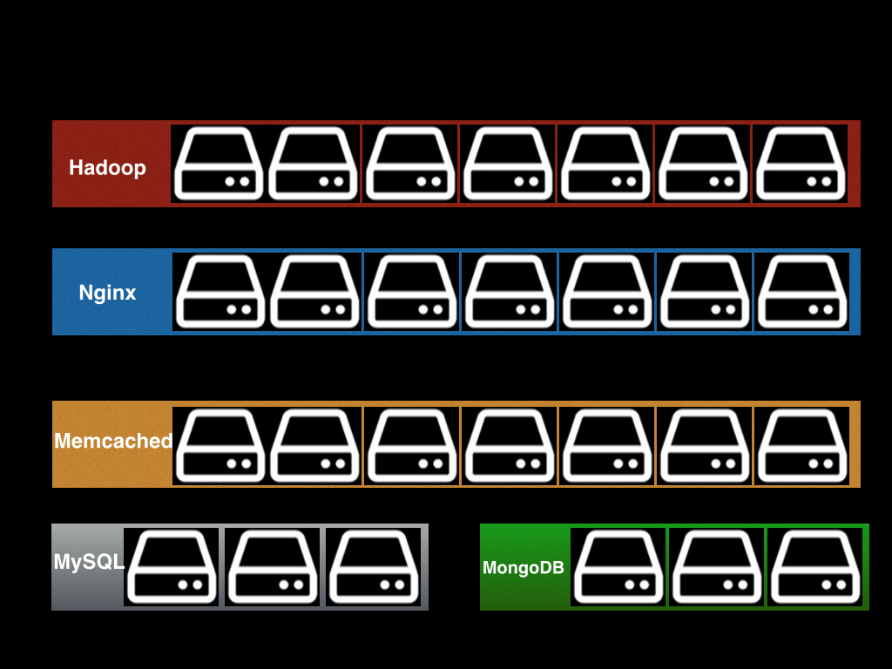
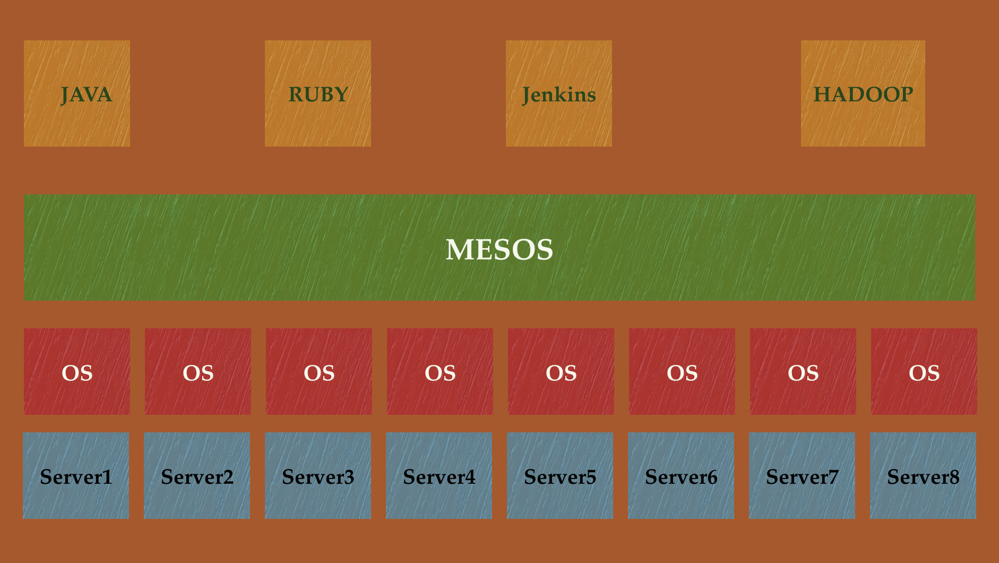
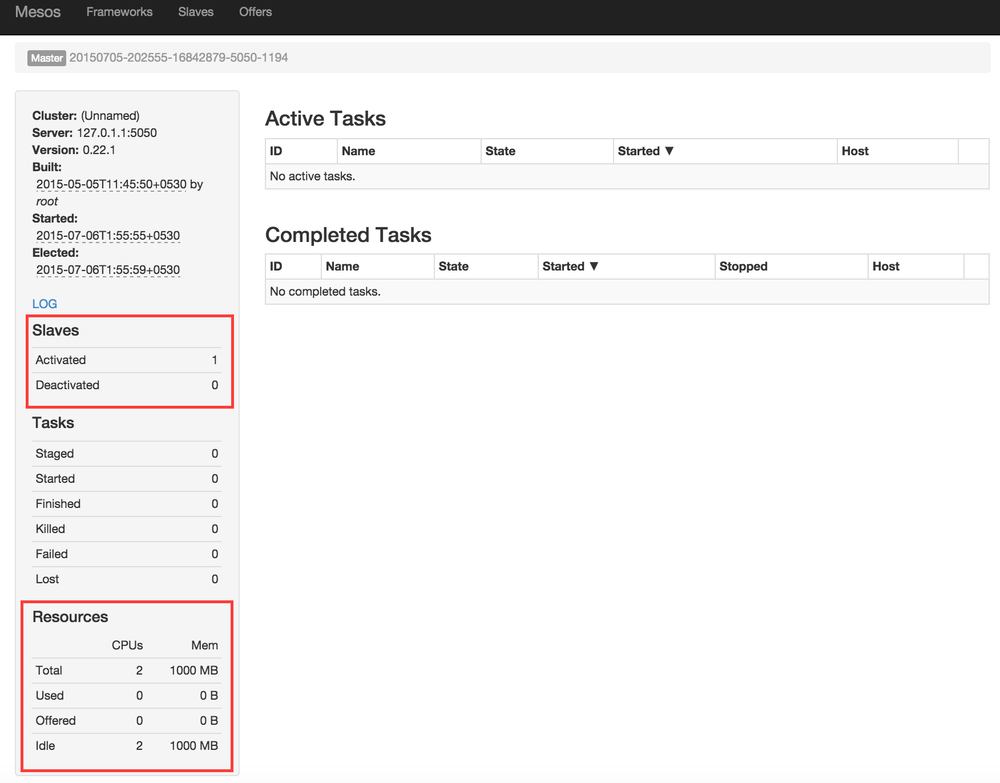
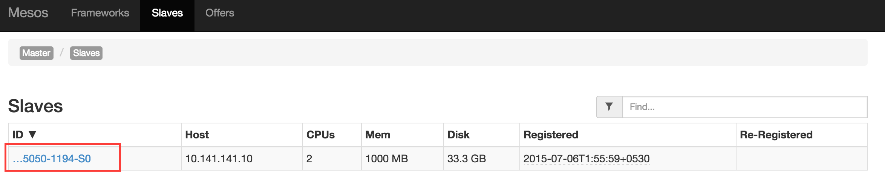
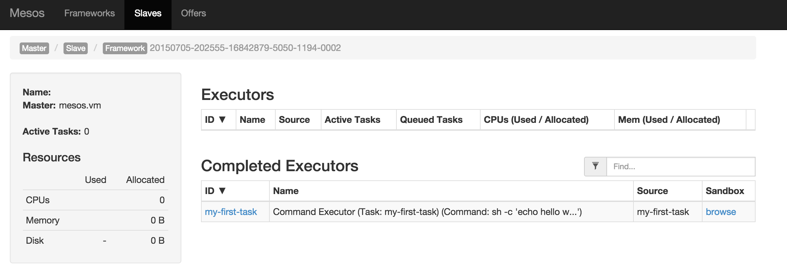

Getting Started with Apache Mesos
----

Welcome to eighteenth week of [52 Technologies in 2016](https://github.com/shekhargulati/52-technologies-in-2016) blog series. This week we will learn about [Apache Mesos](http://mesos.apache.org/) -- an open source cluster manager and scheduler for your datacenter. We will begin this series with an introduction of Apache Mesos covering why it exists and what it can do for us. After covering the why and what of Apache Mesos, we will install Mesos inside a [Vagrant box provided by Mesosphere](https://github.com/mesosphere/playa-mesos) and use it.

## Lets go down the memory lane##

Back in 1950's when computers were a luxury and very expensive it was not possible to use a computer for multiple tasks as the same time. Only one user can work on a computer and run a single application. Then, a brilliant computer scientist named [John McCarthy](https://en.wikipedia.org/wiki/John_McCarthy_(computer_scientist)) came up with an idea ***Lets all share the same computer at the same time.***. He along with his students popularized a concept called **Time-sharing**, which allowed multiple users to concurrently interact with a single computer by means of multi-threading and multi-tasking. So, now a computer was sharing its resources with multiple applications allowing multiple users to work with a computer concurrently, hence dramatically lowering the cost of computing capability.

## Then came the web

For significant part of the computing history, applications used to run on single machines, then with the advent of web applications, the applications started becoming more distributed. We all have seen application architectures in which one machine running web server and another server running a database. One server architecture started getting out of steam so we started buying bigger and bigger boxes to handle the load but it had its limits so a paradigm shift happened and we started running multiple copies of the servers. So, now we typically have multiple web servers talking to a replicated and/or sharded database clusters.

## Current state of datacenter

These days web architectures are becoming more and more complicated with multiple components like web server clusters, application server clusters, database clusters, caching clusters, analytics clusters using tools like Hadoop, etc. A simple datacenter architecture is shown below.



This kind of datacenter architecture is called **Statically Partitioned datacenter**. They are called static partitioned datacenter because your datacenter is a group of static clusters -- hadoop cluster, nginx cluster, and so on.

## Limitations of static partitioning

There are multiple Limitations of traditional datacenter architecture. Some of these are mentioned below.

1. **Under utilization of resources**

2. **Not possible to share resources across clusters**

3. **No centralized view of entire datacenter**

4. **Scale up leads to addition of more servers**


## Apache Mesos

In 2009, Benjamin Hindman along with his fellow PhD students at University of California, Berkeley created Mesos to solve the problem of statically partitioned datacenter by providing a cluster manager and scheduler. The goal was to create a software that will abstract CPU, memory, and disk resources in a way that allows modern datacenter to function like one large machine. It provides a unified API that allow users to work with the datacenter as a single pool of resources. Mesos was later open sourced and donated to Apache software foundation.  Mesos is now a [top level Apache project](http://mesos.apache.org/) and used by many [organizations](http://mesos.apache.org/documentation/latest/powered-by-mesos/) around the world, biggest user being Twitter. Twitter along with Mesosphere and Airbnb are biggest users and contributors to Apache Mesos.

A 10000 feet view of Mesos is shown below. You have server 1..N with a linux based operating system. On each server you have Mesos installed, which gives a feel that all the servers are just one machine that runs multiple applications like Java web applications, Jenkins slaves, hadoop clusters, etc.



Mesos makes your datacenter multi-tenant in nature allowing multiple applications to work on the same machine. Applications define what resources they need and mesos place them on machines that can fulfill their needs. This leads to efficient utilization of resources.

Mesos is used for building highly distributed applications like Hadoop analytics cluster or real time analytics systems based on Apache Storm or Apache Spark.

Mesos, itself is highly distributed and fault-tolerant system. A Mesos cluster has a master, zero or more standby masters for fault tolerance, one or more slaves, one or more zookeeper instances for master selection and coordination.


* **Mesos Master**: Master manages the slave daemons running on each server.

* **Mesos Slave**: They are work horses that do the actual work i.e. execute tasks. A mesos slave is installed on each server/node and share its resource information with master periodically.

## Getting Started with Mesos

There are multiple ways to get started with Mesos. Lets discuss each one of them.

1. Setting up Mesos on your operating system by following the documentation. This is the option for people who like to copy commands from a web page and paste on their terminal. All the steps are mentioned here http://mesos.apache.org/gettingstarted/. It basically goes through downloading Mesos bundle, installing packages for different operating system, updating few configuration files, and then starting services.

2. Second option is to use Mesos on your operating system is by running Mesos inside a virtual machine using Vagrant. Mesosphere provides a Vagrant box that installs Mesos master, slave, and zookeeper instance inside a single virtual machine. This is a free, stupid, and cheap way to try Mesos. In today's blog, we will use this option.

3. Third option is to launch Mesos on a cloud provider like AWS. [Mesos bundle](http://mesos.apache.org/downloads/) available on Mesos website contains a Python script that can launch Mesos cluster on different cloud provider. We will cover this later in this series.

### Launching Mesos Vagrant box

In this blog, we will use the second option to get our hands dirty with Apache Mesos. Before you can do that you need to make sure following prerequisite are met.

**Prerequisite**

1. Download and install Git on your operating system. You can download installer for your operating system from https://git-scm.com/downloads.

2. Download and install Vagrant on your operating system. You can download installer for your operating system from https://www.vagrantup.com/downloads.html


After you are down with installing prerequisites on your machine clone the [playa-mesos Git repository](https://github.com/mesosphere/playa-mesos) on your machine and change directory to `playa-mesos` directory.

```
$ git clone git@github.com:mesosphere/playa-mesos.git
$ cd playa-mesos
```

Next, launch the virtual machine using the `vagrant up` command. This will download the vagrant box, start all the required services, and configure SSH access to the virtual machine. You will see output like the one shown below.

```
→ vagrant up
Bringing machine 'default' up with 'virtualbox' provider...
==> default: Importing base box 'playa_mesos_ubuntu_14.04'...
==> default: Matching MAC address for NAT networking...
==> default: Setting the name of the VM: playa_mesos_ubuntu_14.04
==> default: Clearing any previously set network interfaces...
==> default: Preparing network interfaces based on configuration...
    default: Adapter 1: nat
    default: Adapter 2: hostonly
==> default: Forwarding ports...
    default: 22 => 2222 (adapter 1)
==> default: Running 'pre-boot' VM customizations...
==> default: Booting VM...
==> default: Waiting for machine to boot. This may take a few minutes...
    default: SSH address: 127.0.0.1:2222
    default: SSH username: vagrant
    default: SSH auth method: private key
    default: Warning: Connection timeout. Retrying...
==> default: Machine booted and ready!
==> default: Checking for guest additions in VM...
==> default: Configuring and enabling network interfaces...
==> default: Mounting shared folders...
    default: /vagrant => /Users/abc/7-days-with-mesos/playa-mesos
```

The virtual machine is running master, slave, and zookeeper on a single machine. The virtual machine is allocated with 2048MB memory and 2 CPU cores. This configuration is defined in `config.json` file. The virtual machine is given a private IP address `10.141.141.10`, which is also defined inside `config.json` file.

Mesos master comes with a web interface that gives you a view of your entire datacenter. You can view the web interface for our single node Mesos at http://10.141.141.10:5050/



The web interface shown above is divided into different sections. The **Slaves** section on the left shows that their is one active slave and **Resources** on the left bottom shows that total resources available are 2 cores and 1000MB of memory. The slave is allocated 1000MB because master and zookeeper are also running on the same virtual machine. So far we have not executed any task so **Active Tasks** and **Completed Tasks** sections are empty. You can view all the slaves by clicking **Slaves** http://10.141.141.10:5050/#/slaves in the top navigation bar.



You can drill into a specific slave by clicking the UUID of the slave, which is a link. This will show details of a single slave and details about all the tasks processed by that slave.

### Executing a simple task

Lets now make our single node Mesos cluster do some work. SSH into the vagrant box using `vagrant ssh` command.

```bash
→ vagrant ssh
Welcome to Ubuntu 14.04.2 LTS (GNU/Linux 3.16.0-30-generic x86_64)

 * Documentation:  https://help.ubuntu.com/
Last login: Mon Jun  8 23:07:59 2015 from 10.0.2.2
vagrant@mesos:~$
```

Once you are inside the virtual machine, you can execute a task on Mesos cluster using the `mesos-execute` script as shown below. The task shown below will echo `hello world` on `stdout` and then sleep for 10 seconds.


```bash
$ mesos-execute --master="127.0.1.1:5050" --name="my-first-task" --command="echo hello world && sleep 10" --resources="cpus:1;mem:128"
```

The output of the above command is shown below.

```
I0705 21:09:46.693713  1771 sched.cpp:157] Version: 0.22.1
I0705 21:09:46.695086  1777 sched.cpp:254] New master detected at master@127.0.1.1:5050
I0705 21:09:46.695516  1777 sched.cpp:264] No credentials provided. Attempting to register without authentication
I0705 21:09:46.697149  1779 sched.cpp:448] Framework registered with 20150705-202555-16842879-5050-1194-0004
Framework registered with 20150705-202555-16842879-5050-1194-0004
task my-first-task submitted to slave 20150705-202555-16842879-5050-1194-S0
Received status update TASK_RUNNING for task my-first-task
Received status update TASK_FINISHED for task my-first-task
I0705 21:09:56.799959  1777 sched.cpp:1589] Asked to stop the driver
I0705 21:09:56.799985  1777 sched.cpp:831] Stopping framework '20150705-202555-16842879-5050-1194-0004'
```

Now if you go to Mesos web interface and navigate to the slave, you will see that slave processed our `my-first-task` as shown below.



## How Mesos works?

1. Mesos Slave offers resources to Mesos master the form of resource offers
2. Mesos master scheduler decides which framework to offer resources to.
3. Spark scheduler decides whether it needs the resources. In this case it does not accept the offer
4. User submits a spark job and Spark scheduler accepts it and wait for resource offer
5. It accepts a resource offer from master and launches tasks on slaves.


-----

That's all for this week.

Please provide your valuable feedback by posting a comment to [https://github.com/shekhargulati/52-technologies-in-2016/issues/23](https://github.com/shekhargulati/52-technologies-in-2016/issues/23).

[](https://github.com/igrigorik/ga-beacon)
