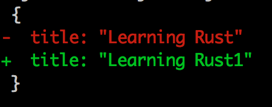

5 open source projects that will make working with JSON awesome and fun
-------

Welcome to twentieth week of [52 Technologies in 2016](https://github.com/shekhargulati/52-technologies-in-2016) blog series. This week I will share my 5 favorite open source projects that makes working with JSON easy and fun. I use them on regular basis and find them very useful whenever I am working with JSON. JSON (JavaScript Object Notation) is the most popular data-interchange format. Most of the REST APIs produce and consume JSON, there are many databases that either directly stores JSON or store JSON in binary format, we even have tools and frameworks that use JSON files for configuration.

Let's get started.

## Project 1: [json-server](https://github.com/typicode/json-server)

[json-server](https://github.com/typicode/json-server) is an easy to use fake REST API server. I used `json-server` for the first time while I was working on a prototype during a hackathon. I was building a product that needs to get data from the SITA(API platform for air transport industry) API. Only airlines are allowed to get data from the SITA API so I used json-server to render the fake data. This allowed me to work as if I was working with a SITA server.

`json-server` is a `node.js` application so you will need node and `npm` installed on your machine. Once you have prerequisite installed, you can install `json-server` by typing the following command.

```
$ npm install -g json-server
```

Create a `JSON` file with fake data. In the example shown below, we are trying to fake a task management application that has two entities - `TaskList` and `Task`.

```js
{
  "tasklists": [
    {
      "id": 1,
      "name": "Todo"
    },
    {
      "id": 2,
      "name": "In Progress"
    },
    {
      "id": 3,
      "name": "Done"
    }
  ],
  "tasks": [
    {
      "id": 1,
      "name": "Write week 20 blog on json-server",
      "tasklistId": 1
    },
    {
      "id": 2,
      "name": "Read Machine Learning in Action book",
      "tasklistId": 2
    },
    {
      "id": 3,
      "name": "Release strman libray",
      "tasklistId": 3
    }
  ]
}
```

Now, you can start the `json-server` using the following command.

```
$ json-server --watch db.json
```

If you add more data to the `db.json` it will be automatically picked. You can view the exposed endpoints by going to [http://localhost:3000/](http://localhost:3000/). You will see it has exposed two resources -- [tasklists](http://localhost:3000/tasklists) and [tasks](http://localhost:3000/tasks).

> **By default, json-server will be listening to port number 3000. If you want to change the port number then you can use `port` option `json-server --watch db.json --port 8000`.**

You are not limited to `GET` requests only, you can make `POST`, `DELETE`, `PUT` requests as well.

You can make `cURL` request to fetch all the tasks.

```
$ curl -i http://localhost:3000/tasks
```

To learn more about `json-server` please refer to its [documentation](https://github.com/typicode/json-server).

## Project 2: [jq](https://stedolan.github.io/jq/)

According to `jq` [documentation](https://stedolan.github.io/jq/),

> **jq is like `sed` for JSON data - you can use it to slice and filter and map and transform structured data with the same ease that `sed`, `awk`, `grep` and friends let you play with text.**

You can download `jq` for your operating system from the [website](https://stedolan.github.io/jq/download/). On Mac OS X, you can use brew package manager as shown below.

```
$ brew install jq
```

Let's see what we can do with `jq`. We will use the REST API exposed by `json-server`. You can use `jq` to pretty print JSON response. You use a tool like cURL to fetch the data and pipe it to `jq` as shown below.


As you can see in the output above, `jq` formatted the JSON response and syntax highlighting is applied.

`jq` can do much more than formatting and syntax highlighting your JSON. You can use it extract data from the JSON. Let's suppose we only want JSON response to contain `name` then we can use follwing command.

```
$ curl 'http://localhost:3000/tasks' | jq '.[] | {name:.name}'
```

```json
{
  "name": "Write week 20 blog on json-server"
}
{
  "name": "Read Machine Learning in Action book"
}
{
  "name": "Release strman libray"
}
```

The `jq` command shown above returns all the JSON documents with only `name` field.

You can also limit the result. Let's suppose we only want 2 tasks then we can execute following command.

```
$ curl 'http://localhost:3000/tasks' | jq '.[0:2]?' | jq '.[] | {name:.name}'
```

```js
{
  "name": "Write week 20 blog on json-server"
}
{
  "name": "Read Machine Learning in Action book"
}
```

There is much more that you can do with `jq`. Please refer to the [documentation](https://stedolan.github.io/jq/manual/) for more information.

## Project 3: [jarg](https://github.com/jdp/jarg)

[jarg](https://github.com/jdp/jarg) is a Python utility that you can use to write JSON. To install `jarg`, you can use the following pip command.

```
$ pip install jarg
```

Then, you can create json documents on the fly as shown below.

```
$ jarg title="Learning Rust" id=1
```

```js
{"id": 1, "title": "Learning Rust"}
```

We can use `jq` to format our JSON as shown below.

```
$ jarg title="Learning Rust" id=1 | jq "."
```

```js
{
  "id": 1,
  "title": "Learning Rust"
}
```

## Project 4: [json-diff](https://github.com/andreyvit/json-diff)

There are times when we have to diff two json files. [json-diff]
(https://github.com/andreyvit/json-diff) is a node module that just does that. You can install it using npm.

```
$ npm install -g json-diff
```

Let's create two json.

```js
$ jarg title="Learning Rust" id=1 | jq "." >> a.json

$ jarg title="Learning Rust1" id=1 | jq "." >> b.json
```

Now, you can use json-diff as shown below.

```
$ json-diff a.json b.json
```



## Project 5: [json2csv](https://github.com/jehiah/json2csv)

There are many tools that understand CSV better than JSON so you have to convert JSON to CSV. I use [json2csv](https://github.com/jehiah/json2csv) Go package to achieve that. To use it, you need Go installed. Then you can install `json2csv` using the following command.

```
$ go get github.com/jehiah/json2csv
```

To convert a json to csv, you will run following command.

```
$ cat data.json | json2csv -k title,id > result.csv
```


-----

That's all for this week.

Please provide your valuable feedback by posting a comment to [https://github.com/shekhargulati/52-technologies-in-2016/issues/25](https://github.com/shekhargulati/52-technologies-in-2016/issues/25).

[](https://github.com/igrigorik/ga-beacon)
