Making Sense of Regular Expressions
-----

Welcome to the twenty second blog of [52-technologies-in-2016](https://github.com/shekhargulati/52-technologies-in-2016) blog series. This week I wanted to write about speech recognition but end up learning regular expressions. Regular Expressions or Regex allows you to define patterns to match text. For example, you can write a regular expression `[Ss]hekh?ar` which will match `Shekhar, shekhar, Shekar, or shekar`. I am programming for last eleven years but I was never comfortable with regular expressions. Whenever I see a relatively complicated regular expression, I don't understand how to break it into smaller pieces to make sense of it. So, I decided to learn about regular expressions. In this tutorial, I will walk you through a series of examples that will help you learn about regular expressions. I will end this tutorial by covering a library [VerbalExpressions](https://github.com/VerbalExpressions) that you can use to programmatically build regular expressions. VerbalExpressions is implemented in most of the commonly used programming languages so you can use it with your favorite programming language.


## Why [Ww]e|[Ii] don't get regular expressions?

I think there are two reasons why I never understood regular expressions.

1. You can easily google for common regular expressions so you don't spend time learning about them.

2. Although regular expressions are composable in nature but because we don't understand them well enough we are unable to break them into smaller pieces and understand them. You can always understand a complicated problem by breaking it into smaller easy to understand components.

3. A lot of time developers abuse regular expressions by using them at places where different solution will be better. There are even jokes on regular expressions. You can read about more jokes on regular expressions [here](http://www.rexegg.com/regex-humor.html).

  > **Some people, when confronted with a problem, think "I know, I'll use regular expressions." Now they have two problems.**

## Regular expressions history

Yes, regular expressions too have their history. Regular expression originated in 1956 when an American Mathematician [Stephen Kleene](https://en.wikipedia.org/wiki/Stephen_Cole_Kleene) was working on formalizing Regular languages. **Computer Science borrows most of the good ideas from Mathematics. Mathematicians has biggest impact on computer science.** Regular language is any language that can be expressed using regular expressions. First application of regular expression was an editor named QED developed by Ken Thompson. Regular expressions are present in every programming language and most of the *nix tools make use of them like `find`, `grep`, etc.


## Regular expression applications

There are many applications of regular expressions. Some of them are mentioned below:

1. Form validation
2. Find and replace
3. Text transformation
4. Log Processing

## Regular expression in action

To learn regular expression, we will learn how to write a pattern that will match all the possible spellings of `Gaddafi`.  [Muammar Gaddafi](https://en.wikipedia.org/wiki/Muammar_Gaddafi) was a Libyan revolutionary, politician, and political theorist. I found this example in a [Stack Overflow question](https://stackoverflow.com/questions/5365283/regular-expression-to-search-for-gadaffi). As per the stackoverflow post, there are 30 possible spellings of Gaddafi as shown below.

```
Gadaffi Gadafi Gadafy Gaddafi Gaddafy Gaddhafi Gadhafi Gathafi Ghadaffi Ghadafi Ghaddafi Ghaddafy Gheddafi Kadaffi Kadafi Kaddafi Kadhafi Kazzafi Khadaffy Khadafy Khaddafi Qadafi Qaddafi Qadhafi Qadhdhafi Qadthafi Qathafi Quathafi Qudhafi Kad'afi
```

I use [https://www.regexpal.com/](https://www.regexpal.com/), an online tool to test regular expressions.

### Spelling 1: Matching `Gadaffi`

Let's start by matching the first spelling `Gadaffi`. To match this spelling, we can simply use `/Gadaffi/g` as our regular expression as shown below.

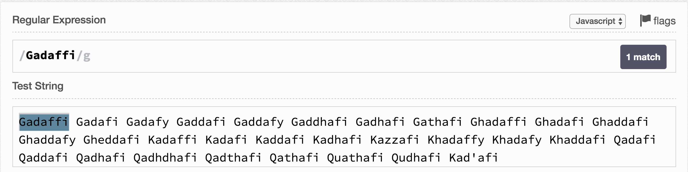

By default, matching is case-sensitive so `Gadaffi` and `gadaffi` are different. You can use flag `\i` to make search case-insensitive.

### Spelling 2: Matching `Gadafi`

The first and second spelling differ with each other in number of `f`. `Gadaffi` has two `f`s and `Gadafi` has one. We can define these using quantifier like `/Gadaf{1,2}i/g`. The `{1,2}` tell the regular expression processor that there could be minimum 1 `f` and maximum 2 `f` in the search text. The braces are considered metacharacters.

![](images/regex-2.png

Rather than defining a range like `{1,2}`, you can also define fixed values like `f{5}` which means there should be 5 `f` in the search text. Also, you upper limit can be open like `{2,}` which will mean 2 and above.

There are shorthand notation for common quantifier mentioned below:

`*` = `{0,}`, zero or more

`+` = `{1,}`, one or more

`?` = `{0,1}`, optional

### Spelling 3: Matching `Gadafy`

The second and third spellings differ only in the last character -- `i` or `y`. In regular expression, you can define a set and any of the value in the set will be selected. The regular expression `/Gadaf{1,2}[iy]/g` means last character could be either `i` or `y`.

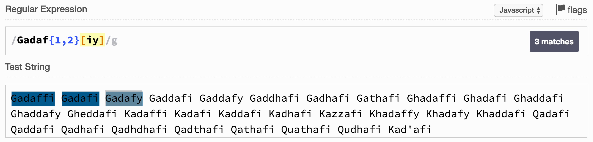

### Spelling 4-5: Matching `Gaddafi` and `Gaddafy`

We can match fourth and fifth spellings very easily by applying quantifiers to `d` as shown below.

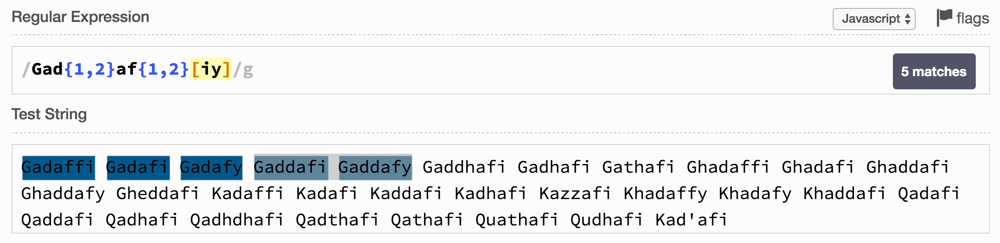


### Spelling 6-7: Matching `Gaddhafi` and `Gadhafi`

These two spellings differ with previous spellings in that they have `h` in their spellings. This means `h` is optional as it is required by some spelling and not required by others. To mark a character optional, you can use quantifier `{0,1}` or you can use it shorthand notation `?` as shown below.

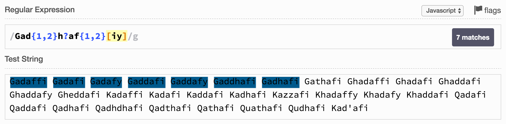

### Spelling 8: Matching `Gathafi`

This spelling differ from previous one's as it uses `t` instead of `d`. So, we have to make a choice between either `d` or `t`. For this we will use `|` to define an or clause as shown below.

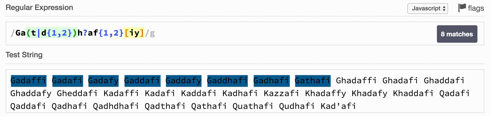


### Spelling 9-12: Matching `Ghadaffi`, `Ghadafi`, `Ghaddafi`, and `Ghaddafy`

You can do this by defining an optional `h` as shown below.

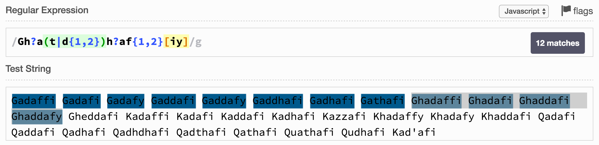

### Spelling 13: Matching `Gheddafi`

We can very easily match this spelling by using a set of `a` and `e`.

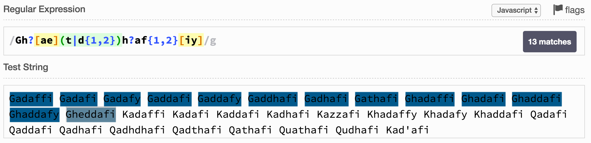

### Spelling 14-17 and 19-21: Matching `Kadaffi`, `Kadafi`, `Kaddafi`, `Kadhafi`, `Khadaffy`, `Khadafy`, and `Khaddafi`

To match these the first character has to be `K`. We have to define a set of `[GK]` to match either `G` or `K` as the first character as shown below.

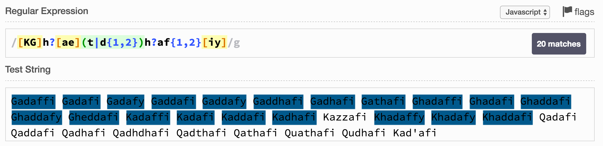

### Spelling 18: Matching `Kazzafi`

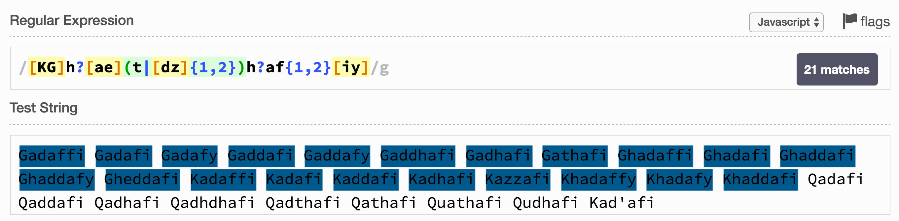


### Spelling 22-24 and 27: Matching `Qadafi`, `Qaddafi`, `Qadhafi`, and `Qathafi`

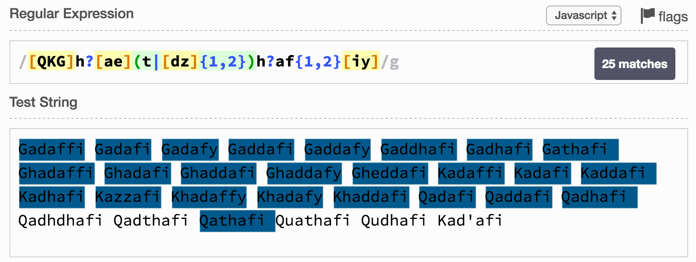

### Spelling 25-26: Matching `Qadhdhafi` and `Qadthafi`

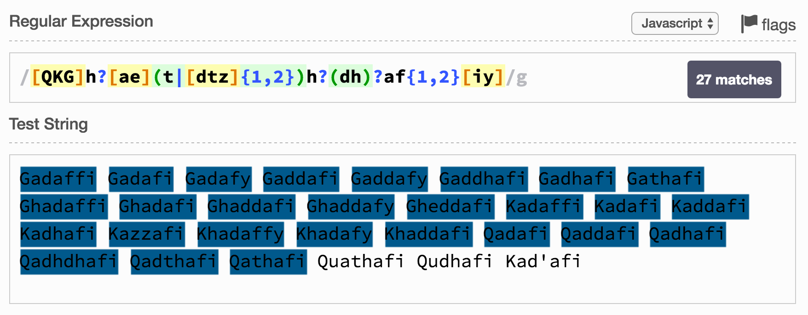

### Spelling 28-29: Matching `Quathafi` and `Qudhafi`

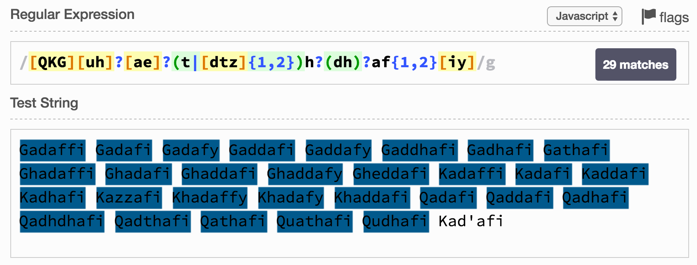


### Spelling 30: Matching `Kad'afi`

This can be very easily matched by adding `'` to the `[dtz]` set as shown below.


### Improving regex by the use of word boundaries

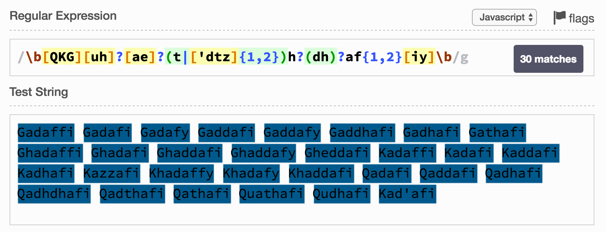


-----


## Getting started with VerbalExpressions

`VerbalExpressions` is a library written for most programming languages that helps you construct difficult regular expressions with ease. In this tutorial, I will show you how to use Java implementation of `VerbalExpressions`.

If you are using Gradle project then you can add following to your `build.gradle`.

```groovy
compile "ru.lanwen.verbalregex:java-verbal-expressions:1.4"
```

Let's write a simple test to `match` method using `VerbalExpression` that will match either `Gadaffi` or `Gadafi`.

```java
import ru.lanwen.verbalregex.VerbalExpression;

public class GaddafiSpellingMatcher {

    public static boolean match(final String spelling) {
        VerbalExpression verbalExpression = VerbalExpression
                .regex()
                .startOfLine()
                .then("Gada")
                .then("f").count(1, 2)
                .then("i")
                .endOfLine()
                .build();
        return verbalExpression.test(spelling);
    }

}
```

In the code shown above, we used the `VerbalExpression` fluent API to build a regular expression. We started with creating the expression builder using the `VerbalExpression.regex()`. Then, we build the regular expression by specifying our clauses -- start the line with `Gada`, then there will be either one or two `f`, finally we will have an `i` in the end.


To match all the names starting with either `G` or `K` we wrote following `VerbalExpression` code.

```java
import ru.lanwen.verbalregex.VerbalExpression;

public class GaddafiSpellingMatcher {

    public static boolean match(final String spelling) {
        VerbalExpression verbalExpression = VerbalExpression
                .regex()
                .startOfLine()
                .anyOf("GK")
                .maybe("h")
                .any("ae")
                .anyOf("tdz").count(1, 2)
                .maybe("h")
                .then("a")
                .then("f").count(1, 2)
                .anyOf("iy")
                .endOfLine()
                .build();
        return verbalExpression.test(spelling);
    }

}
```

To match all the 30 names, the code looks like as shown below.

```java
import ru.lanwen.verbalregex.VerbalExpression;

public class GaddafiSpellingMatcher {

    public static boolean match(final String spelling) {
        VerbalExpression verbalExpression = VerbalExpression
                .regex()
                .startOfLine()
                .anyOf("GKQ")
                .maybe(VerbalExpression.regex().anyOf("uh"))
                .maybe(VerbalExpression.regex().any("ae"))
                .anyOf("tdz'").count(1, 2)
                .maybe("h")
                .maybe("dh")
                .then("a")
                .then("f").count(1, 2)
                .anyOf("iy")
                .endOfLine()
                .build();
        return verbalExpression.test(spelling);
    }

}
```

You can look at all the code [here](./code).

----

That's all for this week. Please provide your valuable feedback by adding a comment to [https://github.com/shekhargulati/52-technologies-in-2016/issues/28](https://github.com/shekhargulati/52-technologies-in-2016/issues/28).

[](https://github.com/igrigorik/ga-beacon)