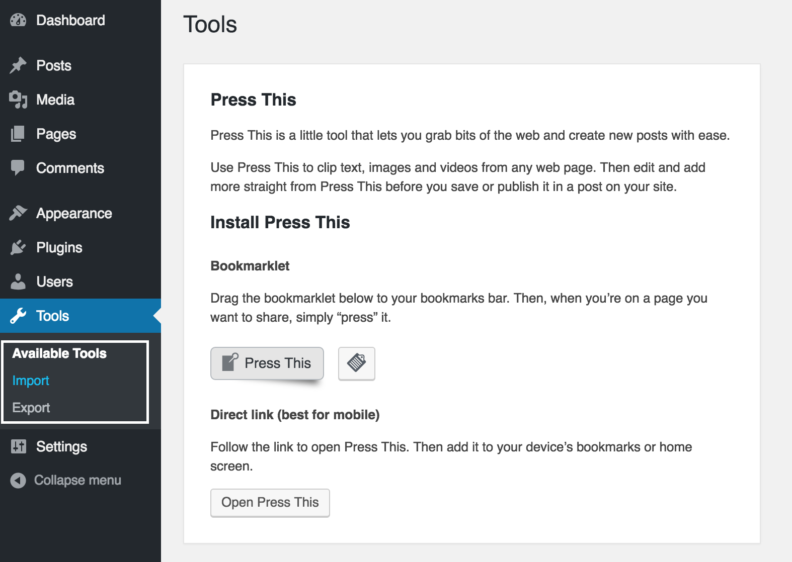
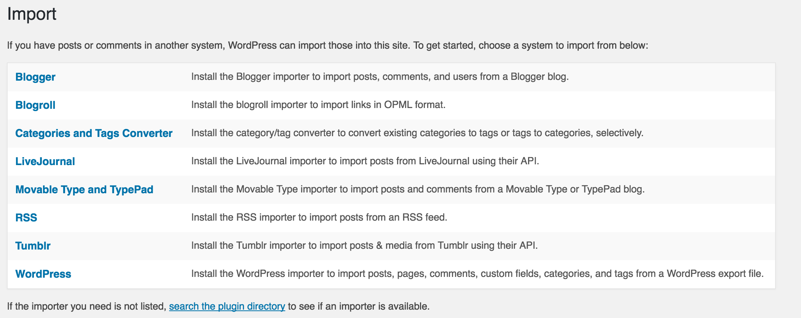
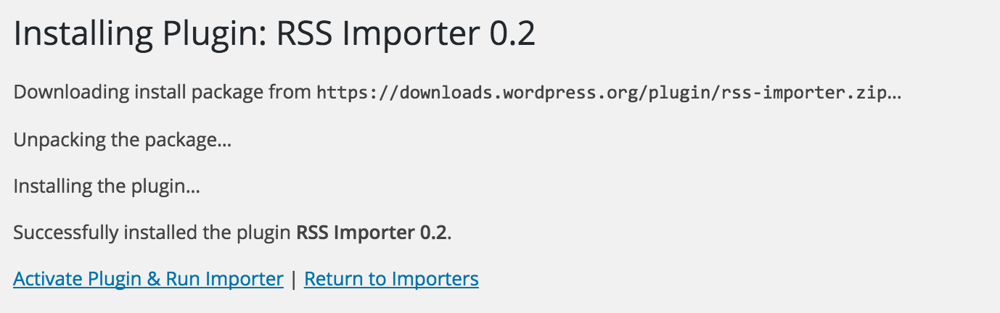
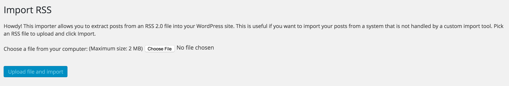

Saved My Ass: Moving back to WordPress from Jekyll
----------

Welcome to week 24 of [52-technology-in-2016](https://github.com/shekhargulati/52-technologies-in-2016) blog series. This week I will share how I moved my organization's official blog from Jekyll to WordPress. A year back, I had moved the official blog from WordPress to Jekyll because I wanted to define the blog publishing workflow. I wanted to apply the pull request based workflow to blog publishing. The idea was simple - write a blog, raise a pull request, get it reviewed (for grammar and other content related feedback), incorporate changes, and finally a blog administrator would press the merge button and the blog will be published. Being a programmer, this all made sense to me. Our organization mainly consists of programmers so it made sense to have developer oriented workflow.

As it turned out, it was not a wise decision by me and we decided to move back to WordPress. In this blog, I will share my experience and learnings that I had during this process. **To me, it was like a software project that went wrong because you had decided to rewrite an existing software project. Rewrites are always costly and most of the time they don't deliver the business value that one expects**.

## Issues with WordPress blog back then

There were a lot of issues with the WordPress blog so I decided to move it to a free of cost Github Pages hosting. Some of the issues were:

1. We were running WordPress on an old machine which went down every few days. There was no monitoring system so we were not even aware if the blog was down for days.
2. It was very slow. Some requests would take more than a minute to give a response.
3. It was spammed heavily. Some of the blogs were injected with viagra text snippets.
4. Layout and theme were not good so it didn't look professional.

> **All these issues could have been easily solved by buying a good theme and hosting WordPress on a commercial provider. It could have cost a bit, but it would have worked great.**

## Move to Jekyll

In January 2015, we had a company-wide hackathon and I decided to work on migrating WordPress blog to Jekyll. The goal was to get a simple Jekyll-based blog running over the weekend and if everyone liked then we will move ahead and replace the existing blog. Jekyll has a pretty [good documentation](https://import.jekyllrb.com/docs/wordpressdotcom/) on migrating WordPress site. In short, you export the WordPress data using the WordPress's inbuilt export functionality. Then you give the exported XML to Jekyll importer which does the magic of generating a Jekyll site from the XML.

```bash
$ ruby -rubygems -e 'require "jekyll-import";
    JekyllImport::Importers::WordpressDotCom.run({
      "source" => "wordpress.xml",
      "no_fetch_images" => false,
      "assets_folder" => "assets"
    })'
```

I had to fix some pages manually but most of the site was generated fine. The only thing that left was to customize the default theme so that it looks good and professional. I am not a UI guy so I decided to buy a relatively cheap theme and use it.

## Releasing it to the world

In a week or so I gave a session on how to use the new blog and wrote a pretty detailed step by step manual for publishing a blog. The reason for writing a detailed manual was to make it easy for people who are not comfortable with Git and Github way of working. I even wrote a `Dockerfile` so that people can run blog in a Docker container. This would allow them to preview their changes easily. These were the steps I had mentioned in the document.

```text
1. Fork the Github repository. You need to fork the repository because you don't have write access to this repository.
2. After forking blog repository, you will have your own repository under your Github account. Private repositories remain private even after forking.
3. Clone your repository on your local machine using Git.
4. Change directory to blog and then checkout the source branch. Please make sure you are on source branch.
5. Create a new markdown file in the `_posts` directory. The name of the file should have `YYYY-MM-dd-blog-slug.md` format. You only have to worry about `_posts` directory.
6. Open the Markdown file in your favorite editor. I(Shekhar) recommend Atom. You can download it from http://atom.io/.
7. Write your new blog following Markdown syntax.
8. Once you have written your blog, commit the blog to your local git repository and then push the changes to your own Github repository.
9. Create a new pull request for your new blog. Make sure to use source branch for both your github repository and official github repository. You can either use github web interface or just open the mentioned link in your favorite browser. Please replace `github_username` with your own github username.
10. Create a new pull request by pressing the `Create pull request` button.
11. After you have created pull request, blog review team will receive a notification via email and also on their Github dashboard that a new blog pull request is received.
```

Once I explained the process I asked people if they liked it. I received no response. I remember someone said `"Isn't it too complicated?"`. My answer was as they are not used to it so they are finding it complicated once they start using it they will feel home. In my mind, it was an opportunity to learn something new so I went ahead with the new blog.

## Jekyll blog in the wild

The move to Jekyll didn't work well and people stopped blogging. During this process, I learned a lot about the limitations of static generated websites and came to a conclusion that you should not go this route until you really want to spend a lot of time writing code for simplest of use cases. Some of these limitations might be specific to Jekyll but most will apply to all.

1. People want to write blogs not learn new technologies that can help them write blogs. Learning Markdown, Jekyll, Git is too much for most people even developers. **Simple things should remain simple.**

2. There is no easy way to automatically send notifications via social networks or email once the blog is published. You have to write code that can send notifications.

3. Process or workflows restrict people to do their job. I found that I became the bottleneck for everything. People were not comfortable publishing blogs so I had to do it. As this was not my priority most of the time, so blogs remain as PR sometime for more than a month.

4. Jekyll is very slow. It takes around 4 minutes to generate the whole site. We have close to 550 blogs.

5. There is no support for scheduling blogs. You have to write your own custom code to do that.

6. Compared to WordPress, Jekyll lacks quality plugins so you will end up writing Ruby code.

7. You don't have comments support in a static website. You can use service like Disqus to integrate an external commenting system. The problem is to notify the author of the post. Disqus will only send notifications to the registered emails.

8. Github Pages hosting does not allow you to install plugins except the default supported by it. This means you have to generate full HTML static website and push that to Github.

## Going back to WordPress

Finally, it was decided that we should move the blog back to WordPress. You must be thinking Why Wordpress? We thought about a couple of options -- hosting on Medium.com and WordPress. We went with WordPress because we have developers who understand WordPress and they can quickly get a WordPress blog running. I was asked to provide database backup of the existing blog. When I migrated the blog to Jekyll I returned the existing machine used for WordPress blog to the IT team of our office. They decided to format it as well as the database backup system as they thought we will never need it. So, we were left with only static website :(

So, now we have to somehow create WordPress site from the static website. I found following options:

1. Use ruby [wayback](https://github.com/hartator/wayback-machine-downloader) gem to download the full site from [Internet archive](https://archive.org/index.php). Then, import generated HTML into WordPress. This option didn't work because most of the pages downloaded by this gem were nothing more than 404 pages.

2. Use a paid tool like http://waybackdownloader.com/ that downloads the content from the Internet Archive. This could be an option if nothing works but you have to shelve $30-$40.

3. Another option was to import URLs using the [easy grabber](https://wordpress.org/plugins/easy-grabber/) plugin. I couldn't get this plugin to work.

4. Last option was to generate RSS feed of the static website and then import RSS feed into a WordPress blog using RSS importer blog. This was the option I went with and it worked like a charm.

Now, I will walk through how I generated WordPress export XML using the static website feed.

### Step 1: Enable RSS feed for your site

Our blog already had RSS feed integration so this step was not required. If your blog does not have the RSS feed then there are two options -- either use Liquid or a Jekyll plugin. You can learn more about enabling RSS feed for your blog in the [documentation](http://jekyll.tips/jekyll-casts/rss-feed/). We were using Liquid approach. You need to have `feed.xml` at the blog root as shown below.

```xml
---
layout: null
---
<?xml version="1.0" encoding="UTF-8"?>
<rss version="2.0" xmlns:atom="http://www.w3.org/2005/Atom">
  <channel>
    <title>{{ site.title | xml_escape }}</title>
    <description>{{ site.description | xml_escape }}</description>
    <link>{{ site.url }}{{ site.baseurl }}/</link>
    <atom:link href="{{ "/feed.xml" | prepend: site.baseurl | prepend: site.url }}" rel="self" type="application/rss+xml" />
    <pubDate>{{ site.time | date_to_rfc822 }}</pubDate>
    <lastBuildDate>{{ site.time | date_to_rfc822 }}</lastBuildDate>
    <generator>Jekyll v{{ jekyll.version }}</generator>
    
      <item>
        <title>{{ post.title | xml_escape }}</title>
        <description>{{ post.content | xml_escape }}</description>
        <pubDate>{{ post.date | date_to_rfc822 }}</pubDate>
        <link>{{ post.url | prepend: site.baseurl | prepend: site.url }}</link>
        <guid isPermaLink="true">{{ post.url | prepend: site.baseurl | prepend: site.url }}</guid>
        
        <category>{{ tag | xml_escape }}</category>
        
        
        <category>{{ cat | xml_escape }}</category>
        
      </item>
    
  </channel>
</rss>
```

Now, if you run Jekyll using `jekyll serve`, you will see feed at [http://localhost:4000/feed.xml](http://localhost:4000/feed.xml).

### Step 2: Download feed of the entire website

The default `feed.xml` configuration will only generate a feed for 10 blogs as we have limited that in the feed.xml.

```

```

WordPress feed importer does not allow you to upload feed.xml more than 2 MB in size. If your site content is less than 2MB then you can change the limit to the blog count and you will be done. Our blog content was close to 10MB so we had to generate feed iteratively. To generate a feed of first five hundred blogs in a batch of 100, you can use `limit` and `offset` as shown below.

```





```

You can use `wget` to download the feed.xml

```bash
$ wget http://localhost:4000/feed.xml
```

> **After changing the limit and offset, you would have to generate static website again so that feed.xml is generated.**

### Step 3: Running WordPress locally

Now that I have a full website feed, I need to import them into a WordPress blog. I decided to run WordPress locally in Docker containers. When you will Google `Docker wordpress`, the second link will be [Quickstart: Docker Compose and WordPress](https://docs.docker.com/compose/wordpress/). This is the official quickstart by Docker. I never expected that official quickstart will not work. The reason for failure is that Docker Compose does not link WordPress and MySQL containers so you get `MySQL Connection Error: (2002) Connection refused` error in the logs.

So, I decided to go the manual route of running WordPress in Docker container. To run WordPress, run the following commands. We will first create a docker machine and then run the `docker run` commands to start wordpress and mysql containers.

```bash
$ docker-machine create --driver virtualbox blog
$ docker-machine env blog
$ eval $(docker-machine env blog)
$ docker run --name db -v data:/var/lib/mysql -e MYSQL_ROOT_PASSWORD=password -d mysql:5.7
$ docker run --name blog --link db:mysql -p 8000:80 -d wordpress:latest
```

Now, you can access blog at `http://MACHINE_IP:8000`. You can get machine ip by running `docker-machine ip blog` command. The output of `docker ps` command is shown below.

```bash
$ docker ps
```
```
→ docker ps
CONTAINER ID        IMAGE               COMMAND                  CREATED             STATUS              PORTS                  NAMES
77578726b64b        wordpress:latest    "/entrypoint.sh apach"   2 minutes ago       Up 1 seconds        0.0.0.0:8000->80/tcp   blog
ef2a70e40c22        mysql:5.7           "docker-entrypoint.sh"   2 minutes ago       Up 10 seconds       3306/tcp              db
```

### Step 4: Configure WordPress

Next, when you go to `http://MACHINE_IP:8000` you will go through WordPress installation instructions. Once done, login into `wp-admin`.

### Step 5: Import feed

Login to `wp-admin` and then go to **Tools**. Under `Tools`, go to `Import` as shown below.



You will see import screen with all the import options. Click on the RSS.



Click on RSS and you will see a popup that will ask you to install the plugin. Press the `Install Now` button. Once plugin is installed, click the `Activate Plugin and Run Importer`.



Now, you can import RSS feed one by one by uploading the feed.xml.



Once imported all the posts will be public and you will be able to see them in WordPress blog. There are a couple of issues after the import -- 1) It does not create author profiles so all the blogs will be published under administrator user 2) Images will not be imported. Both these could be automated as well. You can write a script that finds all the unique author names in the feed.xml and then using WordPress API, create them. To handle images, you have to do simple find and replace. Replace `src=&quot;/` with `src=&quot;http://blog_url/`. Replace `blog_url` with url of your static blog.

### Step 6: Export WordPress XML

Once you are happy that all the content is cleanly uploaded into your local WordPress installation, you can take export of the data using the inbuilt export functionality of WordPress. Go to **Dashboard > Tools > Export** and click `Download Export File` button to export the data.


Now you can share the exported XML with the team.

------

That's all for this week. Please provide your valuable feedback by adding a comment to [https://github.com/shekhargulati/52-technologies-in-2016/issues/30](https://github.com/shekhargulati/52-technologies-in-2016/issues/30).

[](https://github.com/igrigorik/ga-beacon)
