Trello Clone with Angular Dragula
----

Welcome to twenty-fifth blog of [52-technologies-in-2016](https://github.com/shekhargulati/52-technologies-in-2016) blog series. This week I wanted to learn how to build a Trello like website. [Trello](https://trello.com/) is a web-based project management application that uses kanban philosophy to manage projects. In Trello, you have three main entities -- board, list, and card. A board is a collection of lists and list is a collection of cards. You can drag and drop cards on different lists. Below is a screenshot of a simple Trello board with three lists each having one card for your understanding.

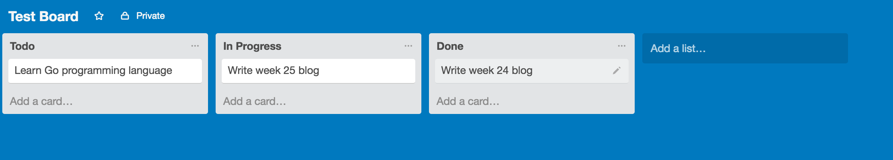

In this blog, we will only cover how to build a drag and drop list user interface. To build user interface of the application, I will use AngularJS along with Twitter Bootstrap. To achieve drag and drop functionality, we will use an [dragula](https://github.com/bevacqua/dragula), an open source JavaScript library to build drag and drop interfaces. We will use Angular Dragula, an Angular wrapper around Dragula. It provides directives that makes it very easy to use dragula in an Angular application.

# Prerequisites

To follow along you will need following on your machine.

1. Node.js : [Download](https://nodejs.org/en/download/) and install the latest version of node. At the time of writing, latest version was `6.2.2`.

2. Install Yeoman, Gulp, and Bower: [Yeoman](http://yeoman.io/) is a scaffolding tool that you can use to scaffold modern web applications. We will use it to scaffold an Angular application. [Gulp](http://gulpjs.com/) is the modern build tool for JavaScript apps. [Bower](https://bower.io/) is a package manager that can manage client side dependencies for you. To install yeoman, execute the `npm install -g yo gulp bower` command.

Now that we have installed all the prerequisites let's get started with app development.

--------------------------------------------------------------------------------

# Step 1: Scaffold Gulp Angular application

We will start with scaffolding an Angular Gulp application using the Swiip's [Yeoman generator](https://github.com/Swiip/generator-gulp-angular).

```bash
$ npm install -g generator-gulp-angular
```

After generator is installed, you can generate the application by typing the following command. Navigate to a convenient location on your filesystem and then run following commands.

```
$ mkdir trello && cd trello
$ yo gulp-angular
```

You will be asked a series of questions that will be used to setup your project according to your preferences.

First, you will be asked to select AngularJS version. We will use version 1.5.

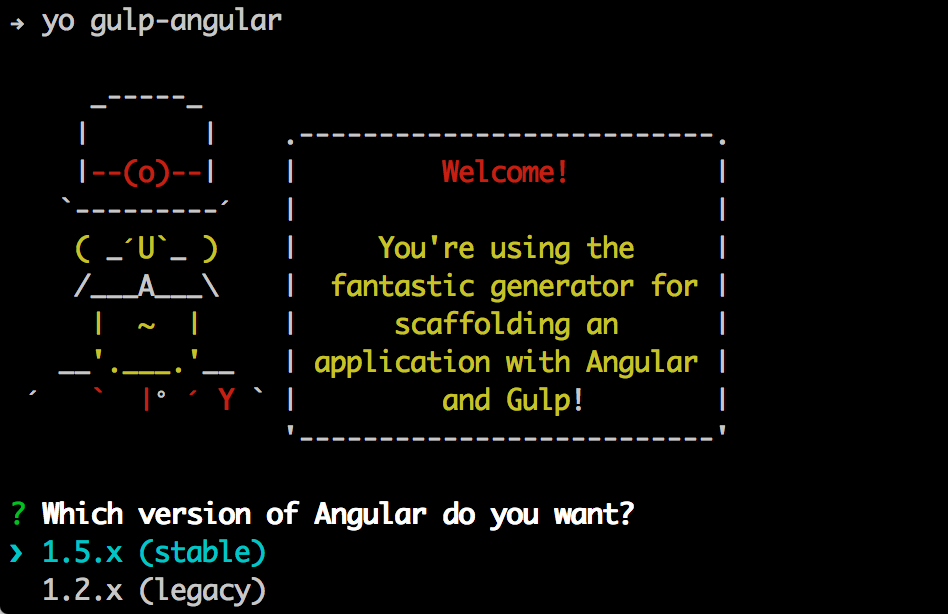

Then, you will be asked to select which all Angular modules you want in your application.

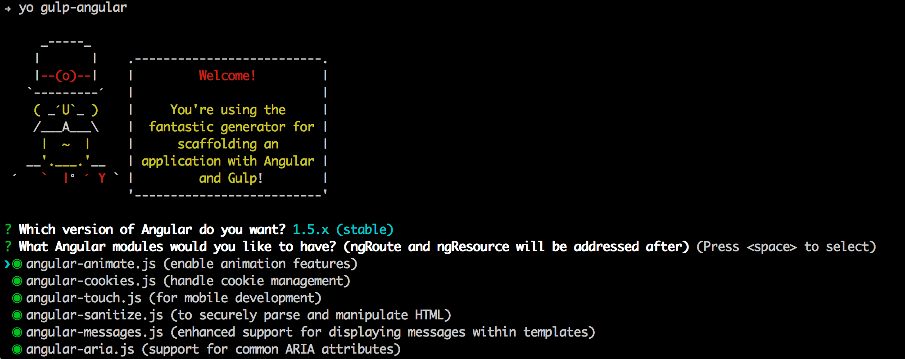

Then, you will be asked to select jQuery implementation. We will select Angular inbuilt `jgLite`.

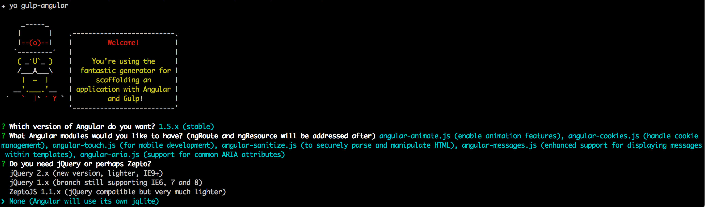

Next, we will select inbuilt `$http` service for interacting with REST service.

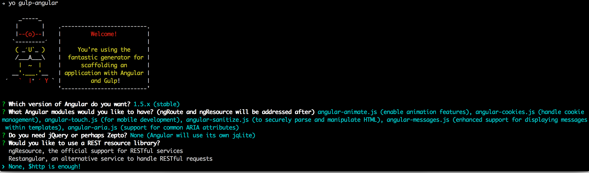

Next, you will be asked to select router implementation. We will select none.

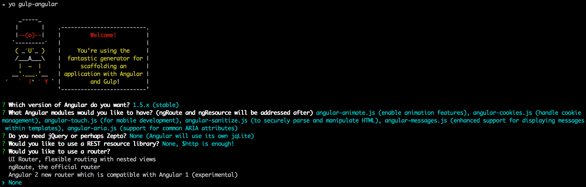

Next, we will select `Bootstrap` as our UI framework.

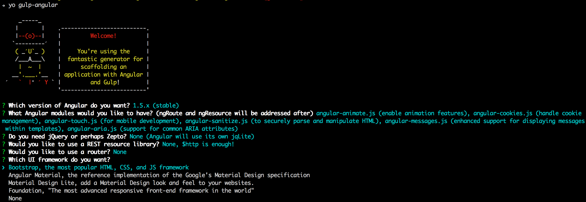

Next, we will be asked about Bootstrap components.

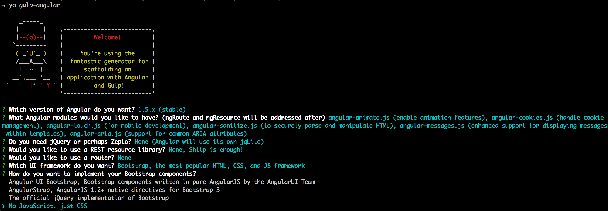

Next, you will be asked if you want to use CSS preprocessor. We will use plain old CSS.


Last question you will be asked is your choice of JS preprocessor. We will use `ES6 (Babel formerly 6to5), ECMAScript 6 compiled with Babel which requires no runtime.` as we would like to use ES6.

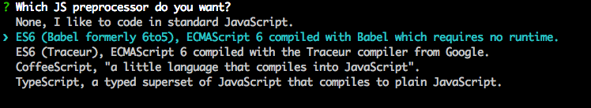

# Step 2: Run the application

Once application is scaffolded in step 1, we can run the application. To run the application, you will use gulp. We will use `serve` task of gulp. It will build the project and then start a simple HTTP server that will render contents of our web application.

```bash
$ gulp serve
```

This will launch application in your default web browser at [http://localhost:3000](http://localhost:3000).

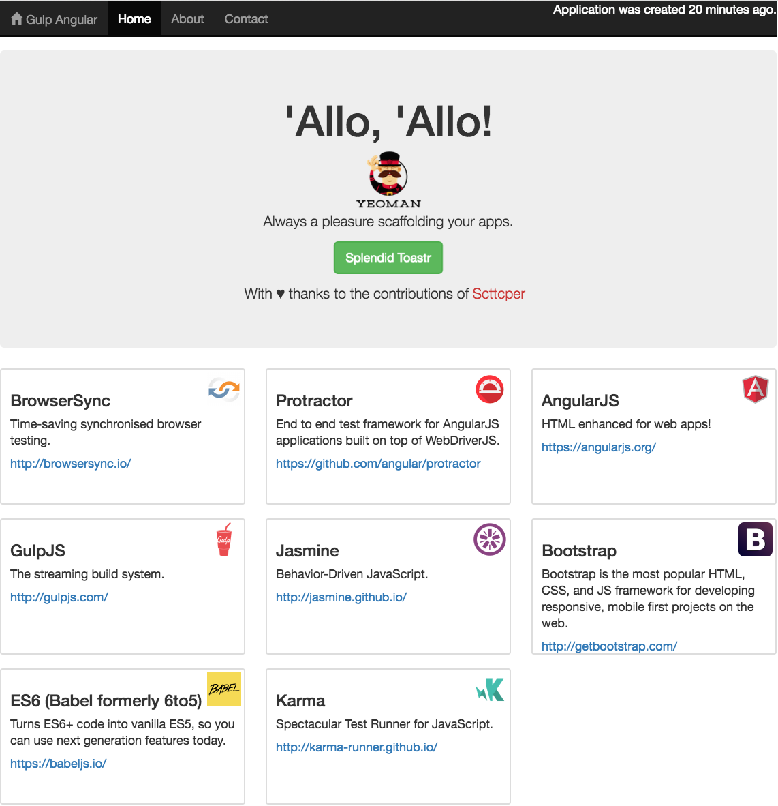

# Step 3: Update index.html to have three hard coded lists

Now, we will update `src/index.html` so that it shows three lists. The content of the lists will be the technologies used by this generator. All the three lists will have the same content. We will change them later. Remove the `jumbotron` section and update main `div` as shown below.

```html
<div class="container" ng-controller="MainController as main">

  <div class="row">

    <div class="col-sm-6 col-md-4">
      <h2 class="text-center">Todo</h2>
      <div ng-repeat="awesomeThing in main.awesomeThings | orderBy:'rank'">
        <div class="thumbnail">
          
          <div class="caption">
            <h3>{{ awesomeThing.title }}</h3>
            <p>{{ awesomeThing.description }}</p>
            <p>
              <a ng-href="{{awesomeThing.url}}">{{ awesomeThing.url }}</a>
            </p>
          </div>
        </div>
      </div>
    </div>

    <div class="col-sm-6 col-md-4">
      <h2 class="text-center">In Progress</h2>
      <div ng-repeat="awesomeThing in main.awesomeThings | orderBy:'rank'">
        <div class="thumbnail">
          
          <div class="caption">
            <h3>{{ awesomeThing.title }}</h3>
            <p>{{ awesomeThing.description }}</p>
            <p>
              <a ng-href="{{awesomeThing.url}}">{{ awesomeThing.url }}</a>
            </p>
          </div>
        </div>
      </div>
    </div>

    <div class="col-sm-6 col-md-4">
      <h2 class="text-center">Done</h2>
      <div ng-repeat="awesomeThing in main.awesomeThings | orderBy:'rank'">
        <div class="thumbnail">
          
          <div class="caption">
            <h3>{{ awesomeThing.title }}</h3>
            <p>{{ awesomeThing.description }}</p>
            <p>
              <a ng-href="{{awesomeThing.url}}">{{ awesomeThing.url }}</a>
            </p>
          </div>
        </div>
      </div>
    </div>
  </div>

</div>
```

After modifying `src/index.html`, changes will be synced and page will be refreshed as shown below.

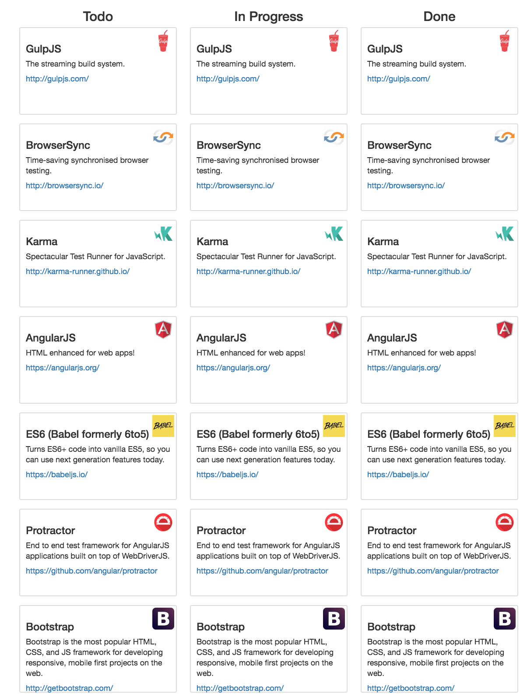

# Step 4: Enable drag and drop with Angular Dragula

Now, that we have three lists we will enable drag and drop feature using Angular Dragula. To use it, you have to first define its dependency in the `bower.json`. In the dependencies section, add a new line at the end that defines `angular-dragula` dependency as shown below. We are using the latest version of Angular Dragula i.e. `1.2.2`.

```json
"dependencies": {
  "angular-animate": "~1.5.3",
  "angular-cookies": "~1.5.3",
  "angular-touch": "~1.5.3",
  "angular-sanitize": "~1.5.3",
  "angular-messages": "~1.5.3",
  "angular-aria": "~1.5.3",
  "bootstrap": "~3.3.5",
  "malarkey": "yuanqing/malarkey#~1.3.1",
  "angular-toastr": "~1.5.0",
  "moment": "~2.10.6",
  "animate.css": "~3.4.0",
  "angular": "~1.5.3",
  "angular-dragula":"1.2.2"
}
```

Now, install the new module using `bower install` command.

Stop and start the app using `gulp serve`.

Once you have defined the dependency, you have to pass `angularDragula` to your angular module. In the `index.module.js`, declare dependency on `angularDragula` as shown below. `angularDragula` takes `angular` instance and uses it to register its own module, services, and directive.

```javascript
import { config } from './index.config';
import { runBlock } from './index.run';
import { MainController } from './main/main.controller';
import { WebDevTecService } from '../app/components/webDevTec/webDevTec.service';

angular.module('trello', ['ngAnimate', 'ngCookies', 'ngTouch', 'ngSanitize', 'ngMessages', 'ngAria', 'toastr', angularDragula(angular)])
  .config(config)
  .run(runBlock)
  .service('webDevTec', WebDevTecService)
  .controller('MainController', MainController)
```

Next, you have to modify `src/index.html` to use `dragula` directive. Update all the divs with ng-repeat as shown below. The `dragula` directive groups container together so that you can drag and drop elements among them. Make sure the value of `dragula` directive is same i.e. `bag` in our case. If lists have different `dragula` directive values then you will not be able to drop elements to them. The `dragula-scope` directive is used to pass the scope you want the bag to be stored on. This is required when you are using `ng-repeat` as `ng-repeat` creates a new isolated scope which causes issues when you are trying to drag items among multiple containers.

```html
<div dragula='"bag"' ng-repeat="awesomeThing in main.awesomeThings | orderBy:'rank'" dragula-scope="$parent">
```

Save your changes. Now, you will be able to drag and drop elements across different lists.

# Step 5: Using trello like data

Now, we will change the code to use trello like data i.e. boards, lists, and tasks. We will start by updating `MainController` to use our new data model as shown below.

```javascript
export class MainController {
  constructor() {
    'ngInject';

    this.board = {
      id: 1,
      title: "Test Board",
      lists: [{
        id: 1,
        name: "Todo",
        cards: [{
          id: 1,
          title: "Lean Go programming language",
          description: "I want to learn Go so that I can build applications with it."
        }, {
          id: 2,
          title: "Finish Missing Kids Android application",
          description: "Work on my Android application"
        }]
      }, {
        id: 2,
        name: "In Progress",
        cards: [{
          id: 3,
          title: "Blog about Angular Dragula",
          description: "Write week 25 blog on Angular Dragula"
        }]

      }, {
        id: 3,
        name: "Done",
        cards: [{
          id: 5,
          title: "Blog about Jekyll to WordPress migration",
          description: "Write week 24 blog on migrating from Jekyll to WordPress"
        }]
      }]
    }
  }
}
```

In the code shown above, we have a board that contains three lists -- Todo, In Progress, and Done. Each list has a number of cards.

We will now update `index.html` so that it can work against the update code.

```html
<body>
  <!--[if lt IE 10]> <p class="browsehappy">You are using an <strong>outdated</strong> browser. Please <a href="http://browsehappy.com/">upgrade your browser</a> to improve your experience.</p> <![endif]-->

  <div class="container" ng-controller="MainController as main">
    <div class="row">
      <div class="col-sm-6 col-md-4" ng-repeat="list in main.board.lists">
        <h2 class="text-center">{{list.name}}</h2>
        <div id="list-{{list.id}}" dragula='"bag"' ng-repeat="card in list.cards" dragula-scope="$parent.$parent" style="min-height: 10px;">
          <div id="card-{{card.id}}" class="thumbnail">
            <div class="caption">
              <h3>{{ card.title }}</h3>
              <p>{{ card.description }}</p>
            </div>
          </div>
        </div>
      </div>
    </div>
  </div>

  // removed commented section for brevity.
</body>
```

After making these changes, application will look like as shown below.

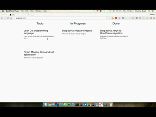


## Step 6: Performing action on drop

Now, that you can drag and drop cards let's look at how we can perform action. Angular Dragula emits events that are replicated on the Angular `$scope`. Let's suppose we have to make a REST call to update the backend when a card is dropped on the list. We can subscribe to the drop event as shown below. To learn about all the events refer to the [documentation](https://github.com/bevacqua/dragula#drakeon-events).

```javascript
export class MainController {
  constructor($scope) {
    'ngInject';

    $scope.$on('bag.drop', function(e, el, target){
      console.log(`Dropped ${el[0].id} on target ${target[0].id}`);
    });
    // removed for brevity
  }
}
```

----

That's all for this week. Please provide your feedback by adding a comment to [https://github.com/shekhargulati/52-technologies-in-2016/issues/31](https://github.com/shekhargulati/52-technologies-in-2016/issues/31).

[](https://github.com/igrigorik/ga-beacon)
