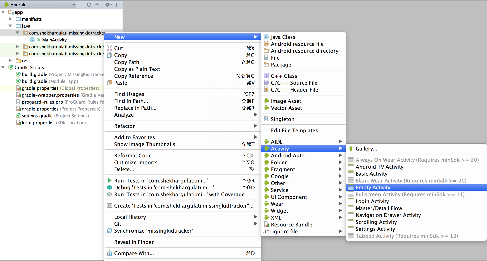
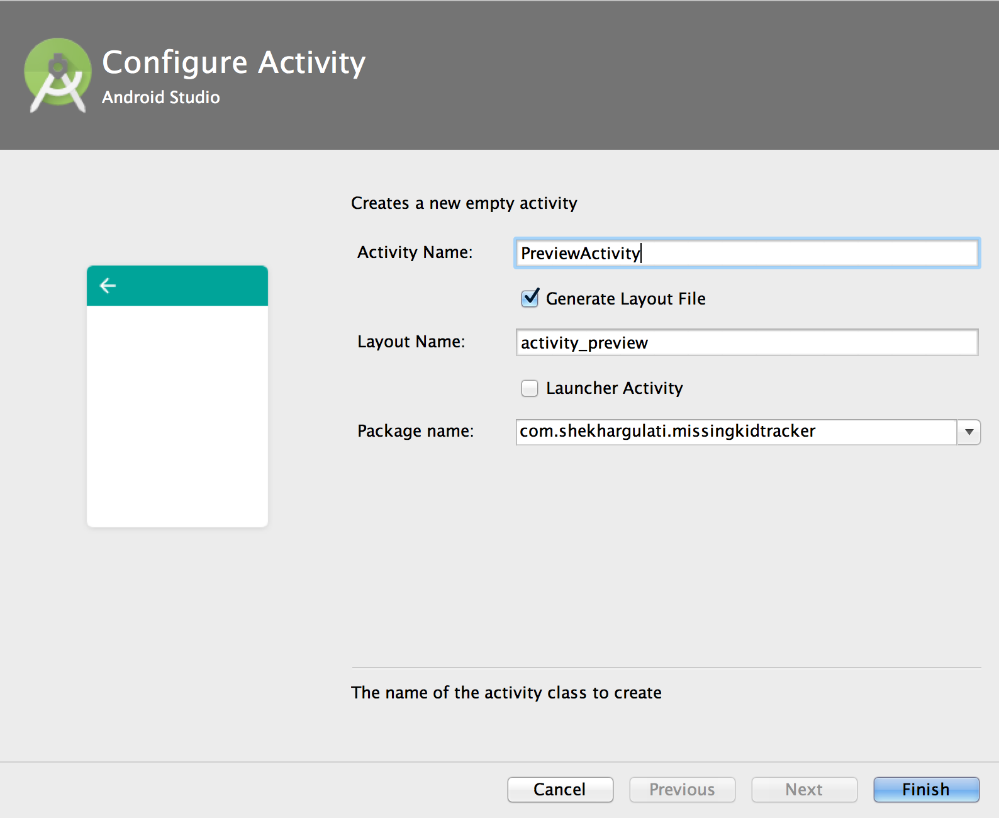
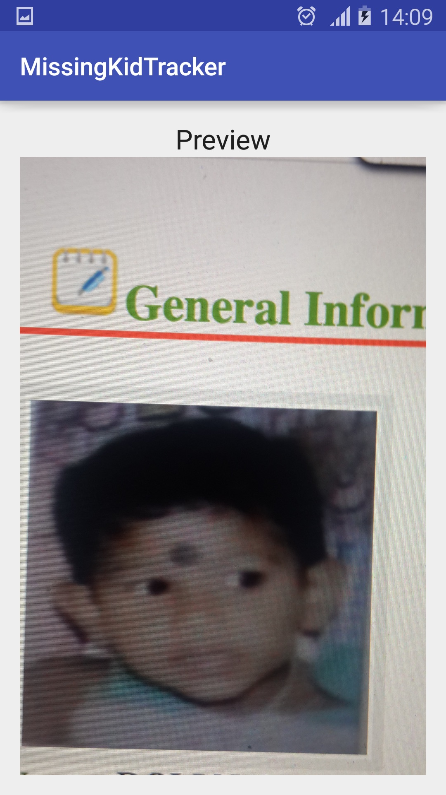
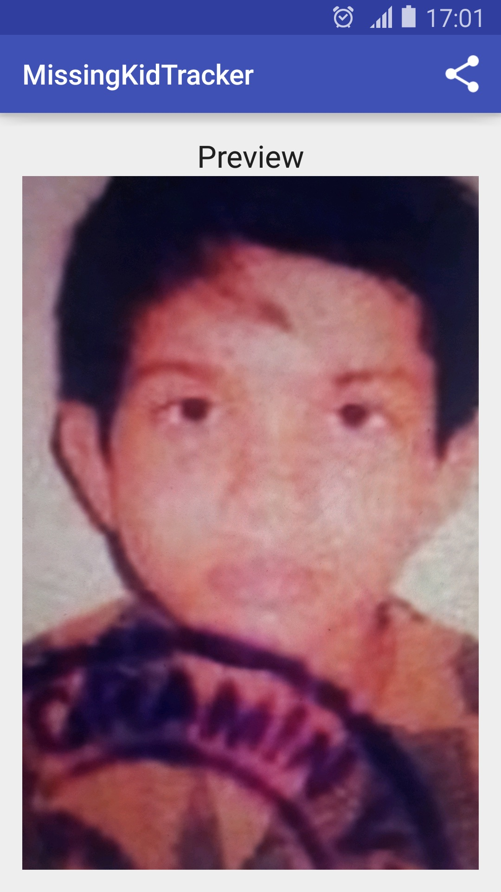

Building An Android Application Part 2
---

Welcome to twenty sixth post of [52-technologies-in-2016](https://github.com/shekhargulati/52-technologies-in-2016) blog series. This week we will extend the Android application that we started developing in [week 23](https://github.com/shekhargulati/52-technologies-in-2016/tree/master/23-android-part1). By the end of part 1, our Android application could take a photo, store that photo in an application specific album, and finally preview the captured photo in the same activity. This week we will achieve the following:

1. Create a new activity `PreviewActivity` that will be responsible for image preview.
2. Use [Glide](https://github.com/bumptech/glide) library for preview.
3. Add a share menu to `PreviewActivity` to allow sharing of the captured image.

## Prerequisite

Before you start working with this blog make sure you have read [part 1](https://github.com/shekhargulati/52-technologies-in-2016/tree/master/23-android-part1) blog. You need following on your machine:

1. Your machine should have JDK 6 or above installed.

2. Download and install [Android Studio](https://developer.android.com/studio/index.html) for your operating system. Please refer to documentation for more [information](https://developer.android.com/training/basics/firstapp/index.html).

3. You will need source code of the part 1. The application source code is hosted on Github. To checkout part 1 source code, execute the following commands.

  ```bash
  $ git clone git@github.com:shekhargulati/missing-kid-tracker.git
  $ git checkout -b part2 part1
  ```


## Feature 1: Create a new activity `PreviewActivity` that will be responsible for image preview.

In this section, we will cover how to create `PreviewActivity` that will be responsible for showing image preview.

### Step 1: Create `PreviewActivity` for previewing captured image

In part 1, we rendered the captured image in the `MainActivity` itself. As discussed previously, Activity represents a single focussed thing that the user can do with your application. `MainActivity` will be the first screen that users will view when they will launch our application. Currently, `MainActivity` only has a menu with one option `Take Photo`. Later in the series, we will update `MainActivity` to show a list of missing kids. Create a new Activity by right clicking on the package and then selecting the `Empty Activity` as shown below in the image.



Next, you will be asked to configure the activity. Change the name of the activity to `PreviewActivity` as shown below.



Press the `Finish` button. This will add the `PreviewActivity.java` and other generated files to the project.


### Step 2: Update `MainActivity` to start `PreviewActivity`

Now, that we have created the `PreviewActivity`, let's update `MainActivity` to start `PreviewActivity` after we have successfully captured the photo. In the `MainActivity`, we have overridden a lifecycle method `onActivityResult`, that is called after taking the photo. Currently, `onActivityResult` is responsible for storing the captured image to gallery and then setting pic to the `MainActivity` `ImageView`. We will move the setting pic to `ImageView` concern to the `PreviewActivity` as shown below. In Android, you call one activity from another using the `Intent`.


```java
@Override
protected void onActivityResult(int requestCode, int resultCode, Intent data) {
    final String tag = getString(R.string.app_name);
    if (resultCode == RESULT_OK) {
        Log.d(tag, String.format("Photo is successfully saved to [%s]", capturedPhotoPath));
        addPicToGallery();
        Intent previewIntent = new Intent(this, PreviewActivity.class);
        previewIntent.putExtra(PreviewActivity.CAPTURED_PHOTO_PATH, capturedPhotoPath);
        startActivity(previewIntent);
    }
}
```

In the code shown above, we created a new intent for `PreviewActivity`. We stored the `capturedPhotoPath` in the intent object so that `PreviewActivity` can use it. Finally, we started the activity using the `startActivity` method.

The `PreviewActivity` is shown below. The only thing that I have added so far is a constant `CAPTURED_PHOTO_PATH`.

```java
import android.support.v7.app.AppCompatActivity;
import android.os.Bundle;

public class PreviewActivity extends AppCompatActivity {

    public static final String CAPTURED_PHOTO_PATH = "capturedPhotoPath";

    @Override
    protected void onCreate(Bundle savedInstanceState) {
        super.onCreate(savedInstanceState);
        setContentView(R.layout.activity_preview);
    }
}
```

### Step 3: Render image preview in `PreviewActivity`

Now, move the `setPic` and its dependent methods in the `PreviewActivity`. Don't worry about compilation errors for now.

```java
import android.content.Intent;
import android.graphics.Bitmap;
import android.graphics.BitmapFactory;
import android.graphics.Matrix;
import android.media.ExifInterface;
import android.support.v7.app.AppCompatActivity;
import android.os.Bundle;
import android.util.Log;
import android.view.View;
import android.widget.ImageView;

import java.io.File;
import java.io.IOException;

public class PreviewActivity extends AppCompatActivity {

    public static final String CAPTURED_PHOTO_PATH = "capturedPhotoPath";

    @Override
    protected void onCreate(Bundle savedInstanceState) {
        super.onCreate(savedInstanceState);
        setContentView(R.layout.activity_preview);
    }

    private void setPic() {
        final String tag = getString(R.string.app_name);
        try {
            ImageView imageView = (ImageView) this.findViewById(R.id.image_preview);
            imageView.setVisibility(View.VISIBLE);
            Bitmap bitmap = createScaledBitmap(capturedPhotoPath);
            imageView.setImageBitmap(bitmap);
        } catch (Exception e) {
            Log.e(tag, "Error encountered while doing image preview", e);
        }
    }

    public Bitmap createScaledBitmap(String pathName) throws IOException {
        final BitmapFactory.Options opt = new BitmapFactory.Options();
        opt.inSampleSize = 2;
        opt.inJustDecodeBounds = false;
        Bitmap bitmap = BitmapFactory.decodeFile(pathName, opt);
        File file = new File(capturedPhotoPath);
        Bitmap rotatedBitmap;
        ExifInterface exif = new ExifInterface(file.getPath());
        int rotation = exif.getAttributeInt(ExifInterface.TAG_ORIENTATION, ExifInterface.ORIENTATION_NORMAL);
        int rotationInDegrees = exifToDegrees(rotation);
        Matrix matrix = new Matrix();
        if (rotation != 0f) {
            matrix.preRotate(rotationInDegrees);
        }
        rotatedBitmap = Bitmap.createBitmap(bitmap, 0, 0, bitmap.getWidth(), bitmap.getHeight(), matrix, true);
        return rotatedBitmap;
    }

    private static int exifToDegrees(int exifOrientation) {
        if (exifOrientation == ExifInterface.ORIENTATION_ROTATE_90) {
            return 90;
        } else if (exifOrientation == ExifInterface.ORIENTATION_ROTATE_180) {
            return 180;
        } else if (exifOrientation == ExifInterface.ORIENTATION_ROTATE_270) {
            return 270;
        }
        return 0;
    }
}

```

In the code shown above, we moved `setPic`, `createScaledBitmap`, and `exifToDegrees` methods from `MainActivity` to `PreviewActivity`. Make sure to delete them from the `MainActivity` class.

The code shown above does not compile because it does not know about `capturedPhotoPath`. We stored `capturedPhotoPath` in the `Intent`. You use `getIntent` method to get the intent. Update the `onCreate` method with the one shown below.

```java
private String capturedPhotoPath;

@Override
protected void onCreate(Bundle savedInstanceState) {
    super.onCreate(savedInstanceState);
    setContentView(R.layout.activity_preview);
    Intent intent = getIntent();
    this.capturedPhotoPath = intent.getStringExtra(CAPTURED_PHOTO_PATH);
    setPic();
}
```

Also, you have to update `activity_preview.xml` so that can we can render image of the missing kid. Replace `activity_preview.xml` with the XML shown below.

```xml
<?xml version="1.0" encoding="utf-8"?>
<RelativeLayout xmlns:android="http://schemas.android.com/apk/res/android"
    xmlns:tools="http://schemas.android.com/tools"
    android:layout_width="match_parent"
    android:layout_height="match_parent"
    android:paddingBottom="@dimen/activity_vertical_margin"
    android:paddingLeft="@dimen/activity_horizontal_margin"
    android:paddingRight="@dimen/activity_horizontal_margin"
    android:paddingTop="@dimen/activity_vertical_margin"
    tools:context="com.shekhargulati.missingkidtracker.PreviewActivity">

    <LinearLayout
        android:layout_width="match_parent"
        android:layout_height="match_parent"
        android:orientation="vertical">

        <TextView
            android:id="@+id/textView"
            android:layout_width="match_parent"
            android:layout_height="wrap_content"
            android:text="Preview"
            android:gravity="center"
            android:textAppearance="?android:attr/textAppearanceLarge" />

        <ImageView
            android:id="@+id/image_preview"
            android:layout_width="match_parent"
            android:layout_height="wrap_content"
            android:adjustViewBounds="true"
            android:scaleType="center"
            android:visibility="visible" />

    </LinearLayout>

</RelativeLayout>
```

### Step 4: Run the application

Now, you can run the application and see if everything works correctly. The preview screen will look like as shown below.




## Feature 2: Use Glide library for preview

In the last section, we got preview functionality working. You will agree that we had to write a lot of code to render the captured image in an `ImageView`. We wrote code to scale the
bitmap and handle image rotation. To me a lot of this code looks like boilerplate code and I would like some library to do this work for me. In my opinion, it is good to start with the manual approach of doing everything yourself to understand how all this works, but once you understand it makes sense to use a battle tested library to do the work. There are many Android libraries that one can use to work with images. Some of the popular libraries are Glide, Picasso, Fresco, etc. To understand the difference between these popular libraries, you should refer to [stackoverflow question](https://stackoverflow.com/questions/29363321/picasso-v-s-imageloader-v-s-fresco-vs-glide). I choose [Glide](https://github.com/bumptech/glide) because it is recommended by [Google](https://google-opensource.blogspot.in/2014/09/glide-30-media-management-library-for.html) and I found it very easy to get started with.

[Glide](https://github.com/bumptech/glide) is an open source image loading and caching library for Android focused on smooth scrolling developed by bumptech. Glide supports large number of [features](https://github.com/bumptech/glide/wiki). Some of these are mentioned below:

1. Animated GIF decoding
2. Local video stills
3. Thumbnail support
4. Lifecycle integration
5. Transcoding
6. Animations
7. OkHttp and Volley support
8. Memory and disk caching

### Step 1: Add glide dependency

To use any library, you have to add it to your application `build.gradle` file. The applications created using Android Studio uses Gradle as their build system.

```groovy
dependencies {
    compile fileTree(dir: 'libs', include: ['*.jar'])
    compile 'com.github.bumptech.glide:glide:3.7.0'
    testCompile 'junit:junit:4.12'
    compile 'com.android.support:appcompat-v7:22.2.1'
}
```

You will also have to sync the project after adding the dependency so that the classpath is updated.

### Step 2: Using Glide for preview

Now, that we have added dependency we can update the `PreviewActivity` to use glide instead of our own custom code.

```java
import android.content.Intent;
import android.os.Bundle;
import android.support.v7.app.AppCompatActivity;
import android.widget.ImageView;

import com.bumptech.glide.Glide;
import java.io.File;

public class PreviewActivity extends AppCompatActivity {

    public static final String CAPTURED_PHOTO_PATH = "capturedPhotoPath";
    private String capturedPhotoPath;

    @Override
    protected void onCreate(Bundle savedInstanceState) {
        super.onCreate(savedInstanceState);
        setContentView(R.layout.activity_preview);
        Intent intent = getIntent();
        this.capturedPhotoPath = intent.getStringExtra(CAPTURED_PHOTO_PATH);
        setPic();
    }

    private void setPic() {
        ImageView previewView = (ImageView) this.findViewById(R.id.image_preview);
        File file = new File(capturedPhotoPath);
        Glide
                .with(this)
                .load(file)
                .into(previewView);
    }

}
```

Doesn't the code above look much cleaner? Let's understand what we did in the code shown above:

1. In the `setPic` method instead of using our own custom code we used Glide library.
2. Glide library has a `Glide` class  that provides all the methods that you will need. Glide has fluent interface that makes it very easy to use. You start by calling the `with` method, which creates an instance of `RequestManager` that handles the Glide requests. Once you have handle to `RequestManager`, you call `load` method, which as per its name load image from a source. In the example shown above source is a `File` but it could be a URI or a String URL as well. The loaded resource is then set into the `ImageView` provided in the `into` method argument.

> **If you use Glide to load image from internet then make sure to set the permission to access the internet by adding `<uses-permission android:name="android.permission.INTERNET"/>` to `AndroidManifest.xml`.**

If you run the application now, you will see the same behavior. This time preview functionality is handled by Glide.

### Step 3: Handling failures

When I first used Glide I was not able to get it working. The `ImageView` was not set and there was no error in the logs. It was very difficult to understand what has gone wrong without any exception stack trace. Let's suppose you are loading an image from the internet and the image was either removed or there was an issue with the internet connection, then you will get an empty `ImageView`. To get handle on exception, you have to subscribe a listener using the `listener` method as shown below. You have to provide your own implementation of `RequestListener` interface.

```java
private void setPic() {
    ImageView previewView = (ImageView) this.findViewById(R.id.image_preview);
    File file = new File(capturedPhotoPath);
    Glide
            .with(this)
            .load(file)
            .listener(new RequestListener<File, GlideDrawable>() {
                @Override
                public boolean onException(Exception e, File model, Target<GlideDrawable> target, boolean isFirstResource) {
                    Log.e(getString(R.string.app_name), "Exception occurred while loading image", e);
                    return false;
                }

                @Override
                public boolean onResourceReady(GlideDrawable resource, File model, Target<GlideDrawable> target, boolean isFromMemoryCache, boolean isFirstResource) {
                    return false;
                }
            })
            .into(previewView);
}
```

In the code shown above, we logged the exception in the `onException` method of `RequestListener`. We have returned false to allow Glide to handle the request and update the target.

Let's suppose in addition to logging the exception you would like to show a placeholder image in case application is unable to load the image. This can be achieved very easily using Glide's `error` function as shown below.

```java
private void setPic() {
    ImageView previewView = (ImageView) this.findViewById(R.id.image_preview);
    File file = new File(capturedPhotoPath);
    Glide
            .with(this)
            .load(file)
            .listener(new RequestListener<File, GlideDrawable>() {
                @Override
                public boolean onException(Exception e, File model, Target<GlideDrawable> target, boolean isFirstResource) {
                    Log.e(getString(R.string.app_name), "Exception occurred while loading image", e);
                    return false;
                }

                @Override
                public boolean onResourceReady(GlideDrawable resource, File model, Target<GlideDrawable> target, boolean isFromMemoryCache, boolean isFirstResource) {
                    return false;
                }
            })
            .error(R.drawable.kid)
            .into(previewView);
}
```


## Feature 3: Add a share menu to `PreviewActivity`

Sharing is an important feature that most applications need in today's virtual social world. Android makes it very easy to add share action button to the action bar using the ActionProvider.


### Step 1: Create menu for `PreviewActivity`

Create a new file `preview_menu.xml` in the `res/menu` directory. In the XML snippet shown below, we added `actionProviderClass` attribute to the menu item. `ShareActionProvider` will now be responsible for handling the look and feel of the item.

```xml
<?xml version="1.0" encoding="utf-8"?>
<menu xmlns:android="http://schemas.android.com/apk/res/android"
    xmlns:app="http://schemas.android.com/apk/res-auto"
    android:layout_width="wrap_content"
    android:layout_height="wrap_content">
    <item
        android:id="@+id/menu_share_photo"
        android:title="@string/share_photo"
        app:actionProviderClass="android.support.v7.widget.ShareActionProvider"
        app:showAsAction="ifRoom" />
</menu>
```

### Step 2: Add intent for sharing

After you have updated the menu declaration to include `ShareActionProvider`, you have to provide it a share intent. Share intent uses action as `Intent.ACTION_SEND`. We provide this intent our image content as URI and set the mime type as shown below.

```java
private Intent shareIntent = new Intent();

@Override
protected void onCreate(Bundle savedInstanceState) {
    super.onCreate(savedInstanceState);
    setContentView(R.layout.activity_preview);
    Intent intent = getIntent();
    this.capturedPhotoPath = intent.getStringExtra(CAPTURED_PHOTO_PATH);
    setPic();
    shareIntent.setAction(Intent.ACTION_SEND);
    shareIntent.putExtra(Intent.EXTRA_STREAM, Uri.fromFile(new File(capturedPhotoPath)));
    shareIntent.setType("image/jpeg");

}
```

### Step 3: Set share intent to menu item

Next, we retrieve the action provider using the `getActionProvider` passing it the our menu item. Finally, we set the share intent in the provider.

```java
private ShareActionProvider shareActionProvider;

@Override
public boolean onCreateOptionsMenu(Menu menu) {
    MenuInflater menuInflater = getMenuInflater();
    menuInflater.inflate(R.menu.preview_menu, menu);
    MenuItem shareMenuItem = menu.findItem(R.id.menu_share_photo);
    shareActionProvider = (ShareActionProvider) MenuItemCompat.getActionProvider(shareMenuItem);
    setShareIntent(shareIntent);
    return true;
}

private void setShareIntent(Intent shareIntent) {
    if (shareActionProvider != null) {
        shareActionProvider.setShareIntent(shareIntent);
    }
}
```

When you run the application now, you will see a share button.



When you will press the share button, then you will see a list of applications that you can use to share the picture.

------

That's all for this week. Please provide your valuable feedback by adding a comment to [https://github.com/shekhargulati/52-technologies-in-2016/issues/32](https://github.com/shekhargulati/52-technologies-in-2016/issues/32).

[](https://github.com/igrigorik/ga-beacon)
