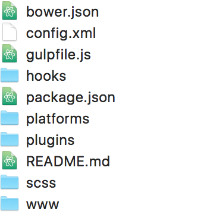
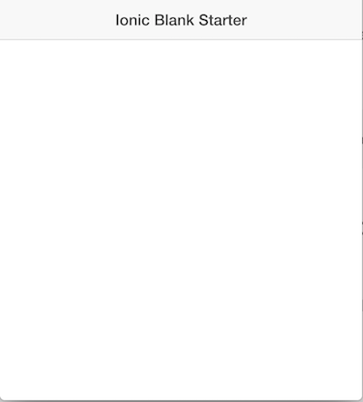

Building `Read It Later` Mobile Application Using Ionic Framework
----

Welcome to twenty-eighth post of [52-technologies-in-2016](https://github.com/shekhargulati/52-technologies-in-2016) blog series. The mobile application development space offers quite a range of development platforms. I am not going to talk about the pros and cons of each of these platforms. Instead, I will show you how to build a `Read It Later` hybrid mobile app using the [Ionic framework](http://ionicframework.com/). Hybrid mobile apps use mobile device browser to display its interface. Hybrid apps are built using web technologies like HTML, JavaScript, and CSS that most web programmers know and use. Ionic is a hybrid mobile application development framework and toolset that is built on top of [AngularJS](https://angularjs.org/) and [Apache Cordova](https://cordova.apache.org/). Ionic uses AngularJS as its web application framework of choice and Apache Cordova is used to access mobile features and packaging the native app.

The idea behind `Read It Later` application is very simple. These days many Twitter users like (or favorite) a tweet to mark it for later read. Our application will subscribe to a user like feed and store it in a database and expose the read it later feed using a nice to use REST API. Our ionic based mobile application will consume the REST API and render the user his/her read it later feed.

> **This is a guest post by [Rahul Sharma](https://www.linkedin.com/in/rahul-sharma-72531111). 52 technologies series is now open for external contributions so if you would like to contribute a guest post send us a PR.**

## Application components

The complete application will consist of two components:

* **REST API Backend** : The server-side component listens to the Twitter API to know any tweets you `liked`. The complete application is built in Python using `tweepy` and `newspaper` libraries. The list of your `likes` is exposed via a JSON API.

* **Mobile Application** : The mobile side component reads the `likes` from the server and presents them in the form of a simple list. Each item in the list consists of an image, summary text, and a title. The complete list can be updated using the `Pull to refresh` feature.

The complete source code for the tutorial is available on [Github](./dailyreads)

## Building `Read It Later` REST API

We will reuse the python based [`Read It Later`](https://github.com/shekhargulati/52-technologies-in-2016/tree/master/16-newspaper) web application developed few weeks back. As stated above, application is built using [tweepy](https://pypi.python.org/pypi/tweepy), [newspaper](https://pypi.python.org/pypi/newspaper), and [flask](https://pypi.python.org/pypi/flask). We will add JSON based API to the application. In this tutorial, we will discuss application backend briefly. Please refer to the [original tutorial](https://github.com/shekhargulati/52-technologies-in-2016/tree/master/16-newspaper) for more details.

The application has a `LikedTweetsListener` which listens to tweets liked by a user. `LikedTweetsListener` is a sub class of `tweepy.streaming.StreamListener` provided by `tweepy` library. When an application receives a tweet, it builds a `newspaper.Article` and extracts information from it. Then, The complete info is saved in an in-memory list. When a user makes a GET request to the index `\` page, then a web page is built using the list and rendered via flask `render_template` function.

Our mobile application needs access to the information in the list. So, we will use Python's inbuilt JSON utilities to convert the data to a JSON document. We will use `json.dumps` to construct a JSON document and then construct a flask `Response` object. The response should have `application/json` as its mime type.

```python
@app.route("/api/bookmarks")
def bookmarks():
    return Response(json.dumps(sorted(articles, key=lambda article: article["liked_on"], reverse=True)),  mimetype='application/json')
```

Also, we have to update `extract_article` so that data can be serialized to JSON. In the previous post, `text` was saved as bytes which could not be converted to JSON. Also, we have removed `publish_date` as it was not required. The updated `extract_article` method is shown below.

```python
def extract_article(story_url):
    article = Article(story_url)
    article.download()
    article.parse()
    title = article.title
    img = article.top_image
    text = article.text.split('\n\n')[0] if article.text else ""
    return {
        'title':title,
        'img':img,
        'text': text
    }
```

Now run the application and access http://localhost:5000/api/bookmarks. It should send back a JSON array.

```
$ curl http://localhost:5000/api/bookmarks | jq '.'
```
```json
[
  {
    "text": "Another week, another police shooting in the United States. So far this year, 569 people have be killed by US police, according to The Guardian’s count. Police brutality is a horrific normality and, in more ways than one, black men being shot by police has become the modern-day equivalent of lynching.",
    "story_url": "http://ift.tt/29u3OZp",
    "liked_on": 1468142910.676542,
    "img": "https://qzprod.files.wordpress.com/2016/07/rtr2ml9x.jpg?quality=80&strip=all&w=1600",
    "title": "How do police handle violence in countries where officers don’t carry guns? — Quartz"
  },
  {
    "text": "",
    "story_url": "http://www.forbes.com/sites/brucelee/2016/07/06/could-brain-research-for-the-past-15-years-be-wrong/?utm_source=TWITTER&utm_medium=social&utm_content=511409081&utm_campaign=sprinklrForbesTech#77508e425836",
    "liked_on": 1468142649.838931,
    "img": "http://specials-images.forbesimg.com/imageserve/141951019/640x434.jpg?fit=scale",
    "title": "Could Brain Research From The Past 15 Years Really Be Wrong?"
  }
]
```

> **In the curl command shown above, we have used `jq` to pretty print JSON result. `jq` was covered in [week 20 post](https://github.com/shekhargulati/52-technologies-in-2016/blob/master/20-json/README.md#project-2-jq).**

This concludes our section on REST API backend. Let's build our mobile application now.

## Building `Read It Later` mobile application

Now, let's embark on the journey to build a hybrid mobile application using Ionic. Ionic is based on AngularJS. So, knowledge of AngularJS is required. The application will be written in ECMAScript 6 that will be [transpiled](https://en.wikipedia.org/wiki/Source-to-source_compiler) using [BabelJS](https://babeljs.io/).

As mentioned in the introduction, Ionic depends on Apache Cordova for building and packaging the native app. So, let's start by installing `cordova` and  `ionic`  command line utilities using `npm`.

```bash
$ npm install -g cordova ionic
```

The cli gives a host of features to generate, build, and run the project. Run the `ionic` command to get the list of tasks. Navigate to a convenient directory on your filesystem where you want to create the mobile application. The structure that I am using is shown below. We have a parent directory called `dailyreads` and inside we have two directories `backend` and `mobileapp`. The `backend` directory will house source code related to our REST API backend. The `mobileapp` directory will house source code for our mobile app source code.

```
dailyreads
  backend
  mobileapp
```

Now, we will generate an Ionic starter project by running the following command. Make sure you are inside the `dailyreads` directory.

```bash
$ ionic start mobileapp blank
```

Above we have used `blank` template, this a prebuilt template provided by Ionic. Ionic offers a bunch of templates like `sidemenu`,`tabs`,`blank`, etc. that you can use to start off your app development. Besides these, you can use any custom template as well.

The above command will generate a bunch of source files in the `mobileapp` folder.



- The `config.xml` contains configuration for the application. It can alter various behaviors of the project.
- The `gulpfile.js`  defines gulp tasks for the project.
- The `www` defines the bundle which contains html, js, css, libs, etc. is packaged with the application.
- The `bower.json` and `package.json` define dependencies / dev-dependencies for the project.
- The `plugins` describes the Cordova and ionic plugins being used.
- The `platform` lists the application platforms being built.

Let's go into the `mobileapp` directory and run the application by issuing the following command.

```bash
$ cd mobileapp
$ ionic serve
```

The server would start and would render a page at http://localhost:8100/



The application is now running in the `live` mode. If I make changes to the files inside the `www` folder, then they will be reloaded automatically thanks to the livereload feature.

The complete application is deployed from the `app.js` file inside the `www\js` directory. Try making some changes to see the effect. The `app.js` is written using ECMAScript 5 syntax, but I will write this application using ECMAScript 6(or ES6). So, we have to setup the project so that we can use ES6 and transpile it to previous JavaScript versions using [Babel](https://babeljs.io/).

I will write ES6 code and then ask `gulp` to convert it to previous versions of JavaScript using `babel`.  To do so, I will create a new directory `src` parallel to the `www` directory. Now, move the `app.js` from `www\js` to the `src\js` directory.

Before we can use gulp, we have to install `gulp-babel`.

```bash
$ npm install gulp-babel --save
```

Let's modify the `gulpfile.js` to define `babel` gulp task as shown below.

```javascript
var babel = require('gulp-babel');
var paths = { es6: ['./src/js/*.js'],  sass: ['./scss/**/*.scss'] };
gulp.task("babel", function () {
  return gulp.src(paths.es6)
    .pipe(babel({presets: ['es2015']}))
    .pipe(gulp.dest("www/js"));
});
```

Add `babel` task as a dependency on `watch` and `default` tasks as shown below. This will make sure `babel` task is run whenever `default` and `watch` tasks are executed.

```javascript
gulp.task('default', ['babel','sass']);
gulp.task('watch', function() {
  gulp.watch(paths.es6, ['babel']);
  gulp.watch(paths.sass, ['sass']);
});
```

Now run the `gulp` command followed by `ionic serve` command. It should render the same blank page. This is all good, but writing two commands every time is painful. It is important to note the now `ionic` is  no longer listening to file changes to `src` folder and it will not refresh if we make any changes.

> In order to use the latest methods like Array.find we need to bundle `babel-polyfill.js` with our application. We can install the same using `bower` : `bower install babel-polyfill --save`. Now include the script in `index.html` :
  ```
  <script src="lib/babel-polyfill/browser-polyfill.js"></script>
  ```

To fix the above issues, let's modify `ionic.project` file. As a first step we should define the correct `name` of the project. Post that, define `gulpDependantTasks` property, the property signified `gulp` tasks which need to be executed before a build. So we can say : `gulpDependantTasks : ["babel"]`
Add `gulpStartupTasks` property, it signifies the gulp tasks to keep alive during `ionic server`. Thus we can say `gulpStartupTasks : ["watch"]`

Now do `ionic serve`. It should execute `gulp-babel` first. Try modifying `src/js/app.js` the server should detect the change.

> As a personal preference, I will add `html` and `css` files to the `src` folder and additionally define `gulp` tasks to build them.

The project is now setup correctly, so let's start building our application.

As a starting point, rename the Angular module in `app.js` from 'starter' to `dailyReads`. Also modify `ng-app` attribute of `body` tag in `index.html` to reflect the same.

Any usable app will consist of  multiple views each offering different things. Thus, we will build an app geared towards multi-views even though we will build a single view. In order to do so, remove the `ion-content` tag from `index.html` and replace it with `ion-nav-view`

Also, we will replace the `ion-header` with an `ion-nav-bar`. The bar will allow us to have navigation buttons and headers based on the rendered view. All the changes suggested above are shown below.

```html
<body ng-app="dailyReads">
  <ion-nav-bar class="bar-positive">
  </ion-nav-bar>
  <ion-nav-view></ion-nav-view>
</body>
```

Let's head back to `src\js\app.js` to construct the view. In order to do so we need to define a state in Angular routes.

```javascript
.config(($stateProvider,$urlRouterProvider) => {
  $stateProvider.state("home",{
    cache: false,
    url :'/home',
    controller :'HomeController',
    templateUrl : 'views/home/home.html'
  });

  $urlRouterProvider.otherwise('/home');
})
```

In the above code we defined the `home` state and configured the route provider to render it.

Now let's build the `HomeController`. All we want to do is to use the `$http` service to call `http://localhost:5000/api/` and store the data in the `$scope` object as shown below.

```javascript
.controller('HomeController',($scope,$http) => {
    $http.get("http://localhost:5000/api/bookmarks")
          .success(function(data){
            $scope.news = data;
         }).error(function(data, status, headers, config){
           console.log('oops error occurred while retrieving data');
         });
  })
```

All that is left now is to build the HTML page. For now we will keep the view simple. The news item will be rendered as [ionic cards](http://ionicframework.com/docs/components/#card-images), listing down the title, image and text.

```html
<ion-view view-title="Home">
  <ion-content>
    <div class="list card" ng-repeat="newsInfo in news track by $index">
      <div class="item item-body">
         
         <p>
           {{ newsInfo.text }}
         </p>
       </div>
    </div>
  </<ion-content>  .
</ion-view>
```

The above code defines the view with a title `Home`.  Next we define the `ion-content`. The directive defines a content area which can be used for scrolling. The rest is a `div` which displays the individual item.

Looks like we are done, so let's start Python server `python app.py` and do a `like` on twitter. The 'http://localhost:5000/' show the favorite. The 'http://localhost:5000/api/bookmarks' gives back a JSON.

Now, run the mobile app using `ionic serve`. It works, but does not show the  favorite. Now, let's look into `Developer Console` in your browser. It lists out an error.

```
XMLHttpRequest cannot load http://localhost:5000/api/. No 'Access-Control-Allow-Origin' header is present on the requested resource. Origin 'http://localhost:8100' is therefore not allowed access
```

Ok! So looks like we are doing cross origin requests. There is a server running on port 8100 and another on 5000, so we need to configure proper set of headers to make it working. This needs to be done on the python server side.

Install the `flask-cors` extension using `pip`.

```bash
$ pip install -g flask-cors
```
Now configure the `flask` application to use the `cors` extension

```python
from flask.ext.cors import CORS

app = Flask(__name__)
CORS(app)
```

Run the server and the mobile application. The favorites should be rendered on the server page, JSON api and the mobile application.

The server shows all the `liked` tweets and updates the view as soon as on tweets are available. But the mobile app does not update the list. So now we will add the `Pull to refresh` feature which will update the list of favorites. Ionic provides the `ion-refresher` tag to do the same.

```html
<ion-refresher pulling-text="Pull to refresh..." on-refresh="reloadFavs()">
</ion-refresher>
```

The tag needs a method which it will call when dragged. Add `reloadFavs` method to `HomeController`. The method should specify when to stop showing loading indicator. This is done by sending `scroll.refreshComplete` event.

```javascript
$scope.reloadFavs = function(){
  $http.get("http://localhost:5000/api/bookmarks")
        .success(function(data){
          $scope.news = data;
          $scope.$broadcast('scroll.refreshComplete');
       }).error(function(data, status, headers, config){
         console.log('oops error occured while refreshing data',JSON.stringify(data));
          $scope.$broadcast('scroll.refreshComplete');
       });
}
```

Looks like we are done now !  But wait, we created the application but did not specify platforms(android/ios) for it. By default it will include `ios` platforms. To make a build on the same we would require `Xcode`. List the available platforms using cli :

```bash
$ ionic platform list
```
```
Installed platforms: ios 3.8.0
Available platforms: amazon-fireos, android, blackberry10, browser, firefoxos, osx, webos
```

Let's add `android` platform using the cli :

```bash
$ ionic platform add android
```

Now build the `.apk` using `cordova compile android`. This should generate an `apk` file inside the `mobileapp/platforms/android/build/outputs/apk/` directory.

Note, if we install the app to an Android device, it will not run as it is trying to load data from  `http://localhost:5000/api/bookmarks`. So make sure to replace the `localhost` with a server IP address. Even after we do, the application may not run various devices. This is due to the fact that android platform has a very strict control over what an app can perform. Since our application is trying to make calls to a server we need to whitelist the http calls. This is done by specifying the intent in `config.xml`.

```xml
<allow-intent href="http://*/*" />
```

Our mobile app is now finally done! So some people might think that we can ship the app now to all kinds of online stores like google play. I would say that no, we are still a few steps away before we can accomplish that. We must release the app. The release process will optimize the build and add version it. Post that we need to have credentials for play store. I will leave this for a future post.

The application as of now offers a good test bed to learn and experiment more things like adding splash screens, icons or replacing the pull with a push(via ionic services). I will advise the readers to try out those features to learn more about the ionic framework.

----------

That's all for this post. Please provide your valuable feedback by posting a comment to [https://github.com/shekhargulati/52-technologies-in-2016/issues/37](https://github.com/shekhargulati/52-technologies-in-2016/issues/37).

[](https://github.com/igrigorik/ga-beacon)
