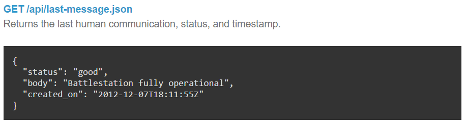
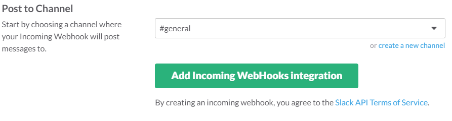
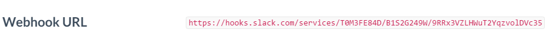
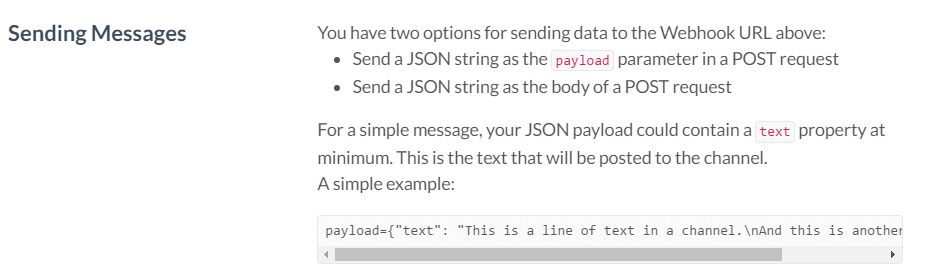
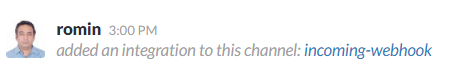
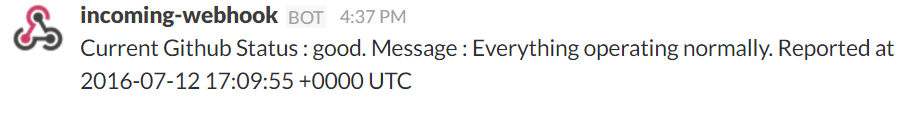

Go Language - GitHub System Status API & Slack Notifications
---------

Welcome to twenty-ninth post of [52-technologies-in-2016](https://github.com/shekhargulati/52-technologies-in-2016) blog series. In a previous [episode](https://github.com/shekhargulati/52-technologies-in-2016/blob/master/27-learn-golang-for-great-good/README.md), we covered the basics of [Golang](https://golang.org/) and saw a number of sample programs to under the basic features in the language. In this episode, we are going to investigate a few more features of the language and combine that into a real life application where we can monitor the status of the GitHub System via its Status API and report its current status directly into a Slack Team page.

In summary, we are going to do the following:
- Understand the GitHub System Status API
- Configure Incoming Webhook Integration for your Slack Team
- Write a Go program to invoke the GitHub System Status API, receive the response in our Go Application and raise the notification in Slack

> **This is a guest post by [Romin Irani](https://twitter.com/iRomin). 52 technologies series is now open for external contributions so if you would like to contribute a guest post send us a PR.**


## GitHub Status API

Github provides a [JSON API](https://status.github.com/api) to check on the Github Status. It provides multiple endpoints via which you can get the current system status, last message reported and a list of last messages. We are going to look at the last message reported endpoint that is available at [https://status.github.com/api/last-message.json](https://status.github.com/api/last-message.json).



A sample invocation of the API gives the JSON response as given below:

```json
{
  "status": "good",
  "body": "Everything operating normally.",
  "created_on": "2016-07-12T17:09:55Z"
}
```

The `status` field returned is of interest to us. The GitHub Status API documentation states that this is set to either good (green) , minor (yellow) or major (red). This article will cover how we can raise the notification and you can easily modify the code to raise the notification only if the status is say "major".

The API call above is a HTTP GET call and we shall we see in a while how we can do that via our Go program.

## Slack Incoming Webhook Integration

The [Slack API](https://api.slack.com/) provides multiple ways in which applications can integrate with it. One of the mechanisms is [Incoming Webhooks](https://api.slack.com/incoming-webhooks) integration via which you can send messages in real-time to Slack. This means that we can use this integration to send messages to our Slack Team in case GitHub Status is "major" or any other combination that you might vis-a-vis the current GitHub Status.

Let us move forward with configuring our Slack Team channel to receive the Incoming Webhook Notification. This will require that we create a Custom Integration. The steps for that are given below:

1. Assuming that you are the Administrator for the Slack Team, you will need to go to the Apps Management page for your Slack Team. This is available at the following URL:

    `https://Your_SlackTeam_URL/apps/manage`

2. Once you are that page, on the left-side you will notice a list of options under Manage. Click on Custom Integrations.
3. Click on Incoming Webhooks and then Add a Configuration.
4. We need to now configure which channel to post the message in. So at this screen, select the `#general` channel as shown below. Click on `Add Incoming Webhooks Integration` button.



5. This will lead to the configuration details, where you will notice a field at the top labelled `Webhook URL`. Note down this URL since this is the endpoint to which you will have to do a HTTP POST to raise the notification message.



6. Note the details that the configuration page also provides  you with i.e. you need to do a HTTP POST with the JSON payload, a sample of which is shown below from my configuration page.



Click on `Save`. This completes the Slack Incoming Webhook Integration configuration and you should see that reflect in your Slack Team #general channel as a message. A sample message is shown below:



We are all set now to write our Go program.

## Go Program

Before we see the code it is important to note what we need to do in our application. The sequence of steps are shown below:
1. We will do a HTTP GET To the GitHub Status API and retrieve the last message. This means that we will look at how to make HTTP GET client requests from a Go program.
2. The Last Message is a JSON formatted response that we will **unmarshall** into a higher level language structure in Golang called a Struct.
3. We will then invoke a local function that will do a HTTP POST to the Slack Incoming Webhook URL that we configured in the previous section.

Let us now take a look at the complete Go program.

```go
//The application checks for GitHub Status and raises a Slack Notification if it is down
package main

import (
	"encoding/json"
	"fmt"
	"io/ioutil"
	"log"
	"net/http"
	"net/url"
	"time"
)

const (
	GitHubStatusAPIURL      = "https://status.github.com/api/last-message.json"
	SlackIncomingWebhookURL = "YOUR_SLACK_INCOMING_WEBHOOK_URL"
)

func check(e error) {
	if e != nil {
		log.Fatalf("Error in GitHubStatus application. Error : %v", e)
	}
}

//GitHubStatusLastMessage struct
type GitHubStatusLastMessage struct {
	Status   string    `json:"status"`
	Message  string    `json:"body"`
	CreateDT time.Time `json:"created_on"`
}

var githubStatus GitHubStatusLastMessage

//SlackMessage is the struct that we will post to Incoming Slack Webhook URL
type SlackMessage struct {
	Message string `json:"text"`
}

func main() {

	//Initiate the GET call to GitHub Status API at https://status.github.com/api/last-message.json
	resp, err := http.Get(GitHubStatusAPIURL)
	check(err)
	defer resp.Body.Close()

	//Read the Response and unmarshall it into GitHubStatusLastMessage struct
	body, _ := ioutil.ReadAll(resp.Body)
	err = json.Unmarshal(body, &githubStatus)
	check(err)

	//Check if the GitHub Status reported is major and raise the Alert
	//The Status is either good (green) , minor (yellow) or major (red)
	//if githubStatus.Status == "major" {
	//	raiseSlackNotification(githubStatus)
	//}
	raiseSlackNotification(githubStatus)
}

//raiseSlackNotification does a HTTP POST to the Incoming Webhook Integration in your Slack Team
func raiseSlackNotification(status GitHubStatusLastMessage) {
	const WebhookURL = SlackIncomingWebhookURL
	postParams := SlackMessage{fmt.Sprintf("Current Github Status : %v. Message : %v Reported at %v", status.Status, status.Message, status.CreateDT)}
	b, err := json.Marshal(postParams)
	if err != nil {
		log.Printf("Error in creating POST Message. Error : %v", err)
		return
	}
	v := url.Values{"payload": {string(b)}}
	_, err = http.PostForm(WebhookURL, v)
	if err != nil {
		log.Printf("Error in sending Slack Notification. Error : %v", err)
	}
}
```

## Understanding our Go program

At the top of the program, we have our standard `import` definitions. We then define 2 `const` that contains the values of our GitHub Status API endpoint and the Slack Incoming Webhook URL.

### Structs in Go
A `struct` in Go allows us to define a record containing multiple fields. For e.g. think of an Employee `struct` that could contain fields like `FirstName`, `LastName`, `Age` and so on.

In our case, we are interested in creating a `struct` that will represent the JSON response that we receive from the GitHub Status API. Recall that at the beginning of the article, we covered the JSON response that the GitHub Status API returns and a sample response is shown below again for your reference:

```json
{
  "status": "good",
  "body": "Everything operating normally.",
  "created_on": "2016-07-12T17:09:55Z"
}
```

So we are definining a struct named `GitHubStatusLastMessage` that captures has the following fields: `Status`, `Message` and `CreateDT`. Notice that we have also declared their respective data types i.e. `string` for `Status` and `Message` and `time.Time` for `CreateDT`. Notice that you have the flexibility of definining your field names that are different from the JSON fields that are returned by the API response. The ``json:"response_field_name"`` that you see next to each field is the actual field name that is present in the JSON response.

The `encoding/json` packge in the standard Go library provides us marshall / unmarshall functions that will map the JSON fields in the response to the appropriate `struct` fields.

Similarly, we define the `SlackMessage` struct that we are going to create to send a HTTP POST To the Slack Incoming Webhook URL.

### main function

Let us look at the `main` function now. We are going to be using the `net/http` library for the HTTP GET method that we need to invoke the GitHub Status API. The `http.Get` function is invoked on the `GitHubStatusAPIURL` and the response is checked for any errors. If all is good, we are then going to use the `ioutil.ReadAll` function to read all the bytes (JSON response) that have been returned.

Now that we have the bytes, we are simply going to use the `json.Unmarshal` function to marshall the bytes into our `GitHubStatusLastMessage` struct variable. This will do the mapping from the JSON fields to the struct fields and the struct will be populated with the right values.

At this point we can inspect the `Status` field of the `GitHubStatusLastMessage` struct and determine if we want to raise the notification or not. But for the purposes of this tutorial we have commented this out and are simply invoking the `raiseSlackNotification` function.

### raiseSlackNotification function

This function first creates a Struct instance of type `SlackMessage` and populates it with the text that we want to raise in our Slack Team channel via a notification.
The next step is to marshal this struct i.e. `SlackMessage` struct into a JSON payload via the `json.Marshall` method.

Finally, we are doing a `http.PostForm` to the Slack Incoming Webhook URL by passing the request variable `payload` (as per the Slack Documentation) and the value of the payload is the JSON data that we constructed in the previous step.

## Running the Go program
This assumes that you have installed the Go Programming environment on your development machine and are familiar with organizing Go code. The entire source code for the file is present in the `main.go` file that we saw in the previous section.

To run the code, simply invoke the `go run` command as shown below:

```bash
$ go run main.go
```

If all goes well, you will see the current GitHub Status being reported in your Slack Team `#general` channel. A sample run is shown below:



That's all for this week. Please provide your valuable feedback by adding a comment to [https://github.com/shekhargulati/52-technologies-in-2016/issues/40](https://github.com/shekhargulati/52-technologies-in-2016/issues/40).

[](https://github.com/igrigorik/ga-beacon)
