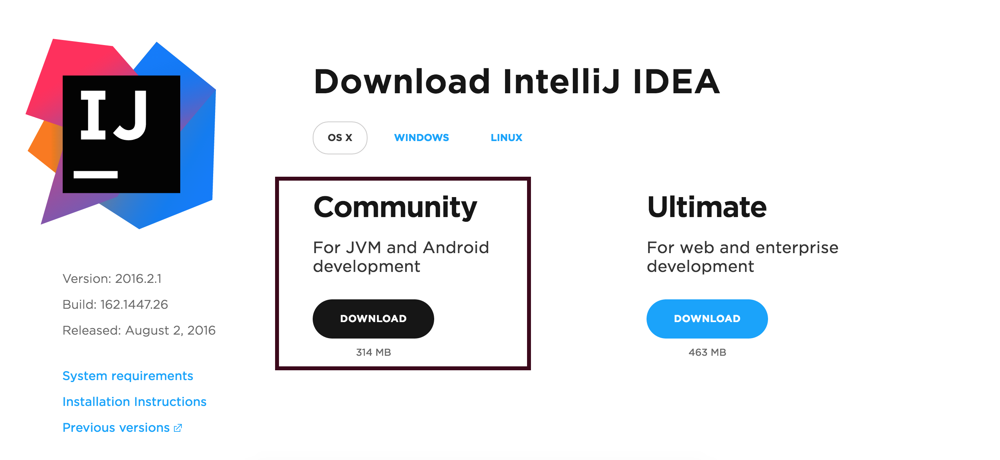
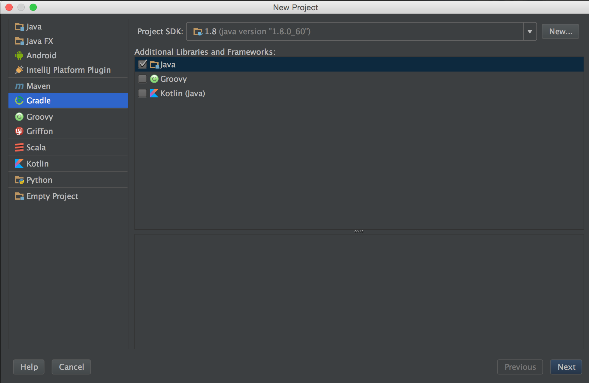
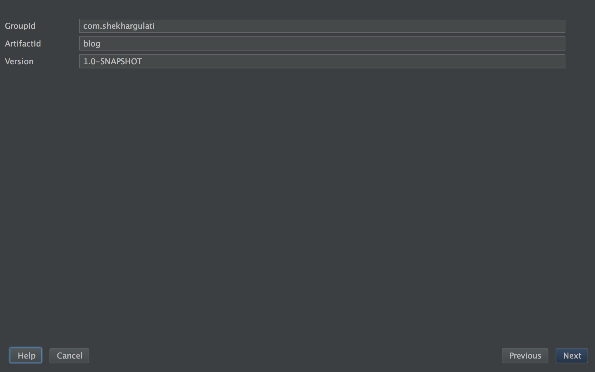
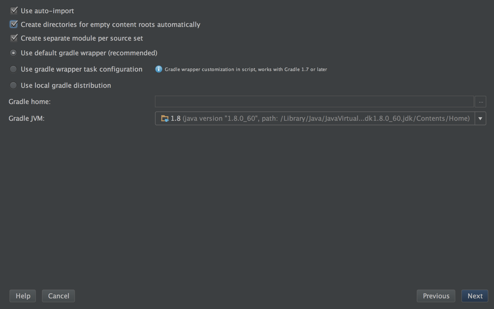
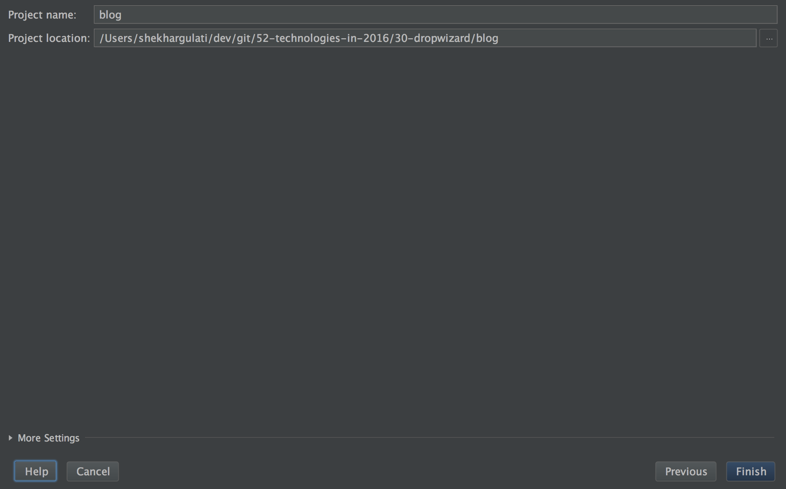
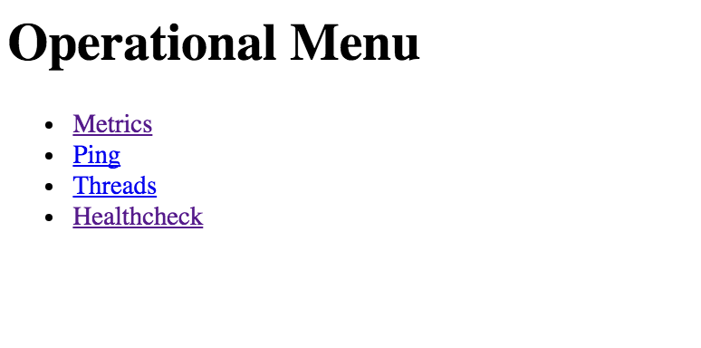

Dropwizard: Your Java Library For Building Microservices
----

Welcome to the thirtieth post of [52-technologies-in-2016](https://github.com/shekhargulati/52-technologies-in-2016) blog series. This week I decided to spend time on [Dropwizard](http://www.dropwizard.io/1.0.0/docs/). Back in 2013, I first learnt about DropWizard when I was exploring Java micro-frameworks. [Dropwizard] impressed me a lot with its opinionated approach to building ops-friendly, high-performance RESTful backends. You can spin up REST backends in a matter of minutes taking your productivity to the next level. [Dropwizard](http://www.dropwizard.io/1.0.0/docs/) is an open source Java framework which was developed by Yammer to power their JVM based backend. It consists of following components :

* Embedded Jetty : Every application is packaged as a jar instead of war file and starts its own embedded jetty container. There is no WAR file and no external servlet container.

* JAX-RS : Jersey(the reference implementation for JAX-RS) is used to write RESTful web services. So, your existing JAX-RS knowledge is not wasted.

* JSON : The REST services speaks JSON. Jackson library is used to do all the JSON processing.

* Logging : It is done using Logback and SLF4J.

* Hibernate Validator : Dropwizard uses Hibernate Validator API for declarative validation.

* Metrics : Dropwizard has inbuilt support for monitoring using the metrics library. It provides unparalleled insight into what our code does in production.

## Github Repository
The code for today’s demo application is available on github: []()

## Prerequisite
1. Basic Java knowledge is required.

2. Install JDK 8 on your operating system.

3. Download latest version of IntelliJ Idea community edition from the [JetBrains official website](https://www.jetbrains.com/idea/download/). IntelliJ Idea community edition is best IDE for Java developers.
  

## Step 1: Create new Java Gradle project

Launch IntelliJ and click on `Create New Project`. You will see a screen where you will have to select the type of project you want to create.



Press `Next`, you will be asked to provide `GroupId` and `ArtifactId`.



Next, you will be asked to configure few Gradle options. We will enable auto import so that project is kept in sync with `build.gradle`.



Finally, you will be asked to provide the name and location of the project. As we are going to create a simple blog application we have used name as blog.



## Step 2: Update project to JDK 8

Open `build.gradle` and define couple of properties as shown below.

```gradle
group 'com.shekhargulati'
version '1.0-SNAPSHOT'

apply plugin: 'java'

sourceCompatibility = 1.8
targetCompatibility = 1.8

repositories {
    mavenCentral()
}

dependencies {
    testCompile group: 'junit', name: 'junit', version: '4.12'
}
```

## Step 3: Define Dropwizard dependencies

Now, we will update the `build.gradle` to include the dropwizard-core maven dependency. This will download a bunch of dependencies so please remain patient.

```gradle
def dropwizardVersion = '1.0.0'

dependencies {
    compile 'io.dropwizard:dropwizard-core:' + dropwizardVersion
    testCompile group: 'junit', name: 'junit', version: '4.12'
}
```

## Step 4: Create Configuration class

Every Dropwizard application has one configuration class which specifies the environment specific parameters. Later in this blog post, we will add MongoDB configuration parameters like host, port, and db name to it. These parameters are specified in a YAML configuration file which is deserialized to an instance of your application's configuration class and validated.

Create a new class `AppConfiguration` in the `blog` package. This class will extend `io.dropwizard.Configuration` class.

```java
package blog;

import io.dropwizard.Configuration;

public class AppConfiguration extends Configuration{
}
```

## Step 5: Create BlogApplication class

The Dropwizard project is bootstrapped by an `Application` class. This class pulls together various bundles and commands which provide basic functionality. It also starts the embedded jetty server and extends `io.dropwizard.Application`.

```java
package blog;

import io.dropwizard.Application;
import io.dropwizard.setup.Bootstrap;
import io.dropwizard.setup.Environment;

public class BlogApp extends Application<AppConfiguration> {


    public static void main(String[] args) throws Exception {
        new BlogApp().run("server");
    }


    @Override
    public void run(AppConfiguration configuration, Environment environment) throws Exception {

    }

    @Override
    public void initialize(Bootstrap<AppConfiguration> bootstrap) {
    }
}
```

The application class shown above does the following:

1. The class has a main method which acts as our application entry point. Inside the main method, we create an instance of `BlogApp` and call the run method passing it `server` command as its argument. The `server` command will start the embedded jetty server.
2. The initialize method is called before running the service run method. Currently, we are not doing anything in the service method.
3. Next, we have `run` method which will be called when application runs. Later in this blog, we will add REST resources inside this method.

You can run this application now. Just right click on the `BlogApp` class and select `Run BlogApp.main` option. This will launch the inbuilt Jetty server and start server at [http://localhost:8080/](http://localhost:8080/). If you make cURL request to it you will get 404. The reason is that you have not defined any endpoints yet.

```bash
$ curl -i http://localhost:8080/
```
```
HTTP/1.1 404 Not Found
Date: Mon, 15 Aug 2016 19:37:38 GMT
Content-Type: application/json
Content-Length: 43

{"code":404,"message":"HTTP 404 Not Found"}
```

## Step 6: Create `IndexResource`

Let us write our first resource which will be invoked when a GET request is made to the `/` url. Create a new JAX-RS resource as shown below. This resource will list all the blogs.


```java
package blog.resources;


import blog.model.Blog;
import com.codahale.metrics.annotation.Timed;

import javax.ws.rs.GET;
import javax.ws.rs.Path;
import javax.ws.rs.Produces;
import javax.ws.rs.core.MediaType;
import java.util.Collections;
import java.util.List;


@Path("/")
public class IndexResource {

    @GET
    @Produces(value = MediaType.APPLICATION_JSON)
    @Timed
    public List<Blog> index() {
        return Collections.singletonList(
                new Blog("Groovy AST Transformations By Example",
                        "https://github.com/shekhargulati/52-technologies-in-2016/blob/master/32-groovy-ast-transformations/README.md"));
    }
}
```

The code shown above is a standard JAX-RS resource class. It is annotated with `@Path` annotation and defines `index` method. The `index` returns a collection of blogs. These blogs will be converted to JSON document. The `@Timed` annotation makes sure that Dropwizard time this method.

The above mentioned `IndexResource` used a blog representation. It is shown as below. The `Blog` representation uses hibernate validator annotations to make sure the content is valid. For example, we use `@URL` annotation to make sure only valid URLs are stored in the MongoDB database.

```java
package blog.model;

import java.util.Date;
import java.util.UUID;

import org.hibernate.validator.constraints.NotBlank;
import org.hibernate.validator.constraints.URL;

public class Blog {

    private String id = UUID.randomUUID().toString();

    @NotBlank
    private String title;

    @URL
    @NotBlank
    private String url;

    private final Date publishedOn = new Date();

    public Blog() {
    }

    public Blog(String title, String url) {
        super();
        this.title = title;
        this.url = url;
    }

    public String getId() {
        return id;
    }

    public String getTitle() {
        return title;
    }

    public String getUrl() {
        return url;
    }

    public Date getPublishedOn() {
        return publishedOn;
    }
}
```

Next, we register `IndexResource` in the application class `run` method. Update the run method in `BlogApp` with the one shown below.

```java
@Override
public void run(AppConfiguration configuration, Environment environment) throws Exception {
    environment
            .jersey()
            .register(new IndexResource());
}
```


Run the application again by right clicking on the `BlogApp` and then selecting `Run BlogApp.main` option. This time if you make GET request to `http://localhost:8080` you will see our hard coded response.

```bash
$ curl http://localhost:8080 |jq '.'
```
```json
[
  {
    "id": "ec96b252-8dc7-4c84-b26b-d41dd479e8f7",
    "title": "Groovy AST Transformations By Example",
    "url": "https://github.com/shekhargulati/52-technologies-in-2016/blob/master/32-groovy-ast-transformations/README.md",
    "publishedOn": 1471290772422
  }
]
```

The administrative interface is available at [http://localhost:8081/](http://localhost:8081/).



We can check the metrics of the `IndexResource` by clicking `Metrics`. The data is available in JSON format.

```json
"timers": {
    "blog.resources.IndexResource.index": {
      "count": 9,
      "max": 0.011309738000000001,
      "mean": 0.00039725750894129734,
      "min": 0.000171131,
      "p50": 0.00040392600000000004,
      "p75": 0.0005585350000000001,
      "p95": 0.0005585350000000001,
      "p98": 0.0005585350000000001,
      "p99": 0.0005585350000000001,
      "p999": 0.011309738000000001,
      "stddev": 0.0004745239115316346,
      "m15_rate": 0.12787342984256184,
      "m1_rate": 0.00982297533390726,
      "m5_rate": 0.05629074869076141,
      "mean_rate": 0.019586528291019135,
      "duration_units": "seconds",
      "rate_units": "calls/second"
    }
}
```

The above shows that we have accessed `IndexResource` 9 times.

## Step 7: Configuring MongoDB

Add the `mongo-jackson-mapper` dependency in `build.gradle`.

```gradle
compile 'net.vz.mongodb.jackson:mongo-jackson-mapper:1.4.2'
```

Update the `AppConfiguration` class with MongoDB database details i.e. host, port, and database name.

```java
package blog;

import io.dropwizard.Configuration;
import org.codehaus.jackson.annotate.JsonProperty;
import org.hibernate.validator.constraints.NotEmpty;

import javax.validation.constraints.Max;
import javax.validation.constraints.Min;

public class AppConfiguration extends Configuration {

    @JsonProperty
    @NotEmpty
    public String mongohost = "localhost";

    @JsonProperty
    @Min(2000)
    @Max(65535)
    public int mongoport = 27017;

    @JsonProperty
    @NotEmpty
    public String mongodb = "blogdb";
}
```

Next we will create a new class named MongoManaged which allows us to manage resources on application start and stop. This implements `io.dropwizard.lifecycle.Managed`.

```java
package blog.mongo;

import com.mongodb.Mongo;
import io.dropwizard.lifecycle.Managed;

public class MongoManaged implements Managed {

    private Mongo mongo;

    public MongoManaged(Mongo mongo) {
        this.mongo = mongo;
    }

    @Override
    public void start() throws Exception {
    }

    @Override
    public void stop() throws Exception {
        mongo.close();
    }

}
```

In the code shown above, we close the MongoDB connections in stop method.

Next we will write a `MongoHealthCheck` which will check if MongoDB is connected or not. A health check is Dropwizard feature to do a runtime test to verify the service’s behaviour in production environment.

```java
package blog.mongo;

import com.codahale.metrics.health.HealthCheck;
import com.mongodb.Mongo;

public class MongoHealthCheck extends HealthCheck {

    private Mongo mongo;

    public MongoHealthCheck(Mongo mongo) {
        this.mongo = mongo;
    }

    @Override
    protected Result check() throws Exception {
        mongo.getDatabaseNames();
        return Result.healthy();
    }

}
```

Now we will update the `BlogApp` class to include the MongoDB configuration.


```java
package blog;

import blog.mongo.MongoHealthCheck;
import blog.mongo.MongoManaged;
import blog.resources.IndexResource;
import com.mongodb.Mongo;
import io.dropwizard.Application;
import io.dropwizard.setup.Bootstrap;
import io.dropwizard.setup.Environment;

public class BlogApp extends Application<AppConfiguration> {


    public static void main(String[] args) throws Exception {
        new BlogApp().run("server");
    }


    @Override
    public void run(AppConfiguration configuration, Environment environment) throws Exception {
        Mongo mongo = new Mongo(configuration.mongohost, configuration.mongoport);
        MongoManaged mongoManaged = new MongoManaged(mongo);
        environment
                .lifecycle()
                .manage(mongoManaged);
        environment
                .healthChecks()
                .register("MongoHealthCheck", new MongoHealthCheck(mongo));
        environment
                .jersey()
                .register(new IndexResource());
    }

    @Override
    public void initialize(Bootstrap<AppConfiguration> bootstrap) {

    }
}
```

In the code shown above :

1. A new Mongo instance is created using the `AppConfiguration` object.
2. A new instance of `MongoManaged` is created and added to the environment.
3. A health check is added.

Run the application as a main program. You can check if MongoDB is running or not by going to the HealtCheck page loacated at http://localhost:8081/healthcheck. If MongoDB is not running, you will see an exception stacktrace.


```bash
$ curl http://localhost:8081/healthcheck | jq '.'
```

```json
{
  "MongoHealthCheck": {
    "healthy": false,
    "message": "can't call something : Shekhar-2.local/192.18.0.2:27017/admin",
    "error": {
      "message": "can't call something : Shekhar-2.local/192.168.1.2:27017/admin",
      "stack": [
        "com.mongodb.DBTCPConnector.call(DBTCPConnector.java:227)",
        "com.mongodb.DBApiLayer$MyCollection.__find(DBApiLayer.java:305)",
        "com.mongodb.DB.command(DB.java:160)",
        "com.mongodb.DB.command(DB.java:183)",
        "com.mongodb.Mongo.getDatabaseNames(Mongo.java:327)",
        "blog.mongo.MongoHealthCheck.check(MongoHealthCheck.java:16)",
        "com.codahale.metrics.health.HealthCheck.execute(HealthCheck.java:172)",
        "com.codahale.metrics.health.HealthCheckRegistry.runHealthChecks(HealthCheckRegistry.java:77)",
        "com.codahale.metrics.servlets.HealthCheckServlet.runHealthChecks(HealthCheckServlet.java:120)",
        "com.codahale.metrics.servlets.HealthCheckServlet.doGet(HealthCheckServlet.java:89)",
        "javax.servlet.http.HttpServlet.service(HttpServlet.java:687)",
        "java.lang.Thread.run(Thread.java:745)"
      ]
    }
  },
  "deadlocks": {
    "healthy": true
  }
}
```

Now, start the MongoDB server and you will see health checks green.

```bash
$ curl http://localhost:8081/healthcheck | jq '.'
```
```json
{
  "MongoHealthCheck": {
    "healthy": true
  },
  "deadlocks": {
    "healthy": true
  }
}
```


## Step 8 : Create `BlogResource`

Now, we will write the BlogResource class which will be responsible for creating the blog entries.

```java
package blog.resources;

import blog.model.Blog;
import com.codahale.metrics.annotation.Timed;
import net.vz.mongodb.jackson.JacksonDBCollection;

import javax.validation.Valid;
import javax.ws.rs.Consumes;
import javax.ws.rs.POST;
import javax.ws.rs.Path;
import javax.ws.rs.Produces;
import javax.ws.rs.core.MediaType;
import javax.ws.rs.core.Response;


@Path("/blogs")
@Produces(value = MediaType.APPLICATION_JSON)
@Consumes(value = MediaType.APPLICATION_JSON)
public class BlogResource {

    private JacksonDBCollection<Blog, String> collection;

    public BlogResource(JacksonDBCollection<Blog, String> blogs) {
        this.collection = blogs;
    }

    @POST
    @Timed
    public Response publishNewBlog(@Valid Blog blog) {
        collection.insert(blog);
        return Response.noContent().build();
    }
}
```

Next, we will update the `BlogApp` run method to add `BlogResource` as well.

```java
@Override
public void run(AppConfiguration configuration, Environment environment) throws Exception {
    Mongo mongo = new Mongo(configuration.mongohost, configuration.mongoport);
    MongoManaged mongoManaged = new MongoManaged(mongo);
    environment
            .lifecycle()
            .manage(mongoManaged);
    environment
            .healthChecks()
            .register("MongoHealthCheck", new MongoHealthCheck(mongo));
    environment
            .jersey()
            .register(new IndexResource());

    DB db = mongo.getDB(configuration.mongodb);
    JacksonDBCollection<Blog, String> blogs = JacksonDBCollection.wrap(db.getCollection("blogs"), Blog.class, String.class);
    environment
            .jersey()
            .register(new BlogResource(blogs));

}
```

Run the `BlogApp` class as a Java application. To test the `BlogResource`, make a curl request as shown below:

```bash
$ curl -i -X POST -H "Content-Type: application/json" -d '{"title":"Groovy AST Transformations By Example","url":"https://github.com/shekhargulati/52-technologies-in-2016/blob/master/32-groovy-ast-transformations/README.md"}' http://localhost:8080/blogs
```

## Step 9 : Update `IndexResource`

Finally, we will update the IndexResource index() method to get all the blog documents from MongoDB.

```java
package blog.resources;


import blog.model.Blog;
import com.codahale.metrics.annotation.Timed;
import net.vz.mongodb.jackson.DBCursor;
import net.vz.mongodb.jackson.JacksonDBCollection;

import javax.ws.rs.GET;
import javax.ws.rs.Path;
import javax.ws.rs.Produces;
import javax.ws.rs.core.MediaType;
import java.util.ArrayList;
import java.util.List;


@Path("/")
public class IndexResource {

    private JacksonDBCollection<Blog, String> collection;

    public IndexResource(JacksonDBCollection<Blog, String> blogs) {
        this.collection = blogs;
    }

    @GET
    @Produces(value = MediaType.APPLICATION_JSON)
    @Timed
    public List<Blog> index() {
        DBCursor<Blog> dbCursor = collection.find();
        List<Blog> blogs = new ArrayList<>();
        while (dbCursor.hasNext()) {
            Blog blog = dbCursor.next();
            blogs.add(blog);
        }
        return blogs;
    }

}
```

We will update the `BlogApp` run method to pass the blogs collection to the `IndexResource`.

```java
@Override
public void run(AppConfiguration configuration, Environment environment) throws Exception {
    Mongo mongo = new Mongo(configuration.mongohost, configuration.mongoport);
    MongoManaged mongoManaged = new MongoManaged(mongo);
    environment
            .lifecycle()
            .manage(mongoManaged);
    environment
            .healthChecks()
            .register("MongoHealthCheck", new MongoHealthCheck(mongo));

    DB db = mongo.getDB(configuration.mongodb);
    JacksonDBCollection<Blog, String> blogs = JacksonDBCollection.wrap(db.getCollection("blogs"), Blog.class, String.class);
    environment
            .jersey()
            .register(new IndexResource(blogs));
    environment
            .jersey()
            .register(new BlogResource(blogs));

}
```

Run the `BlogApp` class as a Java application and test the application.

------

That's all for this week. Please provide your valuable feedback by adding a comment to [https://github.com/shekhargulati/52-technologies-in-2016/issues/43](https://github.com/shekhargulati/52-technologies-in-2016/issues/43).

[](https://github.com/igrigorik/ga-beacon)
