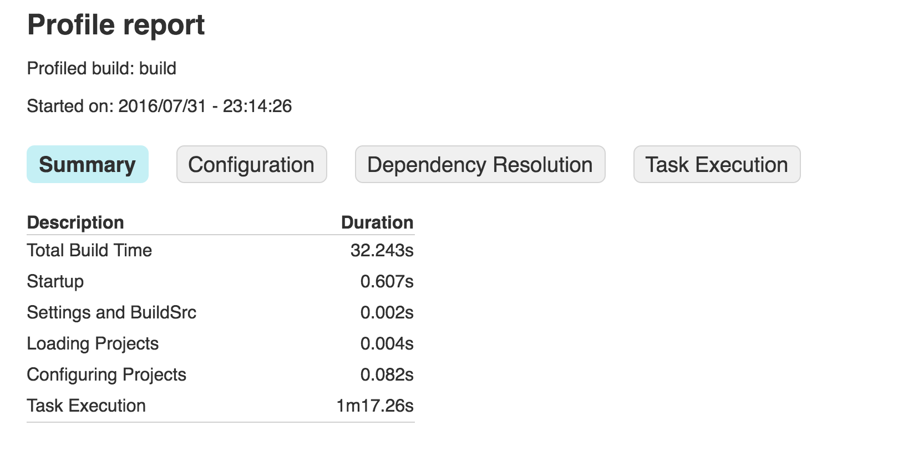
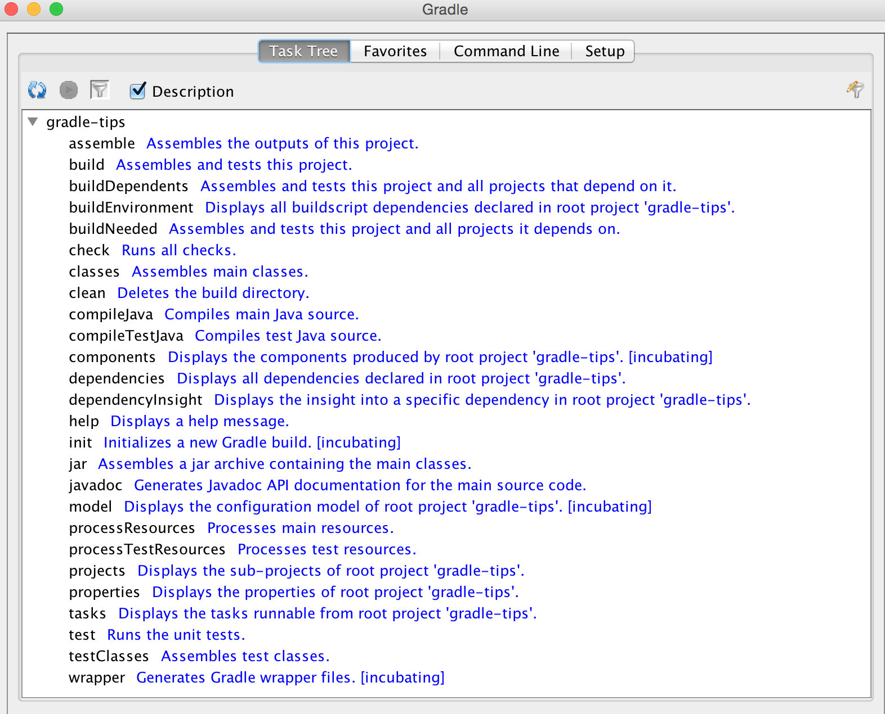

50 Gradle Tips
----

Welcome to thirty-first week of [52-technologies-in-2016](https://github.com/shekhargulati/52-technologies-in-2016) series. This week I decided to write down Gradle tips that I have learnt in last year or so. Over last year or so I have started using Gradle as my primary build tool for JVM based projects. Before using Gradle I was an Apache Maven user. Gradle takes best from both Apache Maven and Apache Ant providing you best of both worlds. Gradle borrows flexibility from Ant and convention over configuration, dependency management and plugins from Maven. Gradle treats task as first class citizen just like Ant.

A Gradle build has three distinct phases - initialization, configuration, and execution. The initialization phase determine which all projects will take part in the build process and create a Project instance for each of the project. During configuration phase, it execute build scripts of all the project that are taking part in build process. Finally, during the execution phase all the tasks configured during the configuration phase are executed.

In this document, I will list down tips that I have learnt over last year or so.

> **The actual gradle tips is maintained at [github:shekhargulati/gradle-tips](https://github.com/shekhargulati/gradle-tips). If you wish to add any Gradle tip please send send pull request to [github:shekhargulati/gradle-tips](https://github.com/shekhargulati/gradle-tips) project.**

## Tip 1: Use Gradle Wrapper

One of the Gradle features that impressed me a lot when I was starting with Gradle was support for wrapper scripts. Gradle wrapper makes your project self contained and independent of build tool installation. It lets you run Gradle builds without a previously installed Gradle distribution in a zero configuration manner. This will ensure everyone use same version of the build tool.

To create Gradle wrapper scripts for your Grade project you can run following command.

```bash
$ gradle wrapper --gradle-version 2.14.1
```

> **To run the above command you will need Gradle installed on your machine. If you are on Mac, then you can use `brew install gradle`.**

This will generate few files in your project -- `gradlew`, `gradlew.bat`, `gradle/wrapper/gradle-wrapper.jar`, and `gradle/wrapper/gradle-wrapper.properties`. Now instead of running `gradle` you should run `gradlew`.

> **Make sure to unignore `gradle-wrapper.jar` in your version control ignone file. By default, version control ignore files ignore jar files.**

At any point in time, if you wish to upgrade the Gradle version just regenerate the Gradle wrapper scripts passing it the Gradle version you want to use. Let's suppose we want to upgrade to Gradle `3.0-milestone-2` run the command again as shown below.

```bash
$ gradle wrapper --gradle-version 3.0-milestone-2
```

Also, it is a good idea to set an alias for `./gradlew`.

```bash
alias gradle="./gradlew"
```

## Tip 2: View Dependency Graph

To view a dependency graph for your project you can run the following command.

```bash
$ gradle dependencies
```

## Tip 3: Build a single project

Gradle supports both single and multi-project builds. Let's suppose our multi-project structure looks like as shown below.

```
app
  api
    model
    rest
  core
  web
  itests
```

To build the `rest` project we will run the following command.

```bash
$ gradle api:rest:build
```

## Tip 4: Exclude tasks

To execute a task you use `-x` option. Let's suppose we want to skip tests then we can use following command

```bash
$ gradle clean build -x test
```

## Tip 5: Profile your build

Gradle has in-built support for profiling. If you are facing performance issues, you should use the `--profile` option to generate profile report. The report displays time taken by different tasks. Let's suppose we want to profile the build task then we can run the following command.

```bash
$ gradle --profile build
```

This will generate report in the `build/reports/profile` directory.



## Tip 6: Perform dry run

There are times when you wish to see all the tasks that will be executed during the build but don't want to execute them. For this scenario Gradle provides `--dry-run` option.

```bash
$ gradle build --dry-run
```

## Tip 7: Install project jars into local Maven repository

```bash
$ gradle install
```

## Tip 8: View Gradle tasks

```bash
$ gradle tasks
```

The above does not list all the tasks. To view all the tasks you have to pass `--all` flag.

```bash
$ gradle tasks --all
```

## Tip 9: Use Gradle daemon

One of the easiest way to speed your Gradle build is to use Gradle daemon to run your build. Gradle daemon is a long-lived background process that performs bootstrapping only once during its lifetime. Gradle daemon is not enabled by default. To use Gradle daemon, you can use `--daemon` flag to your build command.

```bash
$ gradle build --daemon
```

> **It will enabled by default in 3.0.**

Passing the `--daemon` flag each time is cumbersome so you can enable it on your developer machine by adding this flag in the `~/.gradle/gradle.properties` file.

```
org.gradle.daemon=true
```

## Tip 10: Parallelize the build

Open your `~/.gradle/gradle.properties` and add the following line.

```
org.gradle.parallel=true
```

## Tip 11: Customize Gradle tasks

You can customize any Gradle tasks by overriding its `doFirst` and `doLast` life cycle methods. Let's suppose we want add print statements before and after executing tests we can do that by following.

```gradle
apply plugin:'java'
test.doFirst {
    println("running tests...")
}
test.doLast {
    println("done executing tests...")
}
```

## Tip 12: Provide JVM arguments to Gradle daemon

You can specify JVM arguments to Gradle daemon by entering a line in `~/.gradle/gradle.properties` as shown below.

```
org.gradle.jvmargs=-Xmx2048m -XX:MaxPermSize=512m -XX:+HeapDumpOnOutOfMemoryError -Dfile.encoding=UTF-8
```

## Tip 13: Run in offline mode

```bash
$ gradle build --offline
```

## Tip 14: Enable configure on demand

Configuration on demand is an incubation feature of Gradle, so it’s not enabled by default yet.

```bash
$ gradle clean build --configure-on-demand
```

If you want to make this a default option, then you can provide this option globally by adding a line to `~/.gradle/gradle.properties`

```
org.gradle.configureondemand=true
```

## Tip 15: Refresh Gradle dependency cache

```bash
$ gradle clean build --refresh-dependencies
```

You can also delete the cached files under `~/.gradle/caches`. Next time, when you will run the build it will download all the dependencies and populate your cache.

## Tip 16: Define a local jar dependency

Let's suppose you have a `lib` directory that contains jar file that you need to use in your Gradle project.

```gradle
dependencies {
    compile files('libs/myjar.jar')
}
```

This can also be done by following.

```gradle
repositories {
   flatDir {
       dirs 'libs'
   }
}


dependencies {
   compile name: 'myjar'
}
```

## Tip 17: Define all jars in a local directory as dependency

If you need to add all the libraries in a directory then you can do the following:

```gradle
dependencies {
    compile fileTree(dir: 'libs', include: ['*.jar'])
}
```

## Tip 18: Build project and all project it depends on

```bash
$ gradle api:model:buildNeeded
```

## Tip 19: Build project and all its dependents

```
bash
$ gradle api:rest:buildDependents
```

## Tip 20: Provide default tasks to your build script

It is a good practice to define default tasks for your project so that a first time user of your project can easily get started. In your Gradle script, define `defaultTasks` variable passing it the tasks it should execute.

```gradle
defaultTasks "clean","build"
```

Now, if a user will run `gradle` command default tasks will be executed.

## Tip 21: Create checksum for a file

```gradle
apply plugin: 'java'

archivesBaseName = 'checksum-sample'

jar.doLast { task ->
    ant.checksum file: task.archivePath
}
```

## Tip 22: Using different name for build file

By default build file has `build.gradle` as its name. You can use a different name by doing following in the `settings.gradle` file.

```gradle
rootProject.buildFileName = "gradle-tips.gradle"
```

Now, rename your build file `build.gradle` to `gradle-tips.gradle`

## Tip 23: Using different names for build script in multi-project Gradle project

By convention, we use `build.gradle` as the name of the Gradle build script. When you are working with a multi-project Gradle project then it make sense to use different names for build scripts. Let's suppose our multi module project looks like this:

```
app
  api
  core
  web
  itests
```

By default, all of these sub projects will have `build.gradle` as their Gradle build file. We can change that by overriding that in `settings.gradle`

```gradle
rootProject.children.each {
    it.buildFileName = it.name + '.gradle'
}
```

Now, you can use build.gradle for root project. Sub projects will have `api.gradle`, `core.gradle`, `web.gradle`, and `itests.gradle` as their build definition files.


## Tip 24: Using Gradle gui

You can use Gradle gui by launching it via command-line as shown below.

```bash
$ gradle --gui
```

This will open the Gradle gui as shown below.




## Tip 25: Create untar task

```gradle
task untar( type : Copy) {
  from tarTree(‘dist.tar.gz’)
  into ‘destFolder’
}
```

## Tip 26: Fail configuration on version conflict

In your build script, define a configuration block as shown below.


```gradle
configurations {
  compile.resolutionStrategy.failOnVersionConflict()
}
```

## Tip 27: Using provided scope in Gradle

You can use maven like `provided` scope in gradle 2.12+ by using ‘compileOnly’ scope.

```gradle
dependencies {
    compileOnly 'javax.servlet:servlet-api:3.0-alpha-1'
}
```

## Tip 28: Set Java compile encoding explicitly

In your `build.gradle` add the following line.

```gradle
compileJava.options.encoding = 'UTF-8'
```

## Tip 29: Disable transitive dependencies resolution

Turn transitive dependencies off for a whole configuration:

```gradle
configurations {
  compile.transitive = false
}
```

## Tip 30: Viewing Gradle version

You can view Gradle version

```bash
$ gradle -v
```
```

------------------------------------------------------------
Gradle 2.14.1
------------------------------------------------------------

Build time:   2016-07-18 06:38:37 UTC
Revision:     d9e2113d9fb05a5caabba61798bdb8dfdca83719

Groovy:       2.4.4
Ant:          Apache Ant(TM) version 1.9.6 compiled on June 29 2015
JVM:          1.8.0_60 (Oracle Corporation 25.60-b23)
OS:           Mac OS X 10.10.5 x86_64
```

You can view the Gradle version that your current build is running by using `GradleVersion.current()`. You can create a task that does the work.

```gradle
task gradleVersion {
    group = "help"
    description = "Prints Gradle version"

    doLast {
        logger.quiet("You are using [${GradleVersion.current()}]")
    }
}
```

When you will run it you will see the following:

```bash
$ gradle gradleVersion
```
```
:gradleVersion
You are using [Gradle 2.14.1]

BUILD SUCCESSFUL

Total time: 0.667 secs
```

## Tip 31: Disable a task

```gradle
taskName.enabled = false
```

If you want to disable test task then you can disable it as shown below.

```gradle
test.enabled = false
```

## Tip 32: Init a Gradle project

To create Java Gradle project that uses testng testing framework you can use the following command.

```bash
$ gradle init --type java-library --test-framework testng
```
If you want to use JUnit, then don't specify `--test-framework`

```bash
$ gradle init --type java-library
```

You can also create groovy and scala projects as well.

```bash
$ gradle init --type scala-library
```

```bash
$ gradle init --type groovy-library
```

## Tip 33: Sign artifacts

```gradle
apply plugin: 'signing'
signing {
    sign configurations.archives
}
```

If you only want to sign releases not snapshots then you can do following

```gradle
apply plugin: 'signing'
signing {
    required { !version.endsWith("SNAPSHOT”) }
}
```

## Tip 34: Running tests in parallel

```gradle
test {
  maxParallelForks = 2
}
```

## Tip 35: Set memory for tests

```gradle
test {
    minHeapSize = ‘512m'
    maxHeapSize = ‘1024m'
  }
```

## Tip 36: Using short names for tasks

If you have a task `buildServerDistribution` then you can call it as shown below.

```bash
$ gradle bSD
```

You have to make sure it is unique among all tasks. If there is another task `buildSafeDistribution` then you have specify

```bash
$ gradle bSeD
```

## Tip 37: Learn about a Gradle task

```bash
$ gradle help --task <task name>
```

```bash
$ gradle help --task dependencies
```

## Tip 38: Run gradle in debug mode

```
$ gradle clean build --debug
```

## Tip 39: Continue task execution after task failure

```
$ gradle clean build --continue
```

## Tip 40: Convert Maven project to Gradle

Go to your Maven project and run the following command.

```bash
$ gradle init --type pom
```

## Tip 41: Force Gradle to rerun tasks even if they are UP-TO-DATE

```bash
$ gradle build --rerun-tasks
```

## Tip 42: Use exact version numbers in dependencies

When you are declaring dependencies don't use + in your dependencies, rather use exact version numbers. This will make your build faster and reproducible.

## Tip 43: Enable continuous build

If you wish to continuously run your build then you can use `--continuous` flag. It will look for file changes and whenever it detects one it will rerun the command. To enable continuous tests,

```
$ gradle test --continuous
```

## Tip 45: Run a single test case

There are times when we only when to run a single test case rather than running the full test suite. This can be accomplished by following command.

```bash
$ gradle test --tests tips.CalculatorTest
```

To run only a single test case of `tips.CalculatorTest` you can do following.

```bash
$ gradle test --tests tips.CalculatorTest.shouldAddTwoNumbers
```

You can also use regex to specify multiple tests

```
$ gradle test --tests "tips.Calculator*Test"
```

You can also use `--tests` flag multiple times.

```
$ gradle test --tests tips.CalculatorTest --tests tips.Calculator1Test
```

To run a single test in a submodule you can do following

```
$ gradle api:test --tests app.api.PingResourceTest
```

## Tip 45: Generate source and javadoc jar

```gradle
task sourcesJar(type: Jar, dependsOn: classes) {
    classifier = 'sources'
    from sourceSets.main.allSource
}

task javadocJar(type: Jar, dependsOn: javadoc) {
    classifier = 'javadoc'
    from javadoc.destinationDir
}

artifacts {
    archives sourcesJar, javadocJar
}
```

## 46: Accessing environment variable in build script

You can access environment variables in couple of ways

```gradle
println(System.getenv("HOME"))
println("$System.env.HOME")
```

## 47: Configure test logging

By default Gradle will only log test failures on console. This at times limits the visibility of which all tests have ran. Gradle allows you to configure it using the testLogging property. To log all the events, you can do following. For more information read [this](https://docs.gradle.org/current/dsl/org.gradle.api.tasks.testing.logging.TestLoggingContainer.html).

```gradle
test {
    testLogging {
        events "passed", "skipped", "failed"
    }
}
```

Now, when you will run the `./gradlew clean build` you will see passed tests as well.

```bash
$ gradle clean test
```
```
:clean
:compileJava
:processResources UP-TO-DATE
:classes
:compileTestJava
:processTestResources UP-TO-DATE
:testClasses
:test
tips.CalculatorTest > shouldSubtractTwoNumbers PASSED

tips.CalculatorTest > shouldAddTwoNumbers PASSED

tips.CalculatorTest > shouldSubtractTwoNumbers1 PASSED
```

One thing to keep in mind is that `gradle test` command executes the test only when they change. So if you run it second time without any change then no output will be produced. You will see `:test UP-TO-DATE` which means no changes were detected. You can force Gradle to run tests each time by using `./gradlew cleanTest test`.

## Tip 48: Show Standard Output and Error Stream during tests execution

```gradle
test {
    testLogging {
        events "passed", "skipped", "failed"
        showStandardStreams = true
    }

}
```

## Tip 49: Storing credentials

You should not hardcode credentials in your `build.gradle` instead you should rely on your user home `~/.gradle/gradle.properties` to store credentials. Let's suppose you want to use a Maven repository protected by credentials. One way to specify credentials is to hard code them in your build.gradle as shown below.

```gradle
repositories {
    maven {
        credentials {
            username "admin"
            password "admin123"
        }
        url "http://nexus.mycompany.com/"
    }
}
```

The better way is to change your personal `~/.gradle/gradle.properties`

```
nexusUsername = admin
nexusPassword = admin123
```

Now, refer this in the `build.gradle`

```gradle
repositories {
    maven {
        credentials {
            username "$nexusUsername"
            password "$nexusPassword"
        }
        url "http://nexus.mycompany.com/"
    }
}
```

## Tip 50: Debug a Java executable application

If your application is packaged as an executable jar that you can run via Gradle then you can debug it by passing `--debug-jvm` option. Spring Boot applications are run as an executable jar. You can use `gradle bootRun` to run the application. To debug the app at port 5005 you can start app in debug mode.

```
$ gdw <taskname> --debug-jvm
```

```bash
$ gradle bootRun --debug-jvm
```

-----------

That's all for this week. Please provide your valuable feedback by adding a comment to [https://github.com/shekhargulati/52-technologies-in-2016/issues/44](https://github.com/shekhargulati/52-technologies-in-2016/issues/44).

You can follow me on twitter at [https://twitter.com/shekhargulati](https://twitter.com/shekhargulati) or email me at <shekhargulati84@gmail.com>. Also, you can read my blogs at [http://shekhargulati.com/](http://shekhargulati.com/)

[](https://github.com/igrigorik/ga-beacon)
