Automate Your Static Website Social Notifications with AWS Lambda
-----

Welcome to thirty-fourth week of [52-technologies-in-2016](https://github.com/shekhargulati/52-technologies-in-2016) blog series. This week I learnt about AWS Lambda. [AWS Lambda](https://aws.amazon.com/lambda/) is the third compute service from Amazon. It is very different from the existing two compute services EC2(Elastic Compute Cloud) and ECS(Elastic Container Service). AWS Lambda is an event-driven, serverless computing platform that executes your code in response to events. It manages the underlying infrastructure scaling it up or down to meet the event rate. You are only charged for the time your code is executed. AWS Lambda currently supports Java, Python, and Node.js language runtimes. In this blog, we will use Python as our choice of language.

## AWS Lambda use case

In this blog, we will use AWS Lambda for a simple use case of sending a tweet after a blog is published. I host all my blogs on Github. This way I can use my development workflow to publish blogs. I write all my blogs in Markdown, I commit incrementally locally, once I am done I squash all my commit to a single commit, and finally publish the blog by performing a `git push`. I like this writing workflow but miss the automated way to send notifications. Once I publish a blog, I would like to send a tweet about the blog. To solve this problem I decided to use AWS Lambda along with AWS API gateway.

## The traditional way

Let's think how we will achieve this use case in the traditional way.

1. I will write a simple web application using my favorite language.

2. The web application will expose a HTTP POST REST endpoint where Github will send push updates. This is done using Github webhook support.

3. Whenever our web application will receive a push update with certain a text message we will send a tweet.

To host such an application I will have to do following:

1. I will have to provision machines that will host my RESTful backend.

2. For each push update, enqueue a job to process it.

3. Provision a second application that will process these jobs. This app will be responsible determining status message, author and url of the post, and finally tweeting about it.

4. We will also have to think about our deployment tool so that we don't deploy manually.

5. Finally, we will have to pay for the time application was running. If you look at the use case, we don't need our application to be up always it only has to do job when there is a push update.

As you can see this looks like a lot of work. Can we do better? Is there an easy way to build such a use case?

## The lambda way

AWS Lambda provides an event driven compute service that allows you to write functions that respond to events. Lambda functions are stateless and request-driven. These can be triggered by events generated by other AWS services like when an object was PUT to the S3 bucket or a write was made on an Amazon DynamoDB table etc. AWS Lambda allows you to connect different AWS services in a meaningful way to perform a certain task.

Let's look at how we will achieve the above mentioned use case using AWS Lambda.

1. Once I am done with the blog, I will perform a `git push` and my blog will be published on Github.

2. I will configure web hook in my Github repository that will be executed whenever a push is done. The webhook will make a POST request to the HTTP API exposed using AWS API gateway.

3. AWS API gateway will send the request to AWS lambda so that it can process the request.

4. AWS Lambda will invoke the desired lambda function. Lambda function will check whether the commit message contains `new blog` text in it. If it is a new blog then a tweet will be sent.

In this model, you will learn that we didn't had to think about provisioning infrastructure. There are no servers to manage. Our lambda function will only be executed whenever there is a push event. This means we only pay for our function execution. This makes it very cheap compared to hosting server applications.

## Prerequisite

To go through this tutorial you will need following:

1. AWS account
2. Python
3. AWS CLI and configure it.

## Creating AWS Lambda Function

There are couple of ways to create AWS lambda functions. One way is to use the AWS GUI and write the Python script in an online editor. This is useful for simple tasks when you don't depend on any external library. Second way is to write lambda function on your machine and then create and upload the lambda function using AWS CLI. We will use the second method as we will use an external Python library to send tweets.

Navigate to a convenient location on your filesystem and create a directory called `tweet-sender`.

```bash
$ mkdir tweet-sender && cd tweet-sender
```

We will use Python virtualenv so that we don't pollute global python.

```bash
$ virtualenv venv --python=python2.7
```

Next, activate the virtualenv

```bash
$ source venv/bin/activate
```

You can check that you are using python installation from virtualenv by running `which python`.

Please install `python-twitter` package using pip as we will use it to send tweets.

```bash
$ pip install python-twitter
```

Create a Python file `tweet_sender.py` that will host our Python script.

```python
import twitter
import re

api = twitter.Api(consumer_key='consumer_key',
                    consumer_secret='consumer_secret',
                    access_token_key='access_token_key,
                    access_token_secret='access_token_secret')

def tweet_handler(event, context):
    commit_message = event["head_commit"]["message"]
    url = event["repository"]["url"]
    print commit_message
    print url
    if re.search('new blog', commit_message, re.IGNORECASE):
        status = "%s at %s" % (commit_message, url)
        api.PostUpdate(status)
    else:
        print("Commit message was not about new blog so ignoring...")
```

> **Please replace `consumer_key`, `consumer_secret`, `access_token_key`, and `access_token_secret` with your Twitter applications credentials. You can create new Twitter application using [Twitter application management portal](https://apps.twitter.com/app/new).**

In the code shown above we did the following.

* Imported the required packages. `twitter` package will be used for sending tweets and `re` is imported to perform a case insensitive search of `new blog` text in the commit message.
* Next, we created an instance of twitter API.
* Finally, we created a function `tweet_handler` that will be responsible for sending tweets. This is the function AWS Lambda service will invoke. It will receive two parameters -- event and context. The `event` object is a dictionary with the message contents. In our case, event will contain the message containing details about the Github push event.

Now, that we have written the Python code to post a tweet let's create AWS Lambda function. To do that, we will use AWS CLI. But before we can create function, we have to package the code in a zip file. The zip file will contain `tweet_sender.py` as well as the dependencies. All the dependencies are inside our virtualenv `venv/lib/python2.7/site-packages/` directory. To create a zip file copy the `tweet_sender.py` as well as all the files and directories in `venv/lib/python2.7/site-packages/` in a tmp directory and then compress everything in the `tmp` directory into a zip file.

```bash
$ mkdir tmp
$ cp -r tweet_sender.py venv/lib/python2.7/site-packages/ tmp
$ cd tmp
$ zip -r ../tweet-sender.zip .
```


Now that we have zip containing our lambda function code we can create AWS lambda function by running the following command.

```bash
$ aws lambda create-function --region us-east-1 --function-name TweetSender --zip-file fileb://tweet-sender.zip --role arn:aws:iam::account-id:role/service-role/lambda-role  --handler tweet_sender.tweet_handler --runtime python2.7 --timeout 15 --memory-size 512
```

You have to replace `account-id` with your account id.

It will take couple of minutes to create AWS Lambda function so stay calm.

You will receive response like as shown below.

```json
{
    "CodeSha256": "hhnnnkjnkjnjknnjnkjn=",
    "FunctionName": "TweetSender",
    "CodeSize": 5159818,
    "MemorySize": 512,
    "FunctionArn": "arn:aws:lambda:us-east-1:1787:function:TweetSender",
    "Version": "$LATEST",
    "Role": "arn:aws:iam::account-id:role/service-role/lambda-role",
    "Timeout": 15,
    "LastModified": "2016-08-22T19:04:39.300+0000",
    "Handler": "tweet_sender.tweet_handler",
    "Runtime": "python2.7",
    "Description": ""
}
```

If you login into [AWS Lambda console](https://console.aws.amazon.com/lambda/) you will see your newly created function as shown below.

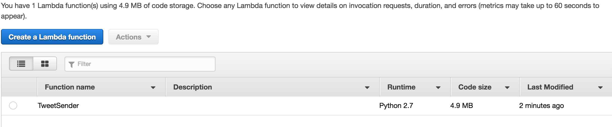

Click on the lambda function and you will shown `TweetSender` lambda function details.

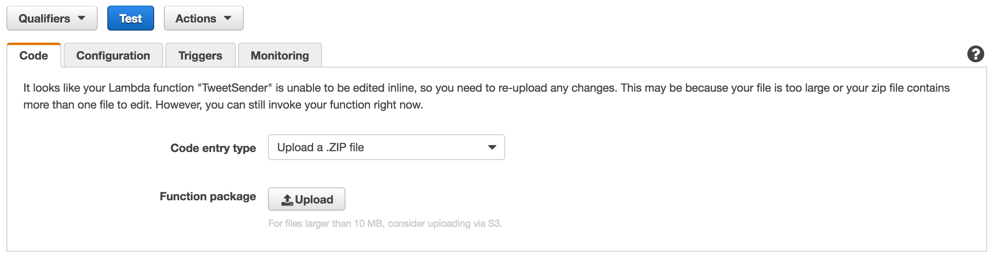

We can test our lambda function by clicking the `test` button.

You will have to provide it a valid JSON that this lambda function will expect. This is the portion of the JSON we are interested in. It has both the commit message and url of the repository.

```json
{
  "head_commit": {
    "id": "1c791fb44a03c32aaf3deeb93dd02c0cfee77780",
    "tree_id": "6f974f0da15eb2ec85ebe98a6b0974eec2fc17f9",
    "distinct": true,
    "message": "New blog on AWS lambda",
    "timestamp": "2016-08-22T18:54:29+05:30"
  },
  "repository": {
    "id": 66274453,
    "name": "test31",
    "full_name": "shekhar-gulati/test31",
    "private": false,
    "html_url": "https://github.com/shekhar-gulati/test31",
    "description": "New test repo",
    "fork": false,
    "url": "https://github.com/shekhar-gulati/test31"
  }
}
```

If you execute this function using this test message, a tweet will be sent using the credentials you provided to the python program.

## Add AWS API Gateway

AWS API Gateway will be expose the REST endpoint that will be used by Github. Whenever there will be push event, Github will call the AWS API Gateway. Log in to [API Gateway console](https://console.aws.amazon.com/apigateway/home) and click on `Get Started`. You will be directed to a page where you have to create a new API. Select the New API option as shown below and click `Create API` button.


Once created you will be redirected to your API Gateway page.

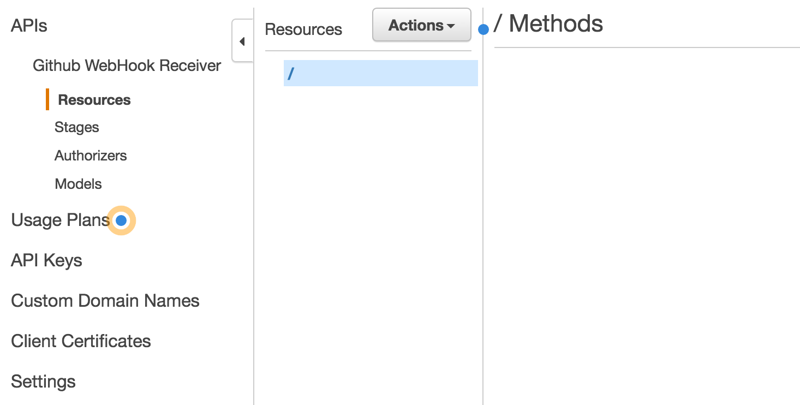

API Gateway is composed of resources and methods. Create a new resource by selecting it from action dropdown as shown below.

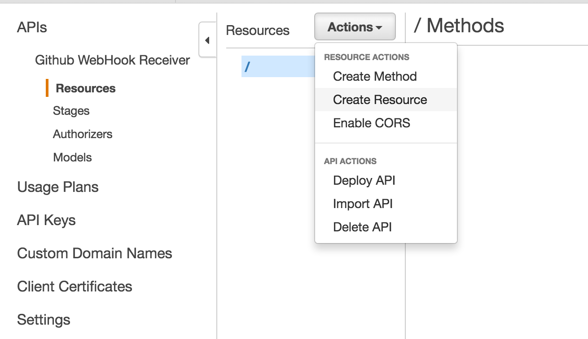

Enter details of your resource and press `Create Resource` button.

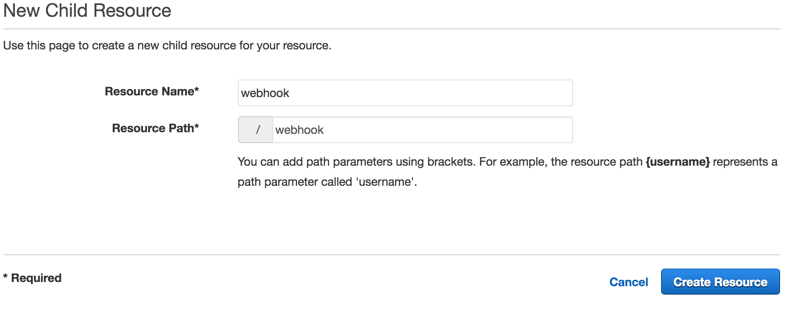

Next, we will create a HTTP method binding.

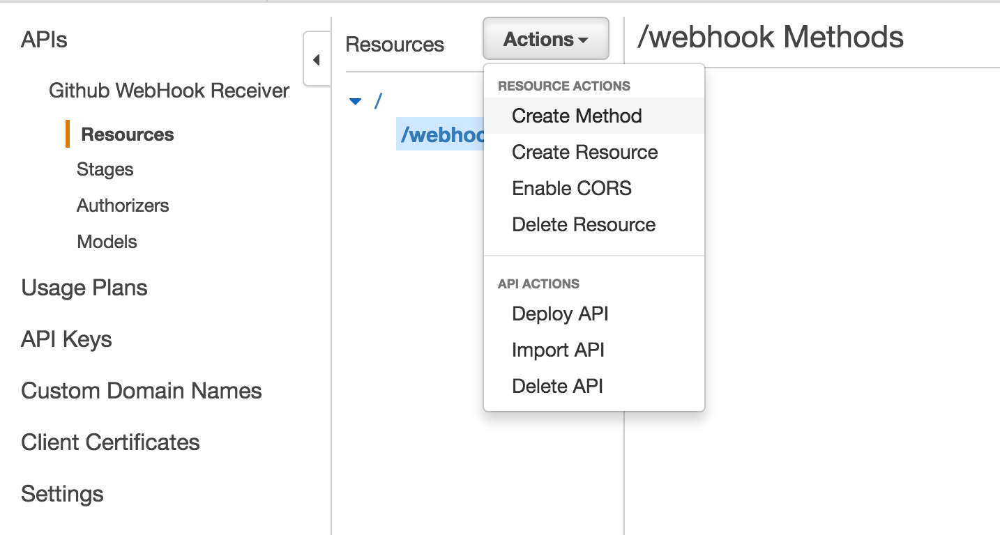

We will select the POST method and save it as shown below.

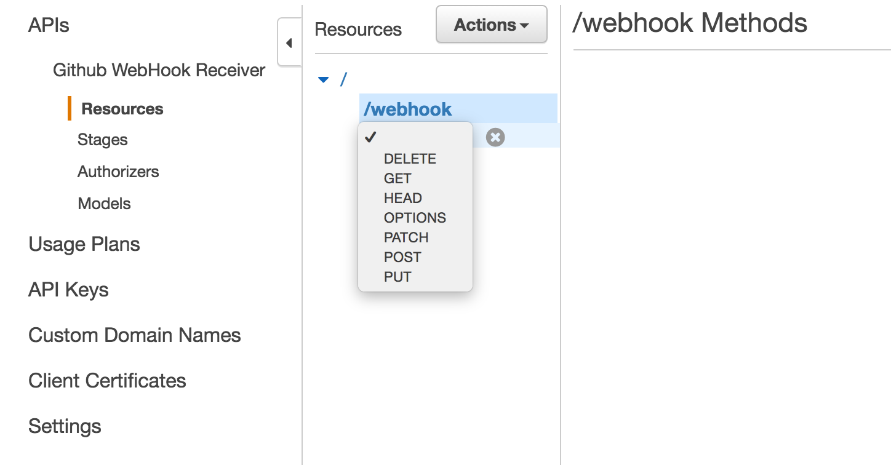

Next, we will setup the POST method so that it invokes the lamda function.

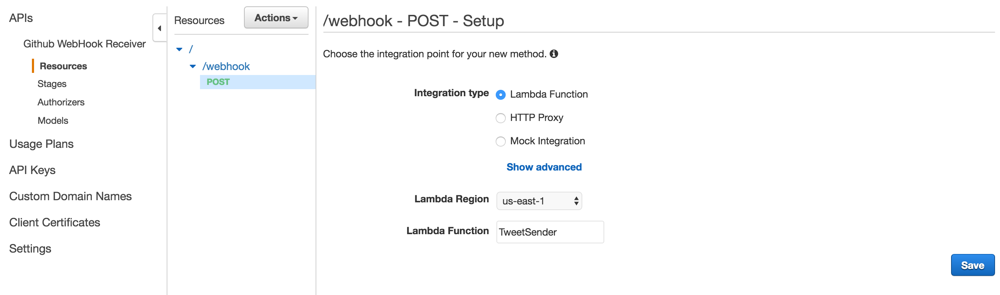

Next, you will be shown a diagram of how execution will flow.

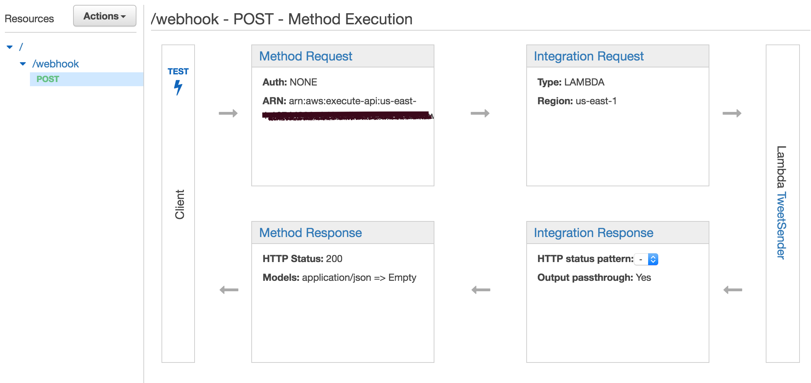

To make your API accessible, you will have to deploy it. Go to `/webhook` resource and then select Deploy API action.

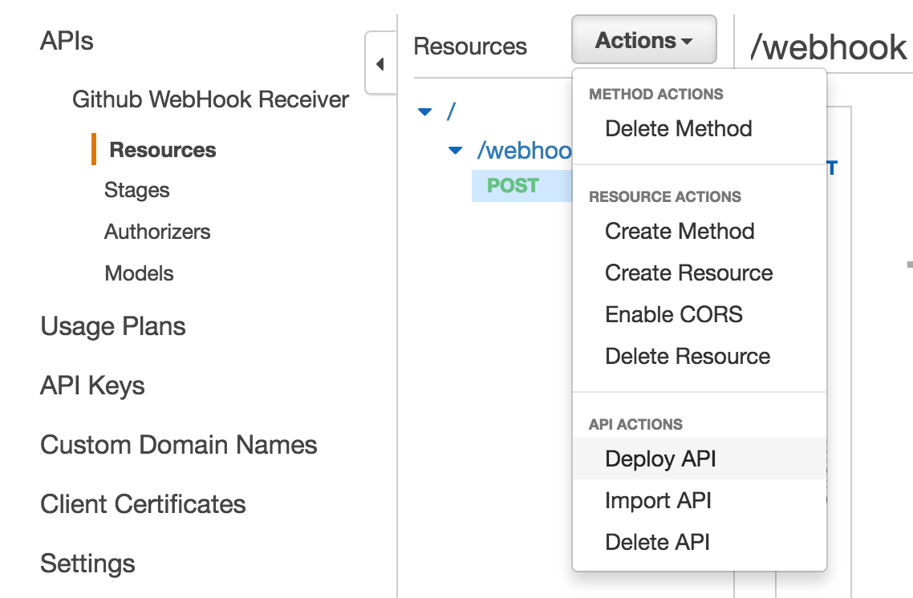

Create a new deployment stage and then create it.


Finally, you will get a URL that you can use. It will be like [https://xcnfjkjknecj.execute-api.us-east-1.amazonaws.com/prod/webhook](https://xcnfjkjknecj.execute-api.us-east-1.amazonaws.com/prod/webhook).

Now, we have successfully created our API endpoint that Github can send messages to.

## Create Github webhook

Go to any of your Github repository settings page.


Select `Webhook & services`

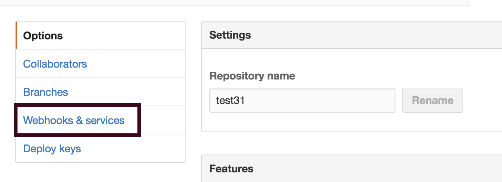

Then, click on `Add webhook`

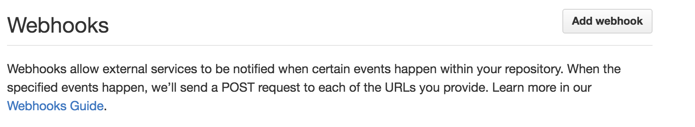


Next, you have to provide details about the webhook as shown below. After entering the details, press `Add webhook` button.


Go to your Github repository and add a new file, commit it with message "new blog", and finally push it. In couple of seconds, a tweet will appear in your twitter timeline.

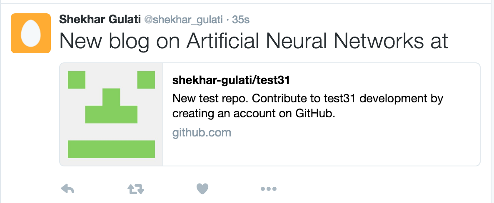


-----


That's all for this week. Please provide your valuable feedback by adding a comment to [https://github.com/shekhargulati/52-technologies-in-2016/issues/47](https://github.com/shekhargulati/52-technologies-in-2016/issues/47).

[](https://github.com/igrigorik/ga-beacon)
