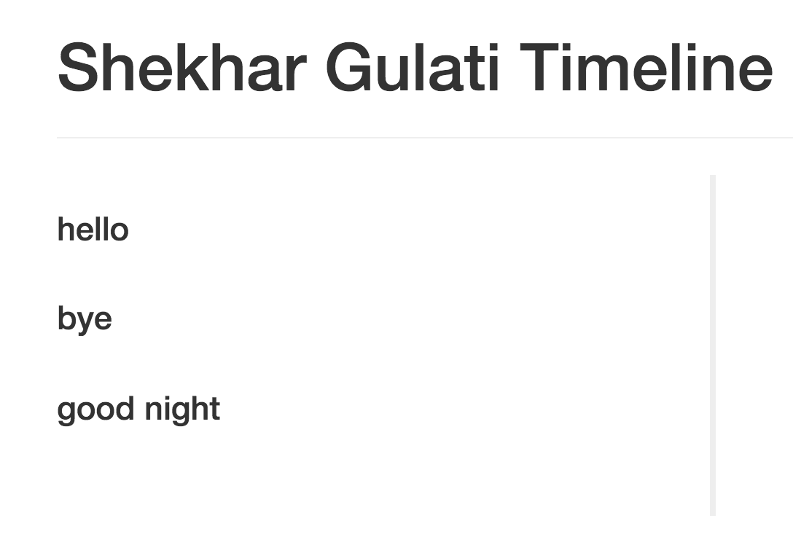
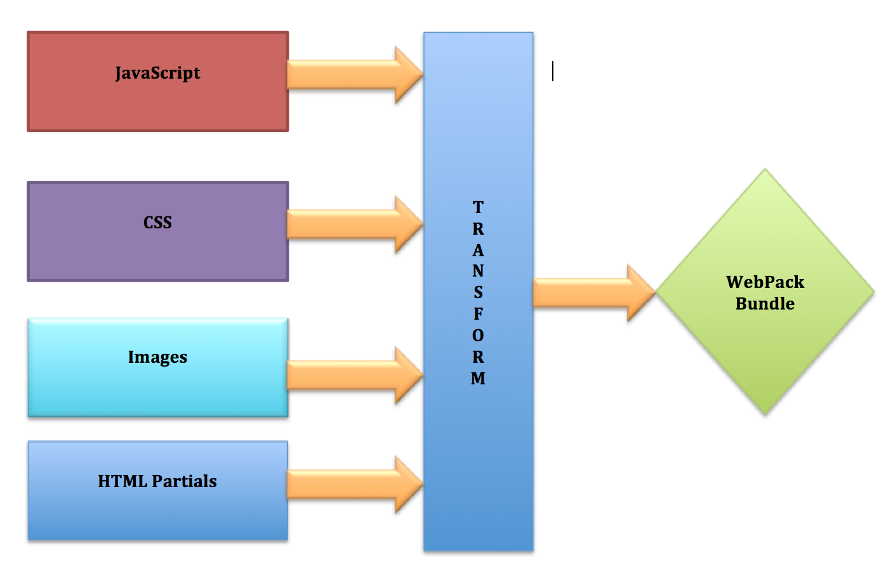
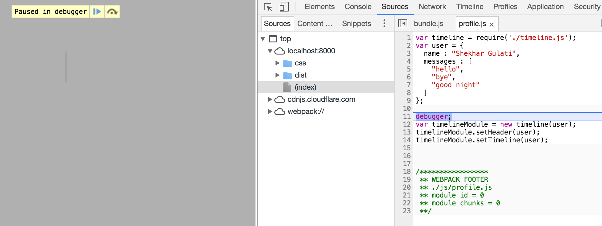

Webpack: The Missing Tutorial &trade; [](http://ttr.myapis.xyz/)
---

Welcome to the thirty-sixth blog of [52-technologies-in-2016](https://github.com/shekhargulati/52-technologies-in-2016) blog series. This week I started learning [React](https://github.com/facebook/react) for one of my personal side project but soon I discovered that I should learn webpack before. webpack is the module bundler of choice for the react community so sooner or later you will have to learn it. I had no idea about webpack so I decided to spend some time understanding and learning about it. I am primarily a backend developer so it becomes difficult for me to remain up to date with the front end ecosystem. Last time I was working with front end, I used to use tools like Grunt and Bower. I know many people moved from Grunt to Gulp as Gulp is considered more performant and it follows code over configuration paradigm. If you are Java developer then you can think Grunt as Maven and Gulp as Gradle. In this blog, we will start with webpack basics and then move to its usage. Nowadays, gulp, grunt, and bower are considered old school and cool kids have started using webpack.

## Why we need webpack?

Before we learn about webpack, let's understand why it exists and what problems it is trying to solve. One way to look at it is that [webpack](https://webpack.github.io/) allows you to get rid of bower and gulp/grunt in your application with a single tool: webpack. Rather than using bower to install and manage client side dependencies, you use the standard Node Package Manager(npm) to install and manage front-end dependencies. Most of the grunt/gulp tasks can be performed by webpack as well.

> **Bower is a package manager for client side technologies. It can be used to search , install, uninstall web assets like JavaScript, HTML, and CSS. GruntJS is a JavaScript based command line build tool that helps developers automate repetitive tasks. You can think of it as a JavaScript alternative to Make or Ant. It perform tasks like minification, compilation, unit testing, linting, etc.**

Let's suppose you are building a simple profile page for a web application that the uses jQuery and underscore JavaScript libraries. One way to build our web page would be to include both jQuery and underscore in our HTML page.

```html
<!DOCTYPE html>
<html>
  <head>
    <meta charset="utf-8">
    <title>User Profile</title>
    <link rel="stylesheet" href="https://cdnjs.cloudflare.com/ajax/libs/twitter-bootstrap/3.3.7/css/bootstrap.css" media="screen">
    <link rel="stylesheet" href="/css/style.css" media="screen">
  </head>
  <body>
    <div class="container">
      <div class="page-header">
        <h1 id="timeline"></h1>
      </div>
      <ul class="timeline">
      </ul>
    </div>
    <script src="https://cdnjs.cloudflare.com/ajax/libs/jquery/3.1.0/jquery.min.js"></script>
    <script src="https://cdnjs.cloudflare.com/ajax/libs/underscore.js/1.8.3/underscore-min.js"></script>
    <script src="js/profile.js"></script>
  </body>
</html>
```

The page shown above is a simple HTML page that uses bootstrap for styling. We included jquery and underscore libraries using the script tag.

Let's now look at the `profile.js` which uses our JavaScript libraries. We enclosed our code in an anonymous closure that encapsulates our business logic. If you don't enclose the code in the function, then variables will be in global space which is bad.

```javascript
(function(){
  var user = {
    name : "Shekhar Gulati",
    messages : [
      "hello",
      "bye",
      "good night"
    ]
  };

  $("#timeline").text(user.name+ " Timeline");

  _.each(user.messages, function(msg){
    var html = "<li><div class='timeline-heading'><h4 class='timeline-title'>"+msg+"</h4></div></li>";
    $(".timeline").append(html);
  });

}());
```

This function is evaluated as soon as script is called.

If you open the web page in a browser, then you will see your profile page as shown below.



The above JavaScript code does two things -- 1) getting user information 2) setting up timeline.

We all know it is a bad practice to mix concerns, so we should write specific modules that do one thing. In the `profile.js` JavaScript file above, we used anonymous closure to encapsulate all our code. There are better ways to write modules in JavaScript. The two popular ways are CommonJS and AMD.

* **A CommonJS module is essentially a reusable piece of JavaScript which exports specific objects, making them available for other modules to `require` in their programs.**

* **Asynchronous Module Definition (AMD) allows you to load modules asynchronously.**

If you want to learn more about JavaScript modules, then I will refer you to [JavaScript Modules: A Beginner’s Guide](https://medium.freecodecamp.com/javascript-modules-a-beginner-s-guide-783f7d7a5fcc#.627yk09t3).

In this blog, we will write CommonJS modules. Let's write the timeline module with methods to set the header and timeline. CommonJS allows you import the dependencies using the `require` function. As our timeline module depends on `jquery` and `underscore`, we explicitly declare them with the require keyword.

```javascript
var $ = require('jquery');
var _ = require('underscore');

function timeline(user){
  this.setHeader = function(){
      $("#timeline").text(user.name+ " Timeline");
  }

  this.setTimeline = function(){
    _.each(user.messages, function(msg){
      var html = "<li><div class='timeline-heading'><h4 class='timeline-title'>"+msg+"</h4></div></li>";
      $(".timeline").append(html);
    });
  }
}

module.exports = timeline;
```

The code shown above creates a new module named `timeline`. We defined two functions: `setHeader` and `setTimeline`. We used the special object `module` and added reference of our function timeline to `module.exports`. This is the way you tell the CommonJS module system that you want to expose a function, so that others can use it.

Now we will update `profile.js` to use our `timeline` module. We can even create a new module that will load up the user information, but for now let's go with one module.


```javascript
var timeline = require('./timeline.js');
var user = {
  name : "Shekhar Gulati",
  messages : [
    "hello",
    "bye",
    "good night"
  ]
};

var timelineModule = new timeline(user);
timelineModule.setHeader();
timelineModule.setTimeline();
```

If you load index.html in your web browser, then you will see an empty page. Looking at the developer tools of your web browser will tell you the error.

```
profile.js:1 Uncaught ReferenceError: require is not defined
```

The reason is that browsers don't understand module systems like CommonJS. You have to give them JavaScript in the format they expect.

## module bundlers to the rescue

Web browsers don't understand these well defined modules. You either have to add all your JavaScript code in a single file and then import it, or you have to import all the JavaScript files manually in your page using the `script` tag. We use module bundlers to overcome this problem. Module bundlers combine different modules and their dependencies into a single file in the correct order. They can parse code written using different module systems into the format browser understand. The two popular module bundler are:

1. **browserify**: it packages npm modules, so that you can use them in your browser. When you are working with browserify, you will end up using Grunt or Gulp to perform tasks like linting, running tests, etc. This means you will have to spend time managing multiple tools and their integration.

2. **webpack**: it is an opinionated build system that not only offers module bundling, but can perform all the tasks that Gulp/Grunt can do. Also, webpack is not limited to bundling JavaScript files; it can work with other static assets like CSS, images, html partials, etc. Webpack also supports a very useful feature called `code splitting`. In bigger application, you can split your application into meaningful chunks which are loaded on-demand.

## What is webpack?

The [official definition of webpack](https://webpack.github.io/) is mentioned below.

> **webpack takes modules with dependencies and generates static assets representing those modules.**

This definition will make sense now that you understand the problem it is trying to solve. Webpack takes a set of input assets and transforms them into a bundle that you can then use.



Transformation is provided by webpack loaders which are the heart of webpack.


## webpack in action

To install webpack on your machine, you need to have node installed. You can download node.js from its [official website](http://nodejs.org/).

Once you have node.js installed, you can install webpack globally using the following command.

```bash
$ npm install -g webpack
```

Create a new node module using `npm init`. It will create a new file `package.json`.

Install the dependencies using npm.

```bash
$ npm install -S jquery
$ npm install -S underscore
```

Additionally, we need to install webpack as a dependency.

```bash
$ npm install -S webpack
```

Replace your `index.html` with the code shown below. As you can see, we have removed all the script tags for jquery and underscore. Also, instead of importing `js/profile.js`, we are importing `dist/bundle.js`.

```html
<!DOCTYPE html>
<html>
  <head>
    <meta charset="utf-8">
    <title>User Profile</title>
    <link rel="stylesheet" href="https://cdnjs.cloudflare.com/ajax/libs/twitter-bootstrap/3.3.7/css/bootstrap.css" media="screen">
    <link rel="stylesheet" href="/css/style.css" media="screen" title="no title">

  </head>
  <body>

    <div class="container">
      <div class="page-header">
        <h1 id="timeline"></h1>
      </div>
      <ul class="timeline">
      </ul>

    </div>

    <script src="dist/bundle.js" charset="utf-8"></script>
  </body>
</html>

```

Now, let's use webpack command-line to create bundle for us. To do that type the following command.

```bash
$ webpack js/profile.js dist/bundle.js
```
```
Hash: 6d83c7db8ae0939be3d0
Version: webpack 1.13.2
Time: 350ms
    Asset    Size  Chunks             Chunk Names
bundle.js  329 kB       0  [emitted]  main
   [0] ./js/profile.js 252 bytes {0} [built]
   [1] ./js/timeline.js 427 bytes {0} [built]
    + 2 hidden modules
```
The command and its output is shown above.

Now, if you reload your page, you will see the profile page working fine.

You can also make webpack watch for changes and automatically generate a bundle. To do that you have to launch webpack with watch flag as shown below.

```bash
$ webpack -w js/profile.js dist/bundle.js
```

This time the webpack process will not shutdown and keep running. As you make changes, a new bundle will be generated. You just have to reload your webpage in your browser. Go to `profile.js` and change name as shown below. Refresh your webpage and you will see the changes.

```javascript
var user = {
  name : "Shekhar Gulati!!!",
  messages : [
    "hello",
    "bye",
    "good night"
  ]
};
```

The code generated by webpack in the `bundle.js` file contains a lot of webpack specific code and your application code with some transformation. If you have to debug your code using your browser devtools, then it will not be friendly. To make it easier for you to debug your code using web tools, you can launch webpack with devtools flag.


```bash
$ webpack -w --devtool source-map js/profile.js dist/bundle.js
```

This will generate the source map for the bundle.js file. The source map allows you to map your minified or combined file back to an unbuilt state. This makes it easy to debug your application.

To test it you can add a debugger statement in profile.js as shown below.

```javascript
var timeline = require('./timeline.js');
var user = {
  name : "Shekhar Gulati",
  messages : [
    "hello",
    "bye",
    "good night"
  ]
};

debugger;
var timelineModule = new timeline(user);
timelineModule.setHeader();
timelineModule.setTimeline();
```

Reload the page and the browser will stop the application at the debug location.




### requiring CSS

In the HTML shown above, you will notice that we are loading our stylesheet `/css/style.css`. As I said before, webpack can be used not only with JavaScript but with other static assets like CSS. Remove the reference of `/css/style.css` from `index.html`. We will require the CSS in `profile.js` as shown below.

```javascript
require('../css/style.css');

var timeline = require('./timeline.js');
var user = {
  name : "Shekhar Gulati",
  messages : [
    "hello",
    "bye",
    "good night"
  ]
};

var timelineModule = new timeline(user);
timelineModule.setHeader();
timelineModule.setTimeline();
```

webpack will reload the changes, and you will see error in the console as shown below.

```
ERROR in ./css/style.css
Module parse failed: /Users/shekhargulati/dev/52-technologies-in-2016/36-webpack/code/css/style.css Unexpected token (1:0)
You may need an appropriate loader to handle this file type.
```

The reason for this exception is that webpack by default does not understand CSS. You have to install couple of loaders that can help webpack handle CSS.

Install the loaders by running the command shown below.

```bash
$ npm install style-loader css-loader --save-dev
```

webpack uses loaders to transform text into the correct format.

You have to update the `require` statement that we added to import CSS as shown below.

```javascript
require('style!css!../css/style.css');
```

The syntax `style!css!` means first apply the `css` transformer to convert the text in `style.css` to CSS and then style the page using the `style` transformer.

Execute the webpack command again to see your changes.

```bash
$ webpack -w --devtool source-map js/profile.js dist/bundle.js
```


## Using webpack config

Rather than specifying all the options using the command line, you can create a configuration file named `webpack.config.js` at the root of your application, and webpack will use it.

```javascript
module.exports = {
  context: __dirname,
  devtool: "source-map",
  entry: "./js/profile.js",
  output: {
    path: __dirname + "/dist",
    filename: "bundle.js"
  }
}
```

Now, you can just use `webpack -w`.

Remember that when you added `style!css!` in the `profile.js`, you basically polluted your production code with webpack configuration. We can move that to webpack configuration as shown below.**Please note that you have to relaunch the webpack again to pick up configuration changes.**

```javascript
var webpack = require('webpack');

module.exports = {
  context: __dirname,
  devtool: "source-map",
  entry: "./js/profile.js",
  output: {
    path: __dirname + "/dist",
    filename: "bundle.js"
  },
  module:{
    loaders: [
      {test : /\.css$/, loader: 'style!css!'}
    ]
  }
}
```

The interesting section is the one with module declaration. Here we have specified that if the file ends with .css, then apply the `style!css!` transformation.

You can verify that changes are picked up, and your webpage is working fine.

### hot reloading in action

webpack achieve hot reloading via the `webpack-dev-server`. You have to first install it.

```bash
$ npm install -g webpack-dev-server
```

Now you can start the server by running `webpack-dev-server` command.

This will launch the server at http://localhost:8080/webpack-dev-server/ with the configuration you specified in `webpack.config.js`.


You can change the port by specifying `--port` option.

```bash
$ webpack-dev-server --port 10000
```
```
 http://localhost:10000/webpack-dev-server
```

The `webpack-dev-server` configuration can also be specified in the `webpack.config.js` configuration file. You specify that inside the `devServer` section.

```javascript
module.exports = {
  context: __dirname,
  devtool: "source-map",
  entry: "./js/profile.js",
  output: {
    path: __dirname + "/dist",
    filename: "bundle.js"
  },
  module:{
    loaders: [
      {test : /\.css$/, loader: 'style!css!'}
    ]
  },
  devServer: {
    inline:true,
    port: 10000
  },
}
```

-----

That's all for this week. There are many more goodies in webpack. You can read more about that in webpack [documentation](http://webpack.github.io/docs/).

Please provide your valuable feedback by posting a comment to [https://github.com/shekhargulati/52-technologies-in-2016/issues/48](https://github.com/shekhargulati/52-technologies-in-2016/issues/48).

[](https://github.com/igrigorik/ga-beacon)
