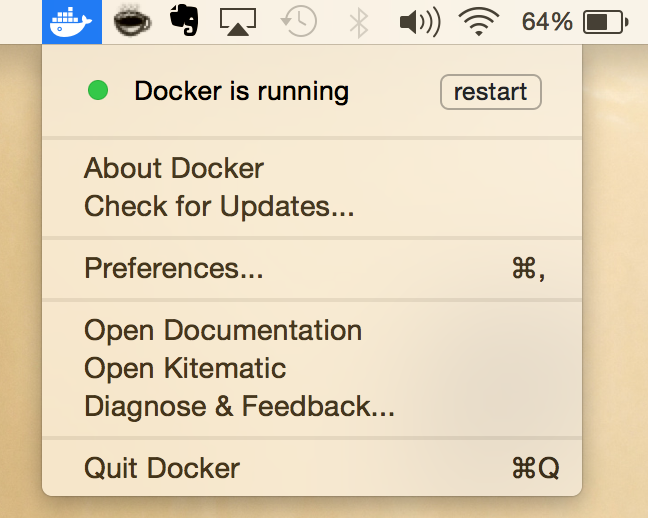
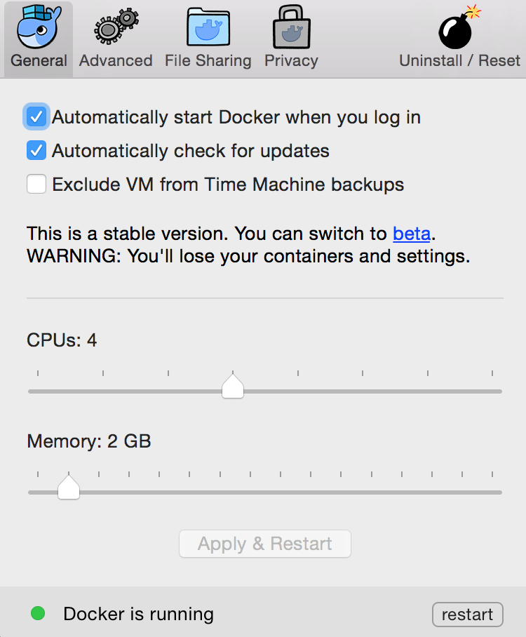

Docker for Java Developers Part 1
--------

Welcome to thirty-ninth post of [52-technologies-in-2016](https://github.com/shekhargulati/52-technologies-in-2016) series. This week I had to give a talk on Docker ecosystem so I spent a lot of my after office hours preparing for the talk. [Docker](http://docker.com/) is a container technology that allows us to package an application and its dependencies together in a filesystem so that they can be deployed together on any server. This helps us achieve package once deploy anywhere. So, in the next few posts of this series, we will learn how Java developers can get started with Docker.

I first learnt about Docker in 2013 when OpenShift decided to rewrite itself using Docker and Kubernetes. At that time, I wrote [Docker: The Missing Tutorial](https://blog.openshift.com/day-21-docker-the-missing-tutorial/) post to share my understanding of Docker with the community. Since then, I have followed Docker ecosystem and used it in few of my projects. Docker has matured from a cool project to a container platform with a very rich toolset.

> **This blog is part of my year long blog series [52 Technologies in 2016](https://github.com/shekhargulati/52-technologies-in-2016)**

## Docker Introduction

Deployment is a complicated problem and a lot can go wrong during the deployment phase. It usually involves a series of steps that have to be performed repeatedly to make your application run on servers. Deployments can go wrong because of various reasons. Some of these are mentioned below.

1. There could be disparity between different environments that could cause deployment failure.
2. An application dependency might be missing in production environment that could lead to deployment failure.
3. Lack of automation might result in a failure.

Over the last decade, we have seen many efforts to make deployments easy and reliable. For me, Google App Engine was the first such system that made deployment a non-issue. Google App Engine was the first Platform as a Service solution that I used to build Java applications back in 2008. You can deploy applications to servers running in Google datacenter from within your IDE. After that I have seen many PaaS like Heroku and OpenShift that made application deployment much more easier. Deployment became just a `git push`.

Most PaaS providers realized that using virtual machines as their unit of computation is not efficient. Virtual Machines are too heavy weight for most use cases and they will not be able to run profitable business with them. So, they started looking for other lightweight options. One such option was LXC (Linux Containers). LXC (Linux Containers) is an operating-system-level virtualization method for running multiple isolated Linux systems (containers) on a control host using a single Linux kernel. This looked like a promising option that can give the efficiency needed to run millions of applications. My first interaction with a system that had something like containers underneath was OpenShift. OpenShift versions prior to 3 had a concept of gears, which was a wrapping around cgroups and namespaces and secured using SELinux. This allowed them to achieve high density of gears on a single virtual machine. OpenShift gears lacked easy way to build them and they were kind of custom hack.

In 2013, Docker originated as a side project of Solomon Hykes, co-founder and CEO of Dotcloud. Dot Cloud was another PaaS provider just like Heroku and OpenShift, which was also playing with idea of using containers to sandbox and isolate different applications. Docker received a lot of attention and buzz so Dotcloud renamed itself to Docker Inc in 2013. Since then Docker has become the most popular container technology.

Docker container wraps software and its dependencies in a filesystem that can be installed on a server. Docker helps to:

1. Build: Package an application into an image
2. Ship: Share image with others using registries
3. Run: instantiate an image into a container

## Getting started with Docker

Download Docker for your operating system from the [Docker website](https://www.docker.com/products/overview).

If you are a Mac user then download it from [https://download.docker.com/mac/stable/Docker.dmg](https://download.docker.com/mac/stable/Docker.dmg). Once downloaded install it on your machine.  You will see Docker whale icon in your Mac Menu Bar at the top of your screen as shown below.



As you can see Docker is running. You can restart or quit the Docker using this user interface. If you click on the Preferences option then you can see how much memory and CPU is allocated to it.



### Running a Java 8 container

Let's start working with Docker by launching a Java 8 container. When you install Docker, it installs both the Docker server and command-lien client. Docker command-line client that we can use to interact with the Docker server. To run a Java 8 container, you can use the `run` command as shown below.

```
$ docker run openjdk:8
```

In the command shown above, we said that we want to run Java container using the `openjdk:8` image. `docker run` command runs a container using the default command defined in its image. Image name is comprised of two parts -- name and label. openjdk is the name and 8 is the label. 8 here signifies that we want to use OpenJDK 8. This makes it feasible to use the same image name for different versions. There are different labels for different version of Java. You can view all OpenJDK versions available as Docker images [here](https://hub.docker.com/_/openjdk/).

> **The `openjdk` is the official image of Java now. The `java` image is deprecated. It is recommended that you use `openjdk` images instead of `java` images.**

If you execute the above command, you will not see any visible output. We can check all the running containers using the `ps` command.

```
$ docker ps
CONTAINER ID        IMAGE               COMMAND             CREATED             STATUS              PORTS               NAMES
```

As you can see there are no running containers. To see all the container irrespective of their state you can use `--all` option as shown below.

```
$ docker ps --all
CONTAINER ID        IMAGE               COMMAND             CREATED             STATUS                     PORTS               NAMES
b320d9235f10        openjdk:8           "/bin/bash"         2 minutes ago       Exited (0) 2 minutes ago                       thirsty_hodgkin
```

As you can see container ran, executed the `/bin/bash` command and then exited. Docker containers die when process they launched on startup dies. As `/bin/bash` is a short lived process so container exited.

We can launch container in interactive mode with a pseudo tty terminal by using the `-it` options.

```bash
$ docker run -it openjdk:8
root@0118e01e0bcc:/#
```

This will launch the container and attach a pseudo TTY terminal to it. Open a new terminal and you will see the running container.

```bash
$ docker ps
```
```
CONTAINER ID        IMAGE               COMMAND             CREATED             STATUS              PORTS               NAMES
0118e01e0bcc        openjdk:8           "/bin/bash"         42 seconds ago      Up 41 seconds                           sad_banach
```

This time you will see that container is `Up 41 seconds`. When you run a container, docker gives it a unique id denoted that you can see under the CONTAINER ID column.

You can check the exact version of Java by running `java -version` inside the container as shown below.

```bash
root@0118e01e0bcc:/# java -version
```
```
openjdk version "1.8.0_102"
OpenJDK Runtime Environment (build 1.8.0_102-8u102-b14.1-1~bpo8+1-b14)
OpenJDK 64-Bit Server VM (build 25.102-b14, mixed mode)
```

You can check the JAVA_HOME environment variable as shown below.

```bash
root@0118e01e0bcc:/# echo $JAVA_HOME
```
```
/usr/lib/jvm/java-8-openjdk-amd64/
```

Now, we will run a simple Java program in our container. There is no text editor installed in the container so we will clone a Gist from Github to the container's `code` directory. Let's create a directory `code` inside the container's user home directory and navigate to it.

```
root@0118e01e0bcc:/# mkdir ~/code && cd ~/code
root@0118e01e0bcc:~/code#
```

The container comes with git installed. So, we will use git to clone a Github gist as shown below.

```bash
root@0118e01e0bcc:~/code# git clone https://gist.github.com/79941605ae314c544e8ad93651df666a.git .
```
```
Cloning into '.'...
remote: Counting objects: 5, done.
remote: Compressing objects: 100% (3/3), done.
remote: Total 5 (delta 0), reused 0 (delta 0), pack-reused 0
Unpacking objects: 100% (5/5), done.
Checking connectivity... done.
```

Let's look at the content of our program.

```
root@0118e01e0bcc:~/code# cat EvenNumbers.java
```
```java
import java.util.stream.IntStream;

public class EvenNumbers {

    public static void main(String[] args) {
        IntStream
                .rangeClosed(1, 10)
                .filter(i -> i % 2 == 0)
                .forEach(System.out::println);
    }
}
```

It is a simple program that prints first five even numbers using Java 8 features. Now, compile and run your Java program by running command shown below.

```bash
root@0118e01e0bcc:~/code# javac EvenNumbers.java
root@0118e01e0bcc:~/code# java EvenNumbers
```
```
2
4
6
8
10
```

Exit the container. After you exit the container, container is stopped. At anytime you can start the container by using the `docker start <container_id>` command. To remove the container, you can use `docker rm <container_id>` command. Please replace `container_id` with your container id.

To remove all the stopped containers you can run the following command on your host system.

```bash
$ docker rm $(docker ps -aq --filter=status=exited)
```

## Running an application inside a container

In this blog, we will use a simple todo application `taskman` that I built using Spring Boot. The application expose two REST endpoint -- 1) `/api/tasks` POST endpoint to create new tasks 2) `/api/tasks` GET endpoint to fetch all the tasks. We will start with an in-memory database and later use a real database. We will start by doing what we did in previous section. We will launch a Java 8 container in an interactive mode.

```bash
→ docker run -it openjdk:8
root@ddfd44abc1a9:/#
```
openjdk:8 container has git installed so we will use git to clone the `taskman` application.

```
root@ddfd44abc1a9:/# mkdir ~/code && cd ~/code
root@ddfd44abc1a9:~/code# git clone https://github.com/shekhargulati/taskman.git
root@ddfd44abc1a9:~/code# cd taskman/
```

This is a Gradle application.

```
root@ddfd44abc1a9:~/code/taskman# ls -l
total 36
-rw-r--r-- 1 root root   53 Oct  6 16:23 README.md
-rw-r--r-- 1 root root 1010 Oct  6 16:23 build.gradle
drwxr-xr-x 2 root root 4096 Oct  6 16:23 docker
drwxr-xr-x 3 root root 4096 Oct  6 16:23 gradle
-rwxr-xr-x 1 root root 5046 Oct  6 16:23 gradlew
-rw-r--r-- 1 root root 2314 Oct  6 16:23 gradlew.bat
-rw-r--r-- 1 root root   30 Oct  6 16:23 settings.gradle
drwxr-xr-x 3 root root 4096 Oct  6 16:23 src
```

This is a Spring Boot application that we can start using a Gradle task `bootRun`. This step will take time as gradlew will first download Gradle and then download taskman dependencies. Please remain patient.

```
root@ddfd44abc1a9:~/code/taskman# ./gradlew clean bootRun
```

Once finished, you will see following printed in your console.

```
2016-10-06 16:30:51.299  INFO 52 --- [           main] s.b.c.e.t.TomcatEmbeddedServletContainer : Tomcat started on port(s): 8080 (http)
2016-10-06 16:30:51.302  INFO 52 --- [           main] taskman.TaskManApp                       : Started TaskManApp in 4.397 seconds (JVM running for 4.757)
```

The application has started on port 8080 inside the container. The application is not accessible from our host system so to test our application we will launch another container. Containers started with default option can see each other. Let's first find out the IP Address of our container running Spring Boot application. This is done using `inspect` command as shown below. Run the command shown below on your host system.

```bash
$ docker inspect --format '{{.NetworkSettings.IPAddress}}' <container_id>
```

We will assume above command returned IPAddress `172.17.0.2` for rest of this section.

Launch a second container that we will use to make request to our container running Spring Boot application using the command shown below.

```bash
$ docker run -it openjdk:8
root@6430367d97d3:/#
```

You can execute ping command to verify you are able to connect with our application container.

```bash
root@6430367d97d3:/# ping 172.17.0.2
PING 172.17.0.2 (172.17.0.2): 56 data bytes
64 bytes from 172.17.0.2: icmp_seq=0 ttl=64 time=0.252 ms
```

Let's make couple of HTTP request to create and fetch tasks using cURL. cURL is already installed in our container so we can use it directly.

```
root@6430367d97d3:/# curl -H "Content-Type: application/json" -X POST -d '{"title": "Writing post on Docker"}' http://172.17.0.2:8080/api/tasks
{"id":1,"title":"Writing post on Docker","completed":false}
root@6430367d97d3:/#
root@6430367d97d3:/# curl -i http://172.17.0.2:8080/api/tasks
HTTP/1.1 200
Content-Type: application/json;charset=UTF-8
Transfer-Encoding: chunked
Date: Thu, 06 Oct 2016 16:46:45 GMT

[{"id":1,"title":"Writing post on Docker","completed":false}]
```

Stop both the containers and remove them.

## Writing your first Dockerfile

Performing commands with in the container is good for testing but to make the process repeatable we will need to codify it. Docker makes it easy to define how you want to build Docker images. Docker provides a set of commands that you write in a file that tells how image should be built. This file is named Dockerfile.

Navigate to a convinient location on your filesystem and clone the repository.

```
$ git clone git@github.com:shekhargulati/taskman.git
```

Let's create a new file Dockerfile in the project root and populate it with following contents.

```
FROM openjdk:8
MAINTAINER "Shekhar Gulati"
ENV APP_DIR /app
ADD . $APP_DIR/
WORKDIR $APP_DIR
EXPOSE 8080
ENTRYPOINT ["./gradlew","clean","bootRun"]
```

Let's understand the Dockerfile:

1. `FROM` command is used to specify the base image you want to use for your container image. This should be the first command in your Dockerfile. This is the image we will build our container image on. We used `openjdk:8` image as we want to run a Java 8 application.

2. `MAINTAINER` commands allows you to specify author of the image.

3. Next, we used `ENV` command to set a environment variable. This is done to make sure we don't repeat ourselves. Our application code will be copied to `/app` directory. This also means container will have APP_DIR environment variable set.

4. Then, we used `ADD` command to copy all files and directory from host to container. This will make sure our Java application code is inside the container `/app` directory.

5. Next, we set `WORKDIR` that sets the working directory for any `RUN`, `CMD`, `ENTRYPOINT`, `COPY` and `ADD` instructions that follow it in the Dockerfile.

6. Then, we told Docker that this container will listens on port 8080. ***EXPOSE does not make the ports of the container accessible to the host. To do that, you must use either the -p flag to publish a range of ports or the -P flag to publish all of the exposed ports.***

7. Lastly, we used `ENTRYPOINT` to specify which command will run when container will be launched. We used Gradle command that will build the project and start the embedded tomcat at port 8080.


Now, that we have created the Dockerfile let's build the image from it. But, before we do that we need to create a file `.dockerignore` that is used to specify which all files and directories we don't want to copy to the container. In the Dockerfile shown above, we used `ADD` command to copy the sources from host system to container. By default, it will copy everything inside the current directory to the container. It does not make sense to copy IDE directory or build directory to the container so we can ignore them. Create a new file `.dockerignore` inside the project root and populate it with following contents.

```
build/
.idea/
.gradle/
docker/
```

Now, we can build the image using the build command as shown below. On the host system, execute the following command.

```
$ docker build -t taskman .
```

The above command will create an image with name `taskman`. You can view the image by executing following command. You can also specify tag with an image name like `taskman:1.0.0`. If you don't specify then latest is used.

```
$ docker images
REPOSITORY          TAG                 IMAGE ID            CREATED              SIZE
taskman             latest              b0509739bca3        About a minute ago   641.1 MB
```

Now, you can start the container using the run command as shown below. This command will take time as it will run a full Gradle build and then start the tomcat server. Each time you run a container using this image Gradle will download full dependencies.

```
$ docker run -it -p 9080:8080 taskman
```

In the command shown above, we start the container in an interactive mode and exposed port 8080 of the container to port 9080 on local host using the `-p` option. Once container boots up, you will be able to access application at [http://localhost:9080](http://localhost:9080). You can view all tasks at [http://localhost:9080/api/tasks](http://localhost:9080/api/tasks). If you are using Docker machine then you replace localhost with value of `docker-machine ip <machine_name>` command.

One problem with building the project in a container is that it will take a long time to start the container as each time you launch the container from this image. Also, each container will have its own Gradle cache where all dependencies will be downloaded. We can do better by using the Gradle cache of local system using Docker volumes.

## Using volume to share Gradle repository cache

In previous section, we saw that each time we launch container we were downloading all the dependencies. Rather than downloading files in the container, we could share our .gradle directory and mount it in the container at `/root/.gradle`. The `/root/.gradle` is the location where Gradle will look for all the dependencies. If this directory is not found then Gradle creates it and downloads all dependencies.

Docker has a concept of volume that creates a mount point on the container where host directory is mounted. This makes it possible to share a persistent file system with the container. To launch a container, that uses host `.gradle` directory we will execute the following command.

```
$ docker run -it -p 9080:8080 -v ~/.gradle:/root/.gradle taskman
```

In the command shown above, we used `-v` option to create a mount point on the container that references host `~/.gradle` directory. Volumes makes it possible for container and data to have independent lifecycle. We all data outlives application. Later in this post, we will use volume to store MySQL container data.

## Running container in the detached mode

So, far we have been running containers in foreground but it make sense to run long running processes like servers in the detached mode. Docker makes it possible using the `-d` option.

```
$ docker run -it -d -p 9080:8080 -v ~/.gradle:/root/.gradle taskman
```

This will return the container id of the container. To see the logs you can use logs command as shown below.

```
$ docker logs -f <container_id>
```

The `-f` option is used to follow the logs.

## Using Gradle plugin to build Docker image

So far we have build Docker image manually using docker build command. This is fine for development and quick playing around but for real deployments you would need to build Docker images during the project build lifecyle. Also, rather than using Gradle to launch application we will run Spring Boot apps as executable jar.

To build images during the application build, we will use [Gradle Docker plugin by Transmode](https://github.com/Transmode/gradle-docker). We can automate that process so that on each build we also build a Docker image. To do that we have to enable Docker Gradle plugin in `build.gradle`.

```gradle
buildscript {
    repositories {
        jcenter()
    }
    dependencies {
        classpath("org.springframework.boot:spring-boot-gradle-plugin:1.4.1.RELEASE")
        classpath('se.transmode.gradle:gradle-docker:1.2')
    }
}
group 'com.shekhargulati'
version '1.0.0'

apply plugin: 'java'
apply plugin: 'spring-boot'
apply plugin: 'docker'

sourceCompatibility = 1.8

jar {
    baseName = "taskman"
    version = ''
}


repositories {
    mavenCentral()
}

dependencies {
    compile("org.springframework.boot:spring-boot-starter-web")
    compile("org.springframework.boot:spring-boot-starter-data-jpa")
    compile("mysql:mysql-connector-java:5.1.39")
    compile("org.hsqldb:hsqldb:2.3.4")

    testCompile("org.springframework.boot:spring-boot-starter-test")
}


task buildDocker(type: Docker, dependsOn: build) {
    push = false
    applicationName = jar.baseName
    dockerfile = file('docker/Dockerfile')
    doFirst {
        copy {
            from jar
            into stageDir
        }
    }
}
```

In the build script shown above, we first declared dependeny of plugin, then enabled it, and finally created a task `buildDocker` that will use the `Dockerfile` present in the `docker` directory. The `buildDocker` tasks copies the `taskman` jar to the staging directory.

Also, we will move Dockerfile from the application root to a new folder `docker` inside the root. Also, we will change the Dockerfile so that we don't build the application within the container but rather use the executable JAR generated by Spring Boot Gradle plugin.

```
FROM openjdk:8
MAINTAINER "Shekhar Gulati"
ENV APP_DIR /app
ADD taskman.jar $APP_DIR/
WORKDIR $APP_DIR
EXPOSE 8080
ENTRYPOINT ["java","-jar","taskman.jar"]
```

To build the image we will use Gradle command `./gradlew clean buildDocker`. The `buildDocker` is the task that we have declared in our `build.gradle`. Once command finishes successfully, we can verify the our image is created successfully. The image will have different name now. Docker Gradle plugin uses `${project.group}/${applicationName}:${tagVersion}` scheme to generate name for the Docker image. Please refer to the [documentation to learn more about it](https://github.com/Transmode/gradle-docker#task-configuration-through-task-properties).

```
$ docker images
REPOSITORY                  TAG                 IMAGE ID            CREATED             SIZE
com.shekhargulati/taskman   1.0.0               7f5a94fa6cbc        4 seconds ago       670.2 MB
```

You can launch container from this image by executing following command.

```
$ docker run -p 8080:8080 com.shekhargulati/taskman:1.0.0
```

This time you will notice that application launched quickly as we didn't had to build the project. Once container boots up, you will be able to access application at [http://localhost:9080](http://localhost:9080). You can view all tasks at [http://localhost:9080/api/tasks](http://localhost:9080/api/tasks). If you are using Docker machine then you replace localhost with value of `docker-machine ip <machine_name>` command.

## Making HSQL write to filesystem

So far we have been using HSQL in an in-memory mode. So, application looses data on each restart. We could make our application use file backed db by specifying `spring.datasource.url` property. But, rather than changing the value in the `application.properties` we can pass it with the application launch command as shown below.

```
$ docker run -it -d -p 9080:8080 com.shekhargulati/taskman:1.0.0 --spring.datasource.url=jdbc:hsqldb:file:/data/taskman-db
```

You can connect to the container and see the data directory.

```
$ docker exec -it <container_id> /bin/bash
root@fce9195dbc87:/data# ls
taskman-db.lck	taskman-db.log	taskman-db.properties  taskman-db.script  taskman-db.tmp
```

It is not a good idea to write to container file system. You can start a container with filesystem in readonly mode.

```
$ docker run -it --read-only -p 9080:8080 com.shekhargulati/taskman:1.0.0 --spring.datasource.url=jdbc:hsqldb:file:/data/taskman-db
```

Application will fail to start. The reason is embedded tomcat needs a writable `/tmp` directory.

```
org.springframework.context.ApplicationContextException: Unable to start embedded container; nested exception is org.springframework.boot.context.embedded.EmbeddedServletContainerException: Unable to create tempDir. java.io.tmpdir is set to /tmp
	at org.springframework.boot.context.embedded.EmbeddedWebApplicationContext.onRefresh(EmbeddedWebApplicationContext.java:137) ~[spring-boot-1.4.1.RELEASE.jar!/:1.4.1.RELEASE]
	at org.springframework.context.support.AbstractApplicationContext.refresh(AbstractApplicationContext.java:535) ~[spring-context-4.3.3.RELEASE.jar!/:4.3.3.RELEASE]
```

This is done using volume option as shown below.

```
$ docker run -it --read-only -p 9080:8080 -v /tmp com.shekhargulati/taskman:1.0.0 --spring.datasource.url=jdbc:hsqldb:file:/data/taskman-db
```

This time also it will fail to start because HSQL fails to write.

```
Caused by: org.hsqldb.HsqlException: Database lock acquisition failure: lockFile: org.hsqldb.persist.LockFile@16359e63[file =/data/taskman-db.lck, exists=false, locked=false, valid=false, ] method: openRAF reason: java.io.FileNotFoundException: /data/taskman-db.lck (No such file or directory)
```

Now, we will use volume to provide HSQL a directory on host system where it can write data.

```
$ docker run -it -d --read-only -p 9080:8080 -v /tmp -v ~/docker/data:/data com.shekhargulati/taskman:1.0.0 --spring.datasource.url=jdbc:hsqldb:file:/data/taskman-db
```

> **It is also a good idea to add a bash function that remove dangling images and volumes and  stopped containers as shown below. Thanks [Xinjiang Shao](https://github.com/soleo) for suggesting this tip.**

> ```
  docker-cleanup() {
      docker rm $(docker ps -a -q);
      docker rmi $(docker images -q -f dangling=true);
      docker volume rm $(docker volume ls -qf dangling=true)
  }
  ```

----

That's all for this week. In the next post, we will learn how to use MySQL database with our application. We will cover Docker networking basics that makes multi container applications tick.


Please provide your valuable feedback by adding a comment to [https://github.com/shekhargulati/52-technologies-in-2016/issues/60](https://github.com/shekhargulati/52-technologies-in-2016/issues/60).

[](https://github.com/igrigorik/ga-beacon)
