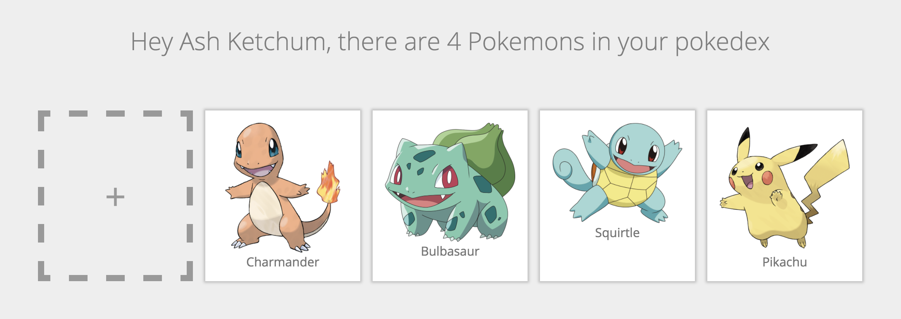
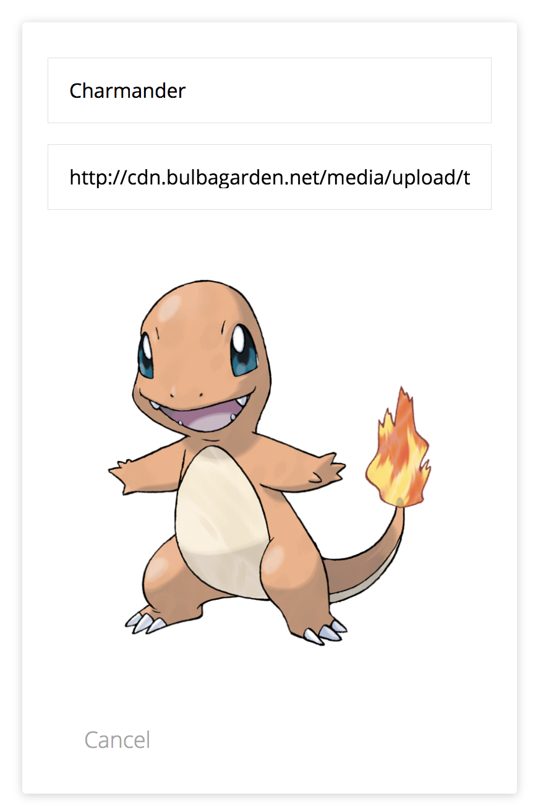
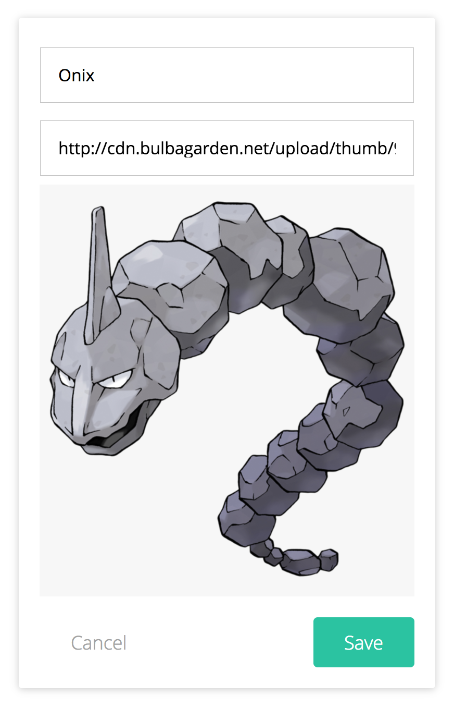

GraphQL - building a pokedex in React with GraphQL
-----

Welcome to the forty-third post of the [52-technologies-in-2016](https://github.com/shekhargulati/52-technologies-in-2016) series. This week, we will explore [GraphQL](http://graphql.org), a query language that is starting to get more and more attention. Facebook, who internally used GraphQL since 2012 and released a first specification and reference implementation of GraphQL in 2015 announced GraphQL to be [production ready] in September 2016. What followed is a trend of more and more companies starting to use GraphQL, such as [GitHub](https://youtu.be/hT-4pVmkGt0), [Coursera](https://youtu.be/JC-UJwBKc2Y) and [Shopify](https://youtu.be/Wlu_PWCjc6Y).

In this post we will explore GraphQL by building a pokedex application with GraphQL. You can find an interactive, read-only demo of the pokedex [here](http://demo.learnapollo.com).



> **This is a guest post by [Nilan Marktanner](htt ps://github.com/marktani). 52 technologies series is now open for external contributions so if you would like to contribute a guest post send us a PR.**

## Introduction to GraphQL

One of the main benefits of using GraphQL is how so called queries allow clients to specify their data requirements in a declarative way. Instead of collecting all the data from different endpoints, as is usual with REST, queries allow an exact and fine-grained selection of data fields that are then resolved by the server. This leads to prevention of data over- and underfetching, two common problems of REST.

As this approach shifts complexity from the clients to the server, we will focus on the client-side in this article. Let's take a quick glance at GraphQL schemas, exposed by GraphQL servers first, though.

### GraphQL schema

When you build an app, you usually have to think about the data model you need. With GraphQL, this is done by defining the so called GraphQL schema. It exposes queries (for fetching data) and mutations (for modifying data), that are based on primitive types (such as integers, booleans or strings) and object types. Let's have a look at the two object types that we'll need in this article.

<details>
<summary>GraphQL schema</summary>
```idl
type Trainer {
  id: String!
  name: String!
  ownedPokemons: [Pokemon]
}

type Pokemon {
  id: String!
  url: String!
  name: String!
  trainer: Trainer
}
```
</details>

### Queries

In our pokedex application, we'll display pokemons that have a `name` and a `url` and are related to the trainer that owns them. A trainer has a `name` and a list of owned pokemons. Both types have the required `id` field (denoted by the `!` in `String!`) that is used to identify different nodes. A node is a data item in our data graph.

These types will then be used by the GraphQL server to expose different queries and mutation. Let's explore common choices for those! One of them is a query that simply returns all nodes of a specific type, in our case that could be the `allPokemons` query. We can use it like this:

<details>
<summary>query</summary>
```graphql
query {
  allPokemons {
    id
    name
  }
}
```
</details>

If you want to follow along with the queries we use, head over to [the interactive GraphiQL tool](https://api.graph.cool/simple/v1/ciwjew0qz0l8d0122v7smvmxu) connecting you to the pokemon project that we setup for this article. If you copy the above query and hit the play button, you should see this result:

<details>
<summary>response</summary>
```json
{
  "data": {
    "allPokemons": [
      {
        "id": "ciwnmyvxn94uo0161477dicbm",
        "name": "Pikachu"
      },
      {
        "id": "ciwnmzhwn953o0161h7vwlhdw",
        "name": "Squirtle"
      },
      {
        "id": "ciwnn0kxq95oy0161ib2wu50g",
        "name": "Bulbasaur"
      },
      {
        "id": "ciwnn11i1960l0161861mxdc1",
        "name": "Charmander"
      }
    ]
  }
}
```
</details>

The GraphiQL tool is maintained by Facebook and highlights another benefit of GraphQL. The GraphQL schema contains so called introspection queries that make all information about the type system available. This allows for the automatically generated documentation in the top right corner of the tool or the great auto-complete feature.

Now go ahead and use the auto-complete feature of GraphiQL with `Ctrl+Space` to add the `url` field to the `allPokemons` query, run it and examine the result. Woah! Changing queries is as easy as that - just include whatever fields you want and run the query. There's one more crucial property of queries. Let us run the following query together:

<details>
<summary>query</summary>
```graphql
query {
  allPokemons {
    id
    name
    trainer {
      name
    }
  }
}
```
</details>

You should see this result:

<details>
<summary>response</summary>
```json
{
  "data": {
    "allPokemons": [
      {
        "id": "ciwnmyvxn94uo0161477dicbm",
        "name": "Pikachu",
        "trainer": {
          "name": "Ash Ketchum"
        }
      },
      {
        "id": "ciwnmzhwn953o0161h7vwlhdw",
        "name": "Squirtle",
        "trainer": {
          "name": "Ash Ketchum"
        }
      },
      {
        "id": "ciwnn0kxq95oy0161ib2wu50g",
        "name": "Bulbasaur",
        "trainer": {
          "name": "Ash Ketchum"
        }
      },
      {
        "id": "ciwnn11i1960l0161861mxdc1",
        "name": "Charmander",
        "trainer": {
          "name": "Ash Ketchum"
        }
      }
    ]
  }
}
```
</details>

Just like with normal fields, we can even select related nodes in our query. This dramatically decreases the number of queries needed and allows for quick prototyping and development of frontend applications. Instead of the time-draining skimming through dozens of potential endpoints, you can simply explore the possible queries interactively which has a great effect on developer experience.

Let's try another query that fetches a single trainer object. Our GraphQL server exposes the `Trainer` query to fetch specific trainer nodes. We can either specify the trainer by an `id` or a `name`. Let's fetch all information on the trainer `Ash Ketchum`:

<details>
<summary>query</summary>
```graphql
query {
  Trainer(name: "Ash Ketchum") {
    id
    name
    ownedPokemons {
      name
    }
  }
}
```
</details>

Run the query in GraphiQL and you should see this result:

<details>
<summary>response</summary>
```json
{
  "data": {
    "Trainer": {
      "id": "ciwnmyn2a9ayt0175axsnyux1",
      "name": "Ash Ketchum",
      "ownedPokemons": [
        {
          "name": "Pikachu"
        },
        {
          "name": "Squirtle"
        },
        {
          "name": "Bulbasaur"
        },
        {
          "name": "Charmander"
        }
      ]
    }
  }
}
```
</details>

### Mutations

Mutations can be used to modify data. Again, the available mutations depend on the GraphQL server. Typical examples include mutations that allow to create, update or delete nodes of a specific type. In our case, we could use the `createPokemon` mutation to create a new pokemon associated with the trainer `Ash Ketchum` like this:

<details>
<summary>query</summary>
```graphql
mutation {
  createPokemon(
    name: "Gyarados"
    url: "http://cdn.bulbagarden.net/upload/thumb/4/41/130Gyarados.png/600px-130Gyarados.png"
    trainerId: "ciwnmyn2a9ayt0175axsnyux1"
  ) {
    id
  }
}
```
</details>

Usually, this mutation would create the new `Gyarados` pokemon node and relate it to the `Ash Ketchum` trainer node (note the id we're passing in for `trainerId`). As the project is read-only though, we receive a permission error:

<details>
<summary>response</summary>
```json
{
  "data": {
    "createPokemon": null
  },
  "errors": [
    {
      "locations": [
        {
          "line": 12,
          "column": 3
        }
      ],
      "path": [
        "createPokemon"
      ],
      "code": 3008,
      "message": "Insufficient permissions for this mutation",
      "requestId": "cix3dug8buz0h0178nd376peo"
    }
  ]
}
```
</details>

## Building a pokedex

With this quick introduction to GraphQL, we are now ready to focus completely on the client side of our pokedex application.
Queries or mutations as seen above can simply be sent using plain http requests to the server. However, to benefit from things like client side caching and higher order components that integrate well with React, we are using [Apollo GraphQL client](http://dev.apollodata.com).

### Initializing Apollo Client

Our pokedex application will need different routes for different tasks. The route path `/` is reserved for our `Pokedex` component where we simply display all pokemons of ouf trainer. `/view/:pokemonId` will be used to display the details of a specific pokemon using the `PokemonPage` component. To create a pokemon and associate it with a specific trainer in the `AddPokemonCard` component, we use the route `/create/:trainerId`.

To make use of Apollo, we initialize a new client and connect it to our GraphQL server by configuring its network interface. Then we use the `ApolloProvider` component provided in `react-apollo` to wrap our route components with the Apollo client, so they can later send queries or mutations to our GraphQL server.

This leads us to the following route setup in `index.js`:

<details>
<summary>index.js</summary>
```js
import React from 'react'
import ReactDOM from 'react-dom'
import Pokedex from './components/Pokedex'
import PokemonPage from './components/PokemonPage'
import AddPokemonCard from './components/AddPokemonCard'
import { Router, Route, browserHistory } from 'react-router'
import ApolloClient, { createNetworkInterface } from 'apollo-client'
import { ApolloProvider } from 'react-apollo'
import 'tachyons'
import './index.css'

const client = new ApolloClient({
  networkInterface: createNetworkInterface({ uri: 'https://api.graph.cool/simple/v1/ciwjew0qz0l8d0122v7smvmxu'}),
  dataIdFromObject: o => o.id
})

ReactDOM.render((
  <ApolloProvider client={client}>
    <Router history={browserHistory}>
      <Route path='/' component={Pokedex} />
      <Route path='/view/:pokemonId' component={PokemonPage} />
      <Route path='/create/:trainerId' component={AddPokemonCard} />
    </Router>
  </ApolloProvider>
  ),
  document.getElementById('root')
)
```
</details>

We use the function `dataIdFromObject` to define how a node can be identified. In our case, all nodes have a unique `id` field so we can use it for this purpose.

### Sending queries



Let's have a closer look at the `PokemonPage` component now, where we display details of a specific pokemon.

<details>
<summary>PokemonPage.js</summary>
```js
import React from 'react'
import { withRouter } from 'react-router'
import { graphql } from 'react-apollo'
import gql from 'graphql-tag'

import PokemonCard from './PokemonCard'

class PokemonPage extends React.Component {

  static propTypes = {
    data: React.PropTypes.shape({
      loading: React.PropTypes.bool,
      error: React.PropTypes.object,
      Pokemon: React.PropTypes.object,
    }).isRequired,
    router: React.PropTypes.object.isRequired,
    params: React.PropTypes.object.isRequired,
  }

  render () {
    if (this.props.data.loading) {
      return (<div>Loading</div>)
    }

    if (this.props.data.error) {
      console.log(this.props.data.error)
      return (<div>An unexpexted error occured</div>)
    }

    return (
      <div>
        <PokemonCard pokemon={this.props.data.Pokemon} handleCancel={this.goBack}/>
      </div>
    )
  }

  goBack = () => {
    this.props.router.replace('/')
  }
}
```
</details>

Note the special `data` object that we define as part of the props. This prop will be injected by Apollo after sending a query. It contains information on the loading or error status of the query in `data.loading` and `data.error` respectively. In the render method, we see that we can use `data.loading` to render a loading state until the query response comes in that we can use to pass the `pokemon` obtained from the query down to another component, `PokemonCard` in this case.

So how do we actually send the query resulting in the response `data`? First, we can use the `gql` function from `graphql-tag` to define a query:

<details>
<summary>PokemonQuery</summary>
```js
const PokemonQuery = gql`query PokemonQuery($id: ID!) {
    Pokemon(id: $id) {
      id
      url
      name
    }
  }
`
```
</details>

Note that the query receives the `id` variable that we can use to select the specific pokemon we want to query.
We can then send this query and inject its response to the `PokemonPage` component by using the `graphql` function from `react-apollo`:

<details>
<summary>PokemonPage.js</summary>
```js
const PokemonPageWithData = graphql(PokemonQuery, {
  options: (ownProps) => ({
      variables: {
        id: ownProps.params.pokemonId
      }
    })
  }
)(withRouter(PokemonPage))

export default PokemonPageWithData
```
</details>

Note how we can access the router parameters with `ownProps.params` to use the path variable as the `id` variable for our `PokemonQuery`.

### Sending mutations



Let's see how we can use mutations with Apollo Client by looking a the `AddPokemonCard` component. Again, we can define the mutation with `gql`:

<details>
<summary>createPokemonMutation</summary>
```js
const createPokemonMutation = gql`
  mutation createPokemon($name: String!, $url: String!, $trainerId: ID) {
    createPokemon(name: $name, url: $url, trainerId: $trainerId) {
      trainer {
        id
        ownedPokemons {
          id
        }
      }
    }
  }
`
```
</details>

This time, we define the `name`, `url` and `trainerId` variables for the mutation, which is the needed information for the `createPokemon` mutation, as seen in the last section. When we use `graphql` now to wrap the existing `AddPokemonCard` component with the mutation, we don't specify the mutation variables yet:

<details>
<summary>AddPokemonCard.js</summary>
```js
const AddPokemonCardWithMutation = graphql(createPokemonMutation)(withRouter(AddPokemonCard))

export default AddPokemonCardWithMutation
```
</details>

Instead of injecting a `data` prop as before, wrapping mutations will inject a `mutate` prop that can be used to actually fire the mutation. We can see that in the `handleSave` function of the `AddPokemonCard` component:

<details>
<summary>AddPokemonCard.js</summary>
```js
handleSave = () => {
  const {name, url} = this.state
  const trainerId = this.props.params.trainerId
  this.props.mutate({variables: {name, url, trainerId}})
    .then(() => {
      this.props.router.replace('/')
    })
}
```
</details>

We take the currently entered information for the `name` and `url` input elements and the path variable `trainerId` and use them for our mutation. Calling the `mutate` function with these variables will return a promise that we can use to navigate back to the `Pokedex` component where now a new pokemon should be displayed.

## Wrap Up

That's it! In this blog post, we saw how we can send GraphQL queries and mutations using Apollo Client in React. The best way to learn more about GraphQL and Apollo is [Learn Apollo](https://learnapollo.com), featuring a hands-on tutorial where you will build a fully-featured pokedex application in multiple technologies such as React, React Native or ExponentJS.

To setup a GraphQL backend in minutes, check out [Graphcool](https://graph.cool) enabling you to implement your business logic with any language and includes realtime subscriptions, user management, service integrations and more.

[](https://www.youtube.com/watch?v=wSkZFfuAToM)
